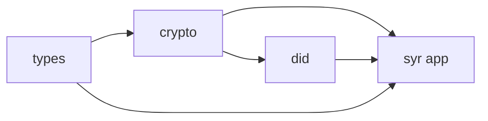

# Syr — AI Context

Conventions, patterns, and achievables for the Syr codebase. Canonical docs: `apps/docs/app/src/routes/`.

---

## Project Overview

- **Syr**: Self Yield Identity Representation — self-hosted multi-tenant self-sovereign identity manager
- **Core concepts**: Ed25519 root keypair, `did:syr` DID method, delegated device keys, Aegis (custodial), Sigil (export)
- **Ecosystem naming**: Aegis = custodial protection; Sigil = portable export format
- **Implementation phases**: Phase 0 (identity correctness) → Phase 5 (production hardening). See `apps/docs/app/src/routes/roadmap/+page.md`

---

## Monorepo Structure

```
apps/
  syr/           # SvelteKit web app (primary)
  docs/          # SveltePress docs
  syner/         # Tauri v2 native app (self-custody keys)
  registry-api/  # NestJS registry server
packages/
  types/         # @syr-is/types — Zod v4 schemas
  crypto/        # @syr-is/crypto — Ed25519, multibase, JCS
  did/           # @syr-is/did — did:syr parsing, DID documents
  resolver/      # @syr-is/resolver — registry resolution
  ui/            # @syr-is/ui — shadcn-svelte components
```



---

## Tech Stack

| Layer      | Technology                                    |
| ---------- | --------------------------------------------- |
| Frontend   | Svelte 5 runes, SvelteKit 2                   |
| Styling    | Tailwind CSS 4, shadcn-svelte, tw-animate-css |
| Validation | Zod v4 (from catalog)                         |
| Forms      | sveltekit-superforms + Zod v4                 |
| Database   | SurrealDB                                     |
| Storage    | SeaweedFS (S3-compatible)                     |
| Auth       | JWT + Argon2id                                |
| Build      | Vite 7, Turborepo, pnpm workspaces            |

---

## Code Patterns

- **Repository pattern**: All data access via `BaseRepository<T>` with Zod validation on reads, date transformation, CRUD, pagination
- **Controller pattern**: Business logic between API routes and repositories; validation, authorization, cross-cutting concerns
- **Composite record IDs**: For owned content (post, upload): `{ created_by: DID, id: ULID }` — enables portable identity, zero-conflict import
- **Codecs**: Zod v4 codecs for bi-directional API ↔ internal type transforms (`stringToRecordId`, `isoDatetimeToDate`, etc.)
- **BaseEntitySchema**: All entities extend `id`, `created_at`, `updated_at`; use `RecordIdSchema`, `TimestampSchema`
- **API responses**: `{ status, data?, error?, meta? }`; paginated: `{ data[], pagination }`; error codes from `APIErrorSchema`

---

## Cryptographic Conventions

- **Ed25519** via `@noble/ed25519` for all keys
- **DID format**: `did:syr:z6Mkt...` (multibase base58btc Ed25519 public key)
- **Canonical signing**: RFC 8785 JCS via `canonicalize()` before signing
- **Delegation**: Root-signed statement `{ did, delegate, scope, createdAt, expiresAt?, signature }`
- **No app logic in crypto package**: Pure cryptography only

---

## Implementation Achievables

- **Phase 0 remaining**: Enforce signed mutations on profile/post writes; `.well-known/syr` discovery; signed mutation middleware
- **Phase 0.5 remaining**: Integration tests for identity lifecycle; load testing; error boundary hardening
- **Spec status**: Reference `apps/docs/app/src/routes/reference/spec-mapping/+page.md` for Implemented / Partial / Missing per requirement

---

## What NOT to Build (Scope Boundaries)

- Phase 0: No registry server, OAuth provider, attestations, federation, VC
- Do not expand Phase 0 scope; follow implementation order in `apps/docs/app/src/routes/implementation/phase-0-blueprint/+page.md`

---

## File References

| Category                   | Path                                                       |
| -------------------------- | ---------------------------------------------------------- |
| Architecture specs         | `apps/docs/app/src/routes/architecture/*/+page.md`         |
| Implementation             | `apps/docs/app/src/routes/implementation/*/+page.md`       |
| Reference docs             | `apps/docs/app/src/routes/reference/*/+page.md`            |
| Spec-to-implementation map | `apps/docs/app/src/routes/reference/spec-mapping/+page.md` |
