# SYR Architecture

## Vision and Principles

The Self-Yield Representation (SYR) Project aims to shift control back to people by creating a decentralized social infrastructure where:

- **Identity is portable**: Users own their digital presence and can move it across services
- **Communities define norms**: Cultural context travels with content, not algorithmic scores
- **Accountability is human**: Judgment rooted in human context, not engagement metrics
- **Discovery is organic**: People find each other through human connections, not feeds

## System Overview

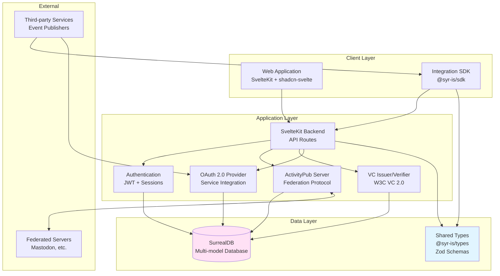
```mermaid
graph TB
    subgraph "Client Layer"
        Web[Web Application<br/>SvelteKit + shadcn-svelte]
        SDK[Integration SDK<br/>@syr-is/sdk]
    end

    subgraph "Application Layer"
        API[SvelteKit Backend<br/>API Routes]
        Auth[Authentication<br/>JWT + Sessions]
        AP[ActivityPub Server<br/>Federation Protocol]
        VC[VC Issuer/Verifier<br/>W3C VC 2.0]
        OAuth[OAuth 2.0 Provider<br/>Service Integration]
    end

    subgraph "Data Layer"
        Types[Shared Types<br/>@syr-is/types<br/>Zod Schemas]
        DB[(SurrealDB<br/>Multi-model Database)]
    end

    subgraph "External"
        Fedi[Federated Servers<br/>Mastodon, etc.]
        Services[Third-party Services<br/>Event Publishers]
    end

    Web --> API
    SDK --> API
    API --> Auth
    API --> AP
    API --> VC
    API --> OAuth

    Auth --> DB
    AP --> DB
    VC --> DB
    OAuth --> DB

    API --> Types
    SDK --> Types

    AP <--> Fedi
    Services --> SDK
    Services --> OAuth

    style Types fill:#e1f5ff
    style DB fill:#ffe1f5
```

## DID Method: did:web

SYR uses **did:web** exclusively for decentralized identifiers:

- **DNS-Based**: DIDs resolve via HTTPS to a domain you control
- **No Blockchain**: No dependency on blockchain infrastructure
- **Self-Sovereign**: Users control their DID by controlling their domain
- **Simple Resolution**: `did:web:example.com` → `https://example.com/.well-known/did.json`
- **Path Support**: `did:web:example.com:users:alice` → `https://example.com/users/alice/did.json`

**Why did:web?**

- Fully sovereign (you control your DNS)
- No centralized registries or blockchain fees
- Works with existing web infrastructure
- Easy to migrate (just move your domain)
- No PLC or blockchain dependency

## Core Components

### 1. User Identity System

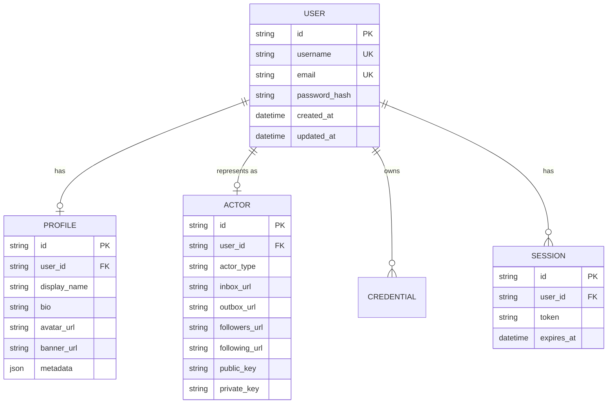
```mermaid
erDiagram
    USER ||--o| PROFILE : has
    USER ||--o| ACTOR : "represents as"
    USER ||--o{ CREDENTIAL : owns
    USER ||--o{ SESSION : has

    USER {
        string id PK
        string username UK
        string email UK
        string password_hash
        datetime created_at
        datetime updated_at
    }

    PROFILE {
        string id PK
        string user_id FK
        string display_name
        string bio
        string avatar_url
        string banner_url
        json metadata
    }

    ACTOR {
        string id PK
        string user_id FK
        string actor_type
        string inbox_url
        string outbox_url
        string followers_url
        string following_url
        string public_key
        string private_key
    }

    SESSION {
        string id PK
        string user_id FK
        string token
        datetime expires_at
    }
```

### 2. ActivityPub Federation

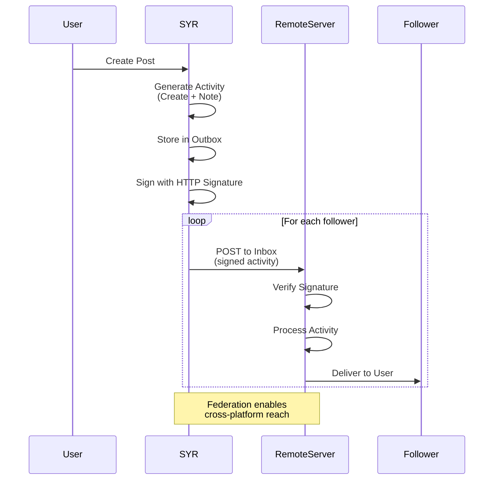
```mermaid
sequenceDiagram
    participant User
    participant SYR
    participant RemoteServer
    participant Follower

    User->>SYR: Create Post
    SYR->>SYR: Generate Activity<br/>(Create + Note)
    SYR->>SYR: Store in Outbox
    SYR->>SYR: Sign with HTTP Signature

    loop For each follower
        SYR->>RemoteServer: POST to Inbox<br/>(signed activity)
        RemoteServer->>RemoteServer: Verify Signature
        RemoteServer->>RemoteServer: Process Activity
        RemoteServer->>Follower: Deliver to User
    end

    Note over SYR,RemoteServer: Federation enables<br/>cross-platform reach
```

### 3. ActivityPub Data Model

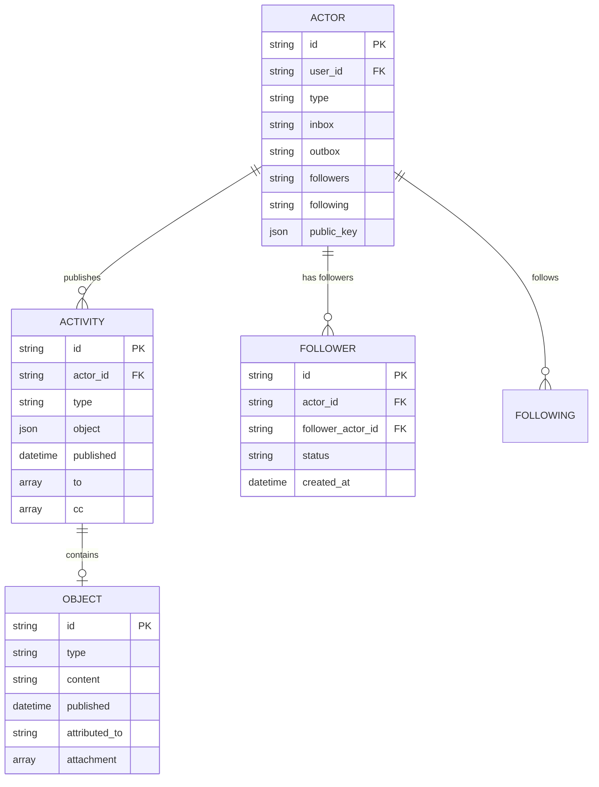
```mermaid
erDiagram
    ACTOR ||--o{ ACTIVITY : publishes
    ACTIVITY ||--o| OBJECT : contains
    ACTOR ||--o{ FOLLOWER : "has followers"
    ACTOR ||--o{ FOLLOWING : follows

    ACTOR {
        string id PK
        string user_id FK
        string type
        string inbox
        string outbox
        string followers
        string following
        json public_key
    }

    ACTIVITY {
        string id PK
        string actor_id FK
        string type
        json object
        datetime published
        array to
        array cc
    }

    OBJECT {
        string id PK
        string type
        string content
        datetime published
        string attributed_to
        array attachment
    }

    FOLLOWER {
        string id PK
        string actor_id FK
        string follower_actor_id FK
        string status
        datetime created_at
    }
```

### 4. Verifiable Credentials Flow

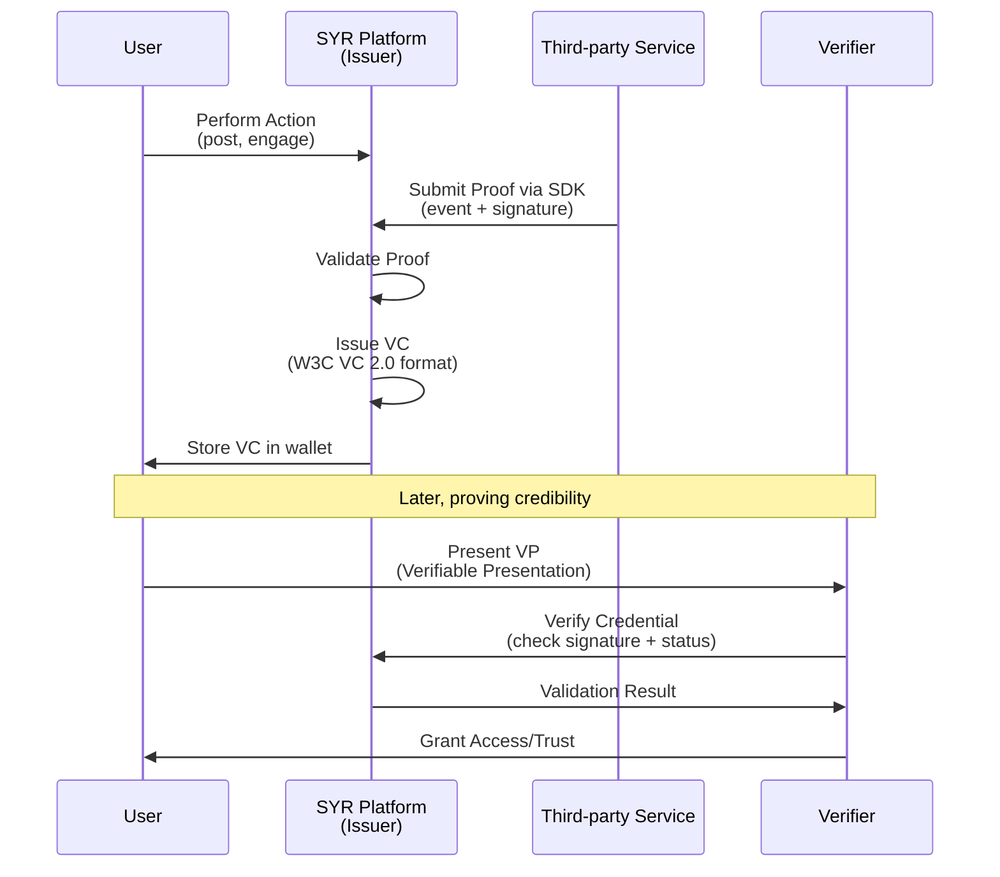
```mermaid
sequenceDiagram
    participant User
    participant SYR as SYR Platform<br/>(Issuer)
    participant Service as Third-party Service
    participant Verifier

    User->>SYR: Perform Action<br/>(post, engage)
    Service->>SYR: Submit Proof via SDK<br/>(event + signature)
    SYR->>SYR: Validate Proof
    SYR->>SYR: Issue VC<br/>(W3C VC 2.0 format)
    SYR->>User: Store VC in wallet

    Note over User,Verifier: Later, proving credibility

    User->>Verifier: Present VP<br/>(Verifiable Presentation)
    Verifier->>SYR: Verify Credential<br/>(check signature + status)
    SYR->>Verifier: Validation Result
    Verifier->>User: Grant Access/Trust
```

### 5. Verifiable Credentials Data Model

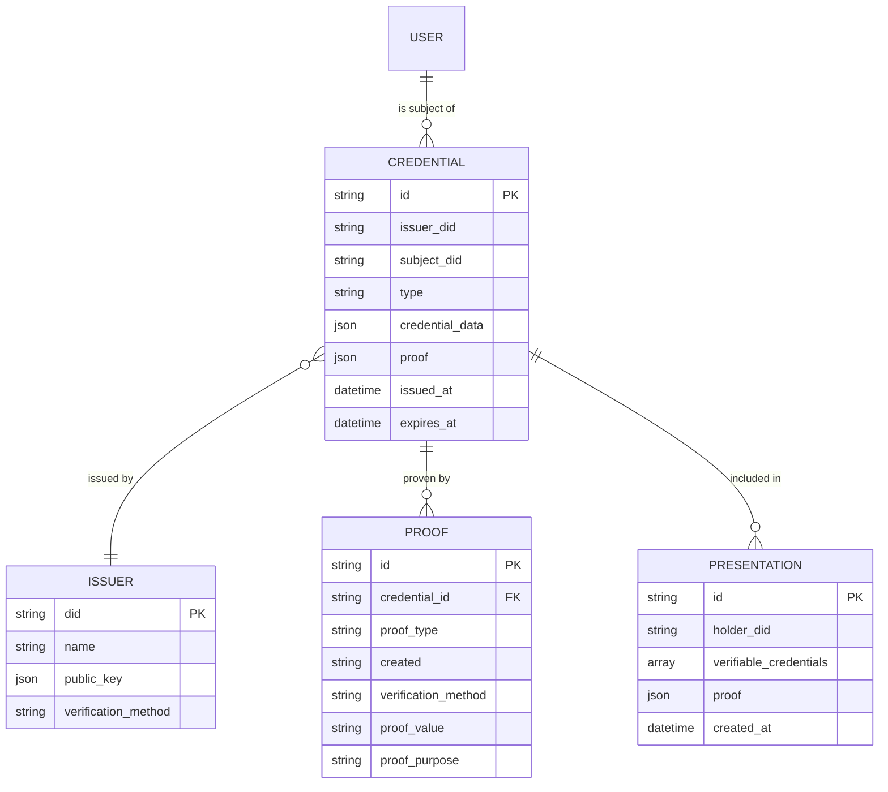
```mermaid
erDiagram
    USER ||--o{ CREDENTIAL : "is subject of"
    CREDENTIAL }o--|| ISSUER : "issued by"
    CREDENTIAL ||--o{ PROOF : "proven by"
    CREDENTIAL ||--o{ PRESENTATION : "included in"

    CREDENTIAL {
        string id PK
        string issuer_did
        string subject_did
        string type
        json credential_data
        json proof
        datetime issued_at
        datetime expires_at
    }

    PROOF {
        string id PK
        string credential_id FK
        string proof_type
        string created
        string verification_method
        string proof_value
        string proof_purpose
    }

    PRESENTATION {
        string id PK
        string holder_did
        array verifiable_credentials
        json proof
        datetime created_at
    }

    ISSUER {
        string did PK
        string name
        json public_key
        string verification_method
    }
```

### 6. OAuth 2.0 Integration Flow

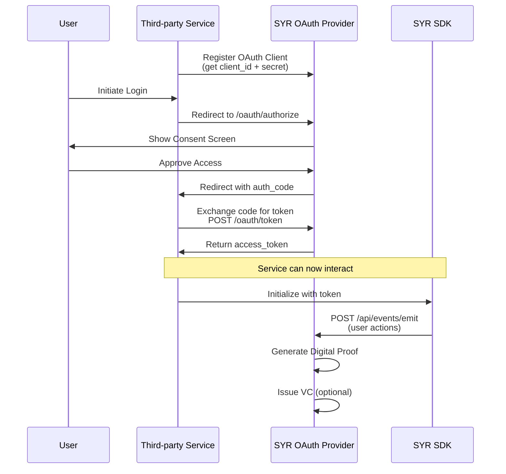
```mermaid
sequenceDiagram
    participant User
    participant Service as Third-party Service
    participant SYR as SYR OAuth Provider
    participant SDK as SYR SDK

    Service->>SYR: Register OAuth Client<br/>(get client_id + secret)

    User->>Service: Initiate Login
    Service->>SYR: Redirect to /oauth/authorize
    SYR->>User: Show Consent Screen
    User->>SYR: Approve Access
    SYR->>Service: Redirect with auth_code
    Service->>SYR: Exchange code for token<br/>POST /oauth/token
    SYR->>Service: Return access_token

    Note over Service,SDK: Service can now interact

    Service->>SDK: Initialize with token
    SDK->>SYR: POST /api/events/emit<br/>(user actions)
    SYR->>SYR: Generate Digital Proof
    SYR->>SYR: Issue VC (optional)
```

### 7. OAuth Data Model

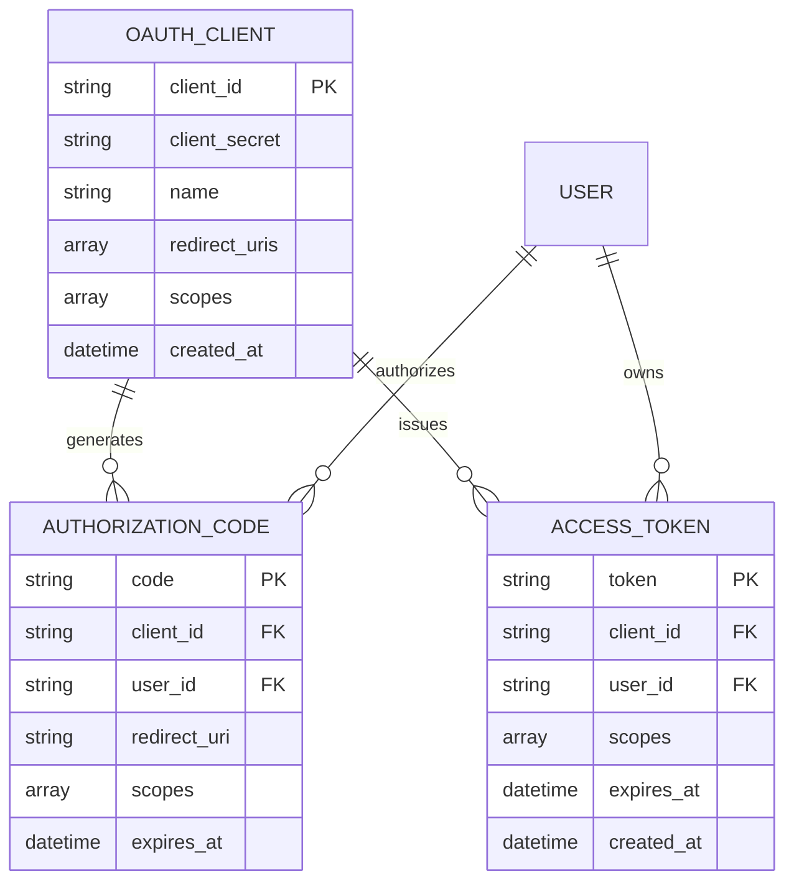
```mermaid
erDiagram
    OAUTH_CLIENT ||--o{ AUTHORIZATION_CODE : generates
    OAUTH_CLIENT ||--o{ ACCESS_TOKEN : issues
    USER ||--o{ AUTHORIZATION_CODE : authorizes
    USER ||--o{ ACCESS_TOKEN : owns

    OAUTH_CLIENT {
        string client_id PK
        string client_secret
        string name
        array redirect_uris
        array scopes
        datetime created_at
    }

    AUTHORIZATION_CODE {
        string code PK
        string client_id FK
        string user_id FK
        string redirect_uri
        array scopes
        datetime expires_at
    }

    ACCESS_TOKEN {
        string token PK
        string client_id FK
        string user_id FK
        array scopes
        datetime expires_at
        datetime created_at
    }
```

## Technology Stack

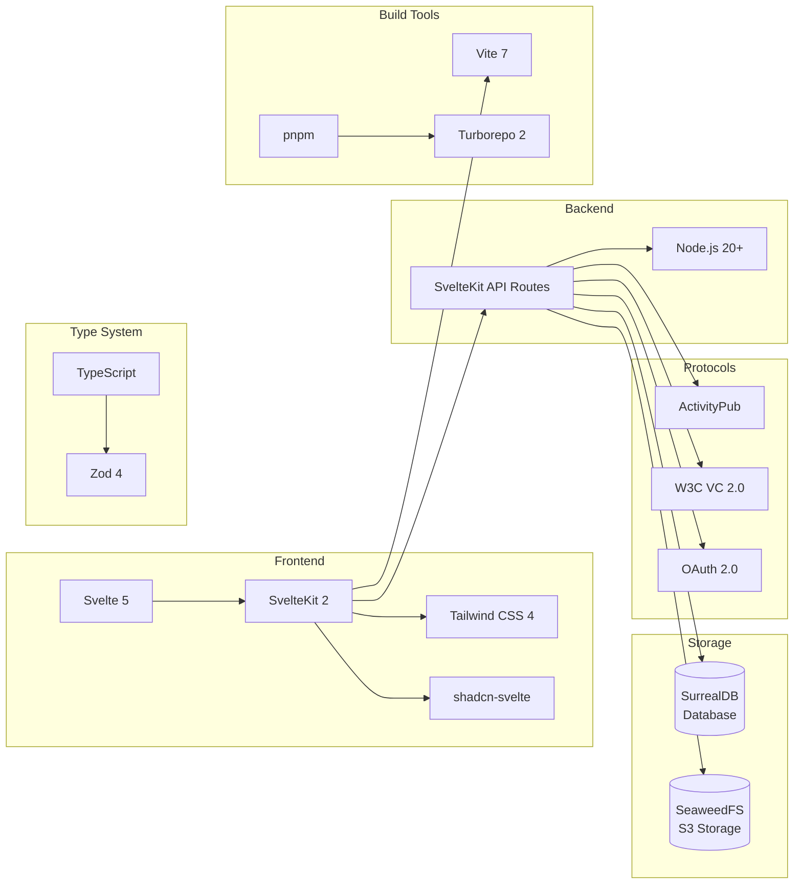
```mermaid
graph LR
    subgraph "Frontend"
        Svelte[Svelte 5]
        SvelteKit[SvelteKit 2]
        Tailwind[Tailwind CSS 4]
        Shadcn[shadcn-svelte]
    end

    subgraph "Backend"
        SK_API[SvelteKit API Routes]
        Node[Node.js 20+]
    end

    subgraph "Type System"
        TS[TypeScript]
        Zod[Zod 4]
    end

    subgraph "Storage"
        SurrealDB[(SurrealDB<br/>Database)]
        SeaweedFS[(SeaweedFS<br/>S3 Storage)]
    end

    subgraph "Protocols"
        AP_Proto[ActivityPub]
        VC_Proto[W3C VC 2.0]
        OAuth_Proto[OAuth 2.0]
    end

    subgraph "Build Tools"
        Vite[Vite 7]
        pnpm[pnpm]
        Turbo[Turborepo 2]
    end

    Svelte --> SvelteKit
    SvelteKit --> Tailwind
    SvelteKit --> Shadcn
    SvelteKit --> SK_API
    SK_API --> Node

    TS --> Zod

    SK_API --> SurrealDB
    SK_API --> SeaweedFS
    SK_API --> AP_Proto
    SK_API --> VC_Proto
    SK_API --> OAuth_Proto

    SvelteKit --> Vite
    pnpm --> Turbo
```

## Authentication & Authorization Flow

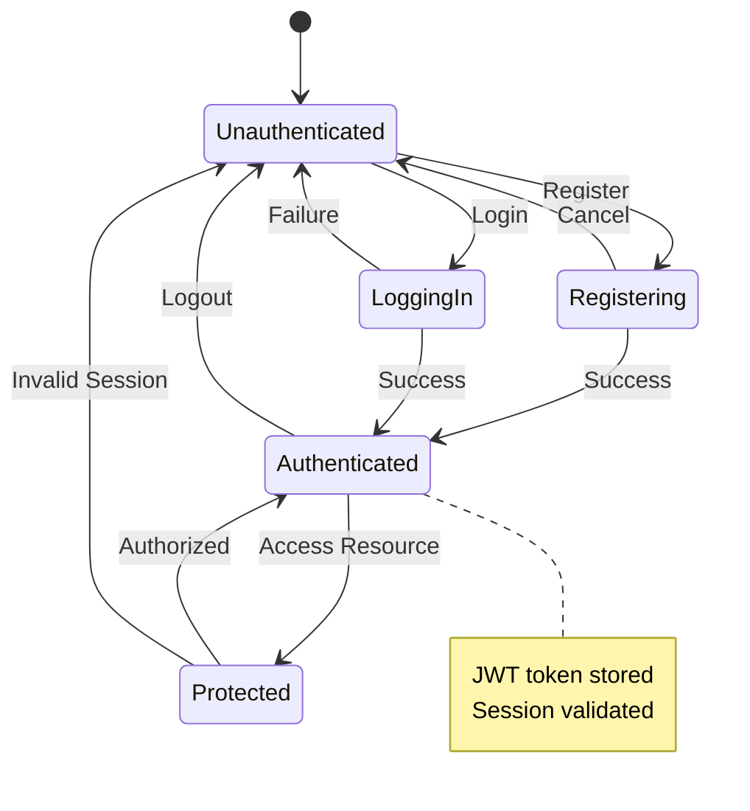
```mermaid
stateDiagram-v2
    [*] --> Unauthenticated

    Unauthenticated --> Registering: Register
    Registering --> Unauthenticated: Cancel
    Registering --> Authenticated: Success

    Unauthenticated --> LoggingIn: Login
    LoggingIn --> Unauthenticated: Failure
    LoggingIn --> Authenticated: Success

    Authenticated --> Protected: Access Resource
    Protected --> Authenticated: Authorized
    Protected --> Unauthenticated: Invalid Session

    Authenticated --> Unauthenticated: Logout

    note right of Authenticated
        JWT token stored
        Session validated
    end note
```

## Data Flow Architecture

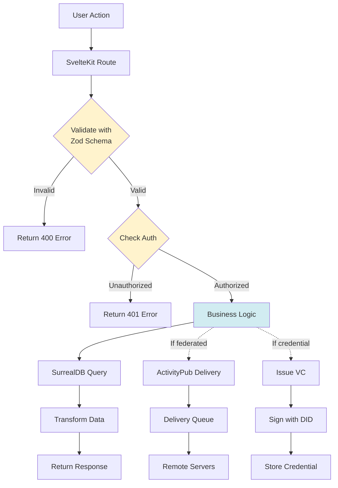
```mermaid
flowchart TB
    User[User Action]

    User --> Route[SvelteKit Route]
    Route --> Validate{Validate with<br/>Zod Schema}

    Validate -->|Invalid| Error[Return 400 Error]
    Validate -->|Valid| Auth{Check Auth}

    Auth -->|Unauthorized| Error401[Return 401 Error]
    Auth -->|Authorized| Business[Business Logic]

    Business --> DB[SurrealDB Query]
    DB --> Transform[Transform Data]
    Transform --> Response[Return Response]

    Business -.->|If federated| Federation[ActivityPub Delivery]
    Business -.->|If credential| VCIssue[Issue VC]

    Federation --> Queue[Delivery Queue]
    Queue --> Remote[Remote Servers]

    VCIssue --> Sign[Sign with DID]
    Sign --> Store[Store Credential]

    style Validate fill:#fff3cd
    style Auth fill:#fff3cd
    style Business fill:#d1ecf1
```

## Security Model

### 1. Authentication Layers

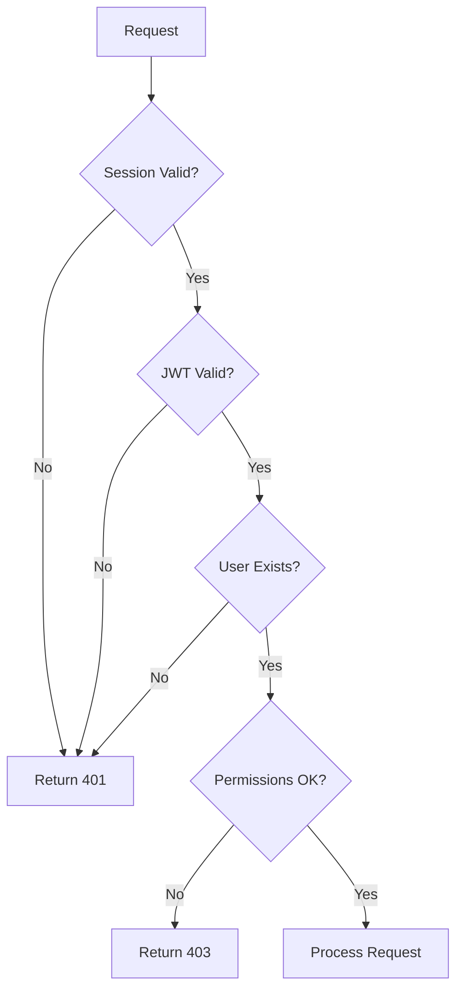
```mermaid
graph TD
    A[Request] --> B{Session Valid?}
    B -->|No| C[Return 401]
    B -->|Yes| D{JWT Valid?}
    D -->|No| C
    D -->|Yes| E{User Exists?}
    E -->|No| C
    E -->|Yes| F{Permissions OK?}
    F -->|No| G[Return 403]
    F -->|Yes| H[Process Request]
```

### 2. Federation Security

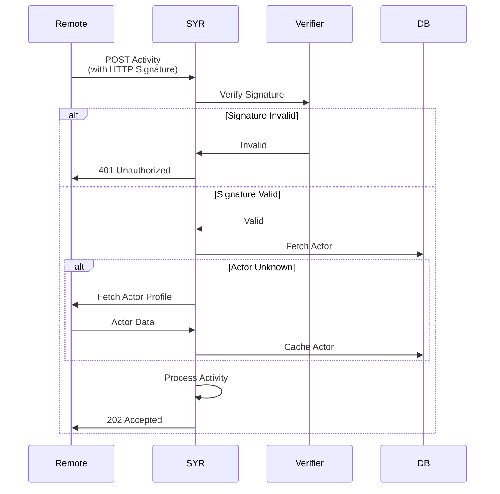
```mermaid
sequenceDiagram
    participant Remote
    participant SYR
    participant Verifier
    participant DB

    Remote->>SYR: POST Activity<br/>(with HTTP Signature)
    SYR->>Verifier: Verify Signature

    alt Signature Invalid
        Verifier->>SYR: Invalid
        SYR->>Remote: 401 Unauthorized
    else Signature Valid
        Verifier->>SYR: Valid
        SYR->>DB: Fetch Actor

        alt Actor Unknown
            SYR->>Remote: Fetch Actor Profile
            Remote->>SYR: Actor Data
            SYR->>DB: Cache Actor
        end

        SYR->>SYR: Process Activity
        SYR->>Remote: 202 Accepted
    end
```

### 3. Password Security

**Argon2id Configuration**

SYR uses Argon2id, the winner of the Password Hashing Competition, for password hashing:

- **Algorithm**: Argon2id (hybrid mode - resistant to both side-channel and GPU attacks)
- **Memory Cost**: 64 MiB (65536 KiB) - makes GPU cracking expensive
- **Time Cost**: 3 iterations - balances security and performance
- **Parallelism**: 4 threads - leverages multi-core CPUs
- **Output**: 32-byte hash with random salt

**Why Argon2id over bcrypt?**

- More resistant to GPU/ASIC attacks
- Configurable memory hardness
- Modern design (2015 vs bcrypt's 1999)
- OWASP recommended
- Native Rust bindings for Node.js (@node-rs/argon2) - extremely fast

## Package Architecture

```mermaid
graph TB
    subgraph "Monorepo Structure"
        subgraph "apps/"
            App[syr<br/>Main SvelteKit App]
        end

        subgraph "packages/"
            Types[types<br/>@syr-is/types<br/>Zod Schemas]
            SDK[syr-sdk<br/>@syr-is/sdk<br/>Integration Library]
        end
    end

    App --> Types
    SDK --> Types

    subgraph "External Consumers"
        ThirdParty[Third-party Services]
    end

    ThirdParty --> SDK
```

## Deployment Architecture

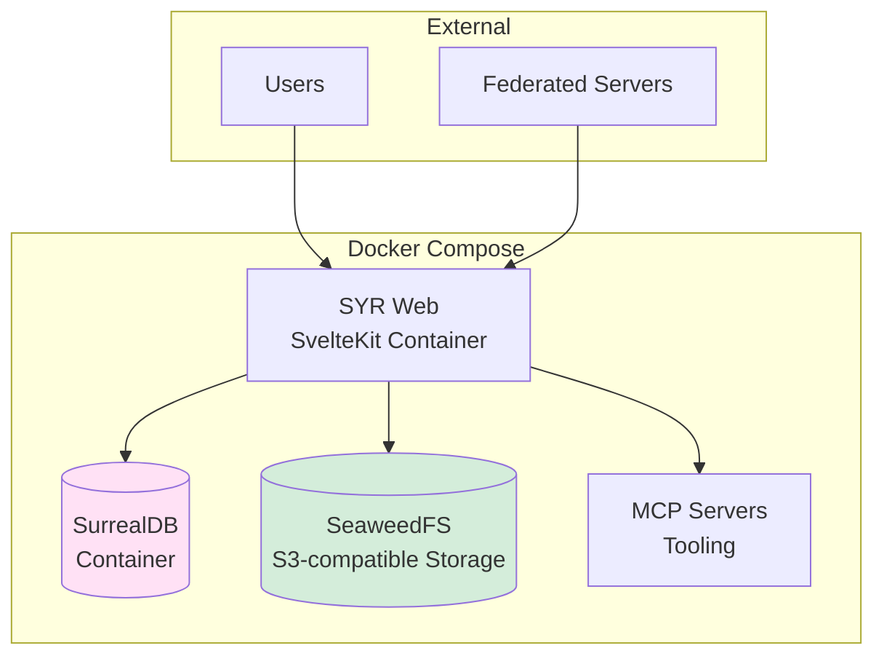
```mermaid
graph TB
    subgraph "Docker Compose"
        Web[SYR Web<br/>SvelteKit Container]
        DB[(SurrealDB<br/>Container)]
        S3[(SeaweedFS<br/>S3-compatible Storage)]
        MCP[MCP Servers<br/>Tooling]
    end

    subgraph "External"
        Users[Users]
        Federation[Federated Servers]
    end

    Users --> Web
    Federation --> Web
    Web --> DB
    Web --> S3
    Web --> MCP

    style DB fill:#ffe1f5
    style S3 fill:#d4edda
```

## Integration SDK Design

### SDK Usage Flow

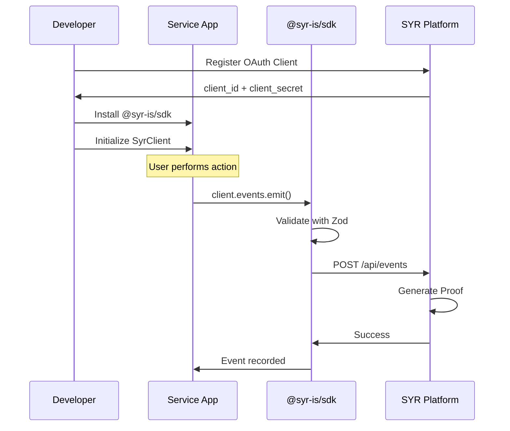
```mermaid
sequenceDiagram
    participant Dev as Developer
    participant Service as Service App
    participant SDK as @syr-is/sdk
    participant SYR as SYR Platform

    Dev->>SYR: Register OAuth Client
    SYR->>Dev: client_id + client_secret

    Dev->>Service: Install @syr-is/sdk
    Dev->>Service: Initialize SyrClient

    Note over Service: User performs action

    Service->>SDK: client.events.emit()
    SDK->>SDK: Validate with Zod
    SDK->>SYR: POST /api/events
    SYR->>SYR: Generate Proof
    SYR->>SDK: Success
    SDK->>Service: Event recorded
```

## Future Considerations

### Scalability

```mermaid
graph LR
    A[Current: Single Server] --> B[Phase 2: Load Balanced]
    B --> C[Phase 3: Microservices]
    C --> D[Phase 4: Edge Computing]

    style A fill:#d1ecf1
    style B fill:#fff3cd
    style C fill:#f8d7da
    style D fill:#d4edda
```

### Federation Network Effect

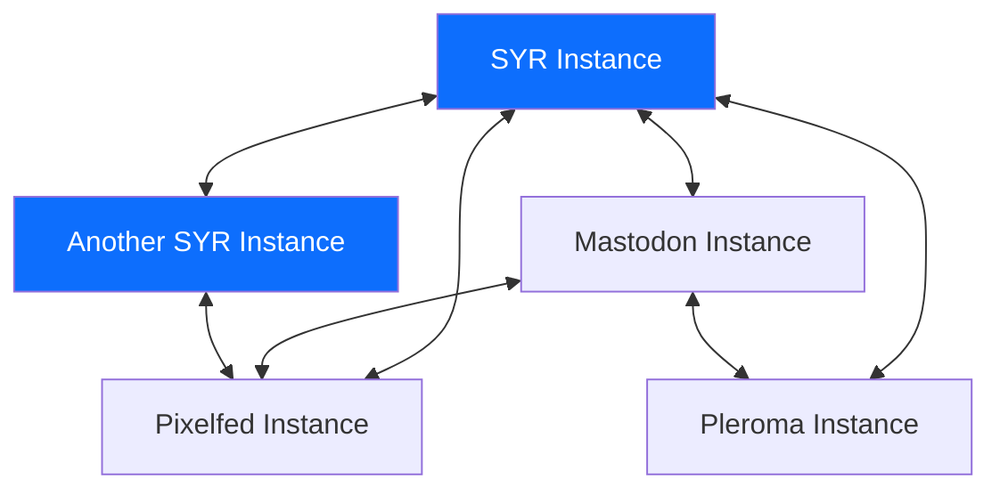
```mermaid
graph TD
    SYR[SYR Instance]
    M1[Mastodon Instance]
    M2[Pixelfed Instance]
    P1[Pleroma Instance]
    SYR2[Another SYR Instance]

    SYR <--> M1
    SYR <--> M2
    SYR <--> P1
    SYR <--> SYR2
    M1 <--> M2
    M1 <--> P1
    SYR2 <--> M2

    style SYR fill:#0d6efd,color:#fff
    style SYR2 fill:#0d6efd,color:#fff
```

## Implementation Phases

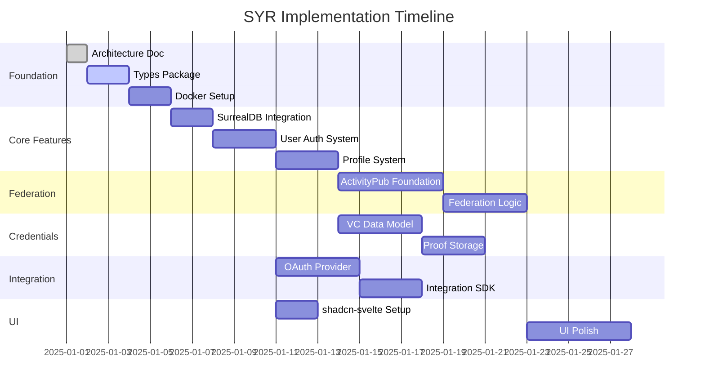
```mermaid
gantt
    title SYR Implementation Timeline
    dateFormat YYYY-MM-DD
    section Foundation
    Architecture Doc           :done, arch, 2025-01-01, 1d
    Types Package             :active, types, after arch, 2d
    Docker Setup              :docker, after types, 2d

    section Core Features
    SurrealDB Integration     :db, after docker, 2d
    User Auth System          :auth, after db, 3d
    Profile System            :profile, after auth, 3d

    section Federation
    ActivityPub Foundation    :ap, after profile, 5d
    Federation Logic          :fed, after ap, 4d

    section Credentials
    VC Data Model            :vc, after profile, 4d
    Proof Storage            :proof, after vc, 3d

    section Integration
    OAuth Provider           :oauth, after auth, 4d
    Integration SDK          :sdk, after oauth, 3d

    section UI
    shadcn-svelte Setup      :ui, after auth, 2d
    UI Polish                :polish, after fed, 5d
```

## Glossary

- **ActivityPub**: W3C standard for decentralized social networking
- **DID**: Decentralized Identifier - a portable, cryptographically verifiable identifier
- **did:web**: DNS-based DID method (e.g., `did:web:example.com`) - no blockchain required
- **VC**: Verifiable Credential - a tamper-evident credential in W3C format
- **VP**: Verifiable Presentation - a collection of VCs shared for verification
- **HTTP Signatures**: Authentication mechanism for ActivityPub federation
- **WebFinger**: Protocol for discovering information about people/resources
- **OAuth 2.0**: Industry-standard protocol for authorization
- **SurrealDB**: Multi-model database supporting document, graph, and relational models
- **SeaweedFS**: Distributed S3-compatible object storage for files, images, and media
- **Zod**: TypeScript-first schema validation library (v4)
- **MCP**: Model Context Protocol - enables AI tools to interact with development environment
- **SurrealMCP**: Official SurrealDB MCP server for database access from AI tools
- **Svelte MCP**: Official Svelte MCP server for component and route management

## References

- [ActivityPub Specification](https://www.w3.org/TR/activitypub/)
- [WebFinger RFC 7033](https://datatracker.ietf.org/doc/html/rfc7033)
- [W3C Verifiable Credentials Data Model 2.0](https://www.w3.org/TR/vc-data-model-2.0/)
- [W3C Decentralized Identifiers (DIDs)](https://www.w3.org/TR/did-core/)
- [OAuth 2.0 RFC 6749](https://datatracker.ietf.org/doc/html/rfc6749)
- [SurrealDB Documentation](https://surrealdb.com/docs)
- [SurrealMCP](https://surrealdb.com/mcp)
- [Svelte MCP](https://svelte.dev/docs/mcp/overview)
- [SeaweedFS Documentation](https://github.com/seaweedfs/seaweedfs)
- [Zod v4 Documentation](https://zod.dev)
- [Zod Codecs](https://zod.dev/codecs)
- [SYR Vision](https://www.syr.is/)
