# SYR Architecture

## Vision and Principles

The Self-Yield Representation (SYR) Project creates **sovereign identity on decentralized social infrastructure** where:

- **Identity is self-sovereign**: Users own cryptographic root identities managed by their SYR instance, exportable on demand
- **Posts are identity**: What you think and share is integral to who you are — posts travel with your identity
- **Communities define norms**: Cultural context travels with content, not algorithmic scores
- **Accountability is human**: Judgment rooted in human context, not engagement metrics
- **Discovery is organic**: People find each other through human connections, not feeds
- **Multi-tenancy is native**: A single instance can manage isolated identity pools for multiple organizations

## System Overview

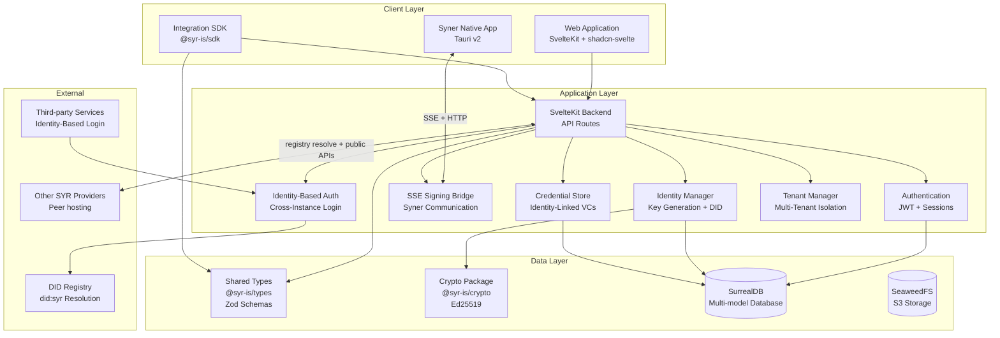

## DID Method: did:syr

SYR uses the **did:syr** method for decentralized identifiers:

- **Key-Anchored**: DIDs are derived from the root identity's Ed25519 public key
- **No Blockchain**: No dependency on blockchain infrastructure
- **Self-Sovereign**: Users control their identity through their cryptographic root key
- **Registry-Resolved**: `did:syr:<multibase-encoded-pubkey>` resolves via the SYR registry to find the user's current provider/instance
- **Portable**: Identity can migrate between SYR instances without changing the DID

**Why did:syr?**

- Fully sovereign (rooted in cryptographic keys you control)
- No centralized registries or blockchain fees
- Provider-portable — move between instances without losing identity
- Compatible with the SYR key hierarchy (root keys, delegated device keys, recovery keys)

## Core Components

### 1. Identity System

The identity system is the core of SYR. In the current phase, keys are **generated and managed server-side** by the SYR instance as a transitionary convenience. Users can explicitly export/offload their keys via the export-bundle endpoint. Once **Syner** (the native companion app) is available, Syner-managed identity becomes the canonical self-custody method, with server-managed keys remaining available for users who prefer managed hosting.

SurrealDB's native composite record IDs extend the identity model into the data layer. The `post` and `upload` tables use composite keys `{ created_by: DID, id: ULID }`, embedding the creator's DID in every record. This yields global uniqueness, portable identity (records survive migration with original IDs), direct ownership proof, and zero-conflict import/export across instances.

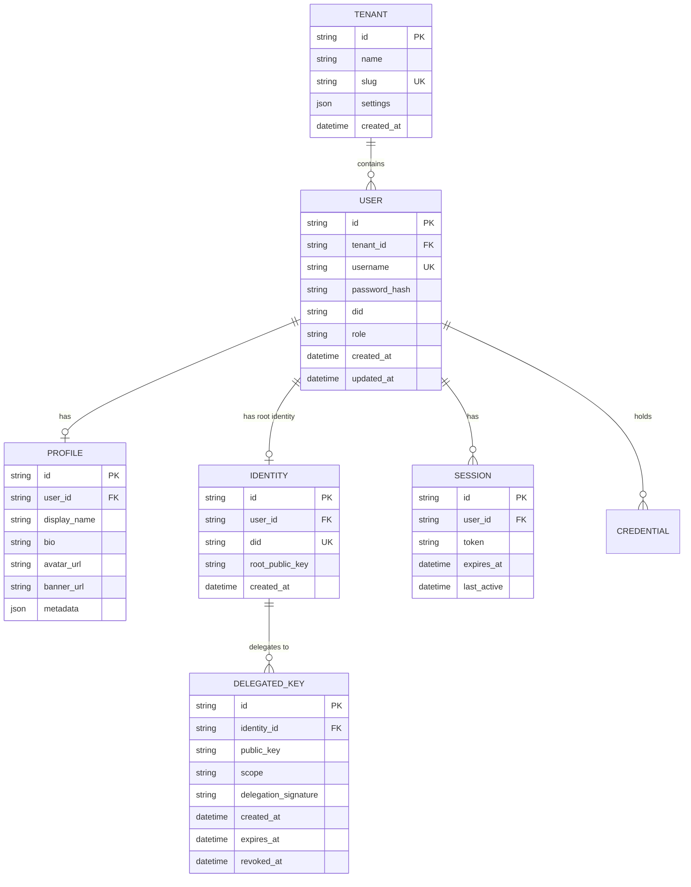

### 2. Cross-provider social (DID + registry + public APIs)

Users on one SYR instance can **follow** other identities by **`did:syr`** and read their **public** profiles and posts from the **author’s Syr instance**. Follow rows persist **`followed_provider_url`** (the provider base URL) after a **registry-verified** resolve at follow time (or after an explicit **refresh from registry**). The home timeline and Following page **fetch public APIs using that stored URL** so routine reads do not depend on discovery registries being reachable. **Legacy rows** without a stored URL fall back to resolving via registries in the browser.

**Manual provider URL override (guardrails):** Advanced users may **manually edit** the stored provider base URL on the Following page when registry data is wrong or a peer has moved. The UI treats this as an operational escape hatch: inputs are normalized to **http(s)** with **no userinfo**, bounded length, and trailing slashes stripped—but there is **no cryptographic proof** that the host matches the followed DID. Prefer **refresh from registry** whenever registries are trustworthy; treat manual overrides as “best effort” until the row is refreshed or re-followed. See _Follows, Discovery, and Home Timeline_ in the docs app.

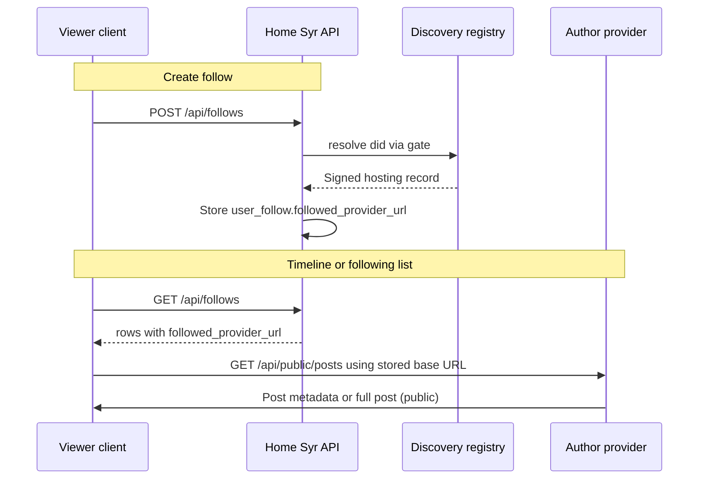

### 3. Verifiable Credentials

VCs in SYR are **credentials that others issue to you**, linked to your identity. They represent attestations like memberships, roles, KYC verifications, or qualifications that enrich your identity. VC exchange for platforms with specific credential requirements to join is planned for a future phase.

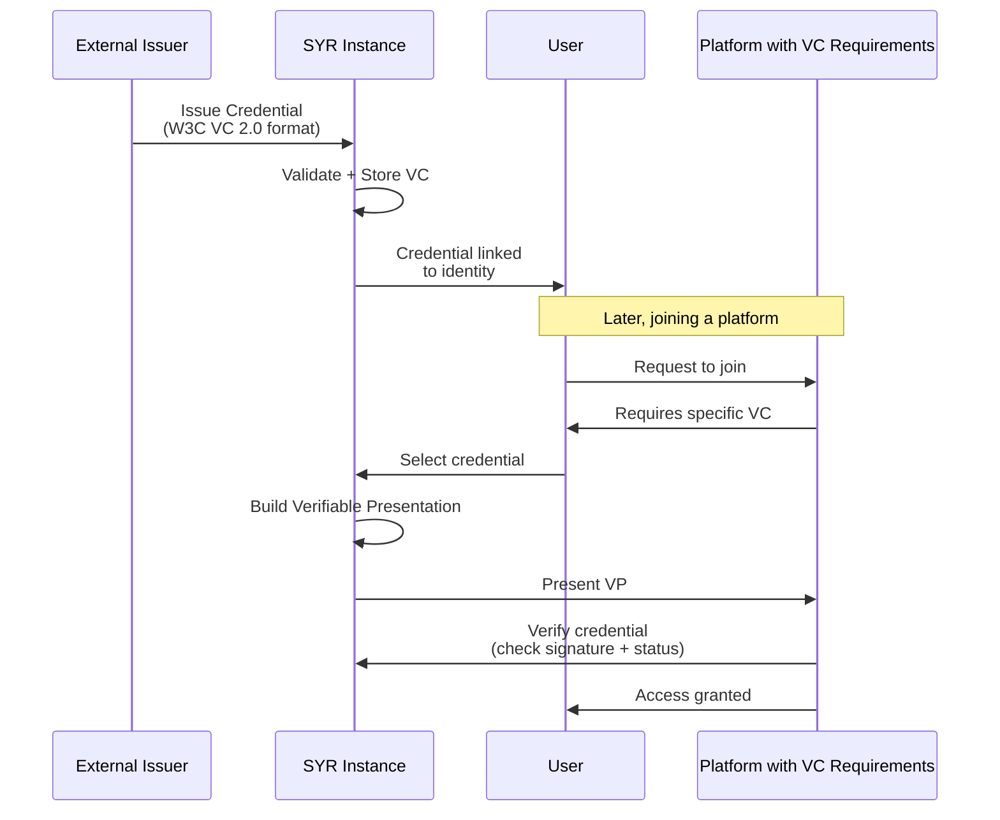

### 4. Verifiable Credentials Data Model

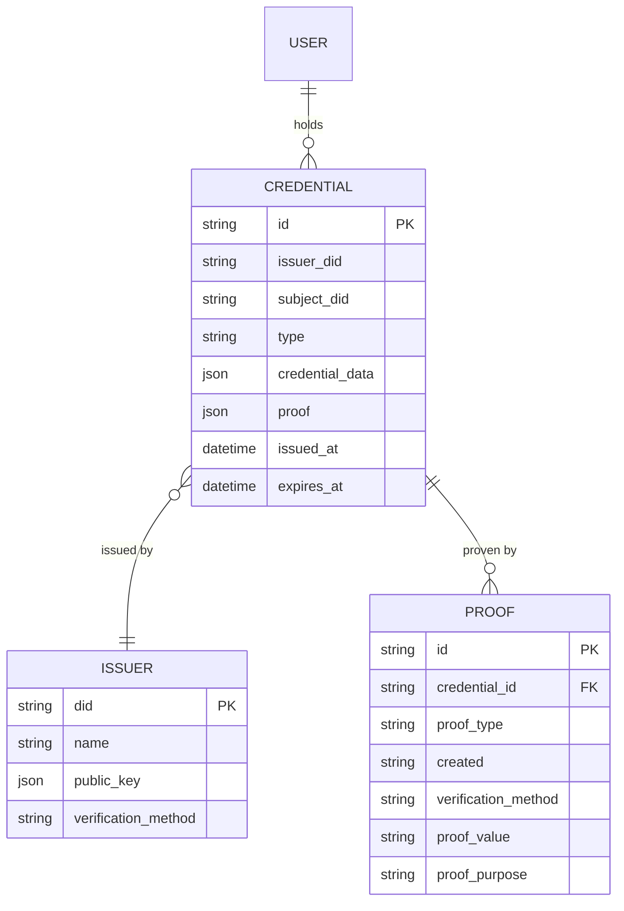

### 5. Identity-Based Login Flow

Third-party platforms authenticate users through their SYR instance. Instead of generic OAuth, users enter their instance name and username (or DID), which is resolved via the registry to locate their SYR instance.

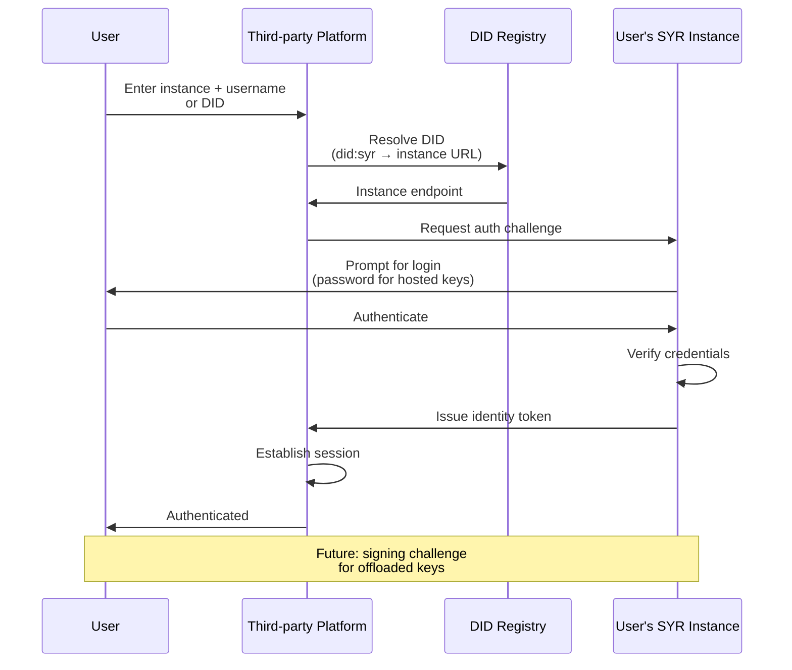

### 6. Identity-Based Auth Data Model

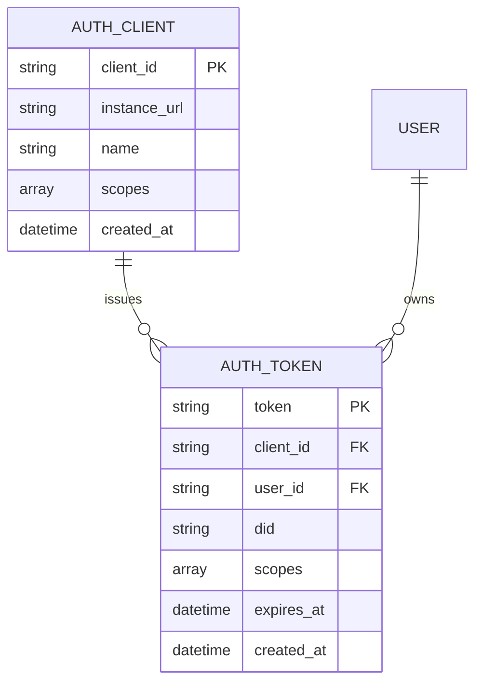

## Technology Stack

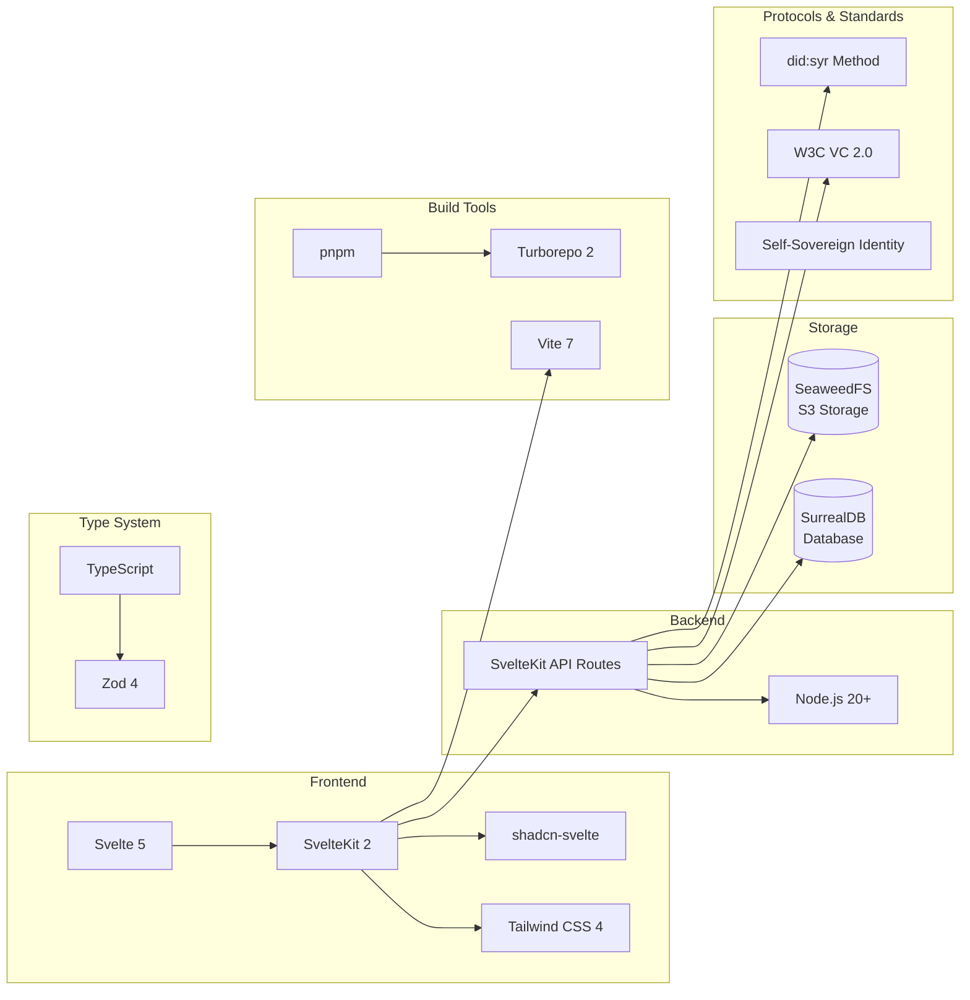

## Authentication & Authorization Flow

SYR uses username/password authentication for users with server-hosted keys. Sessions are managed via JWT tokens.

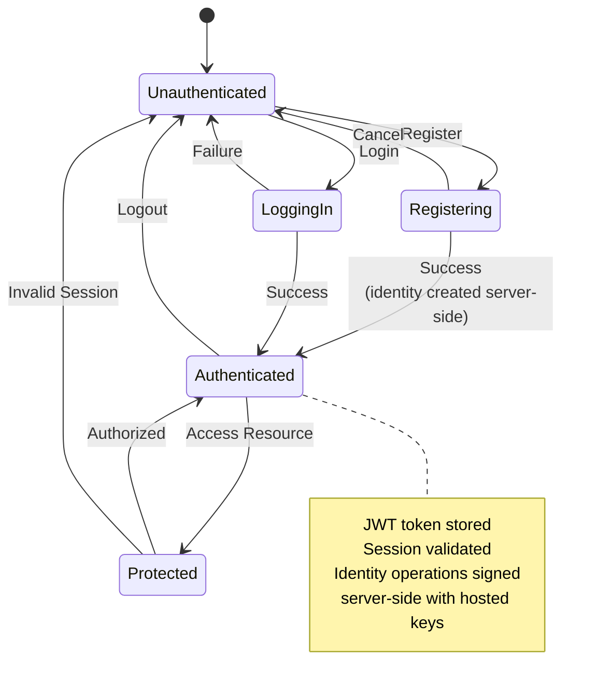

## Data Flow Architecture

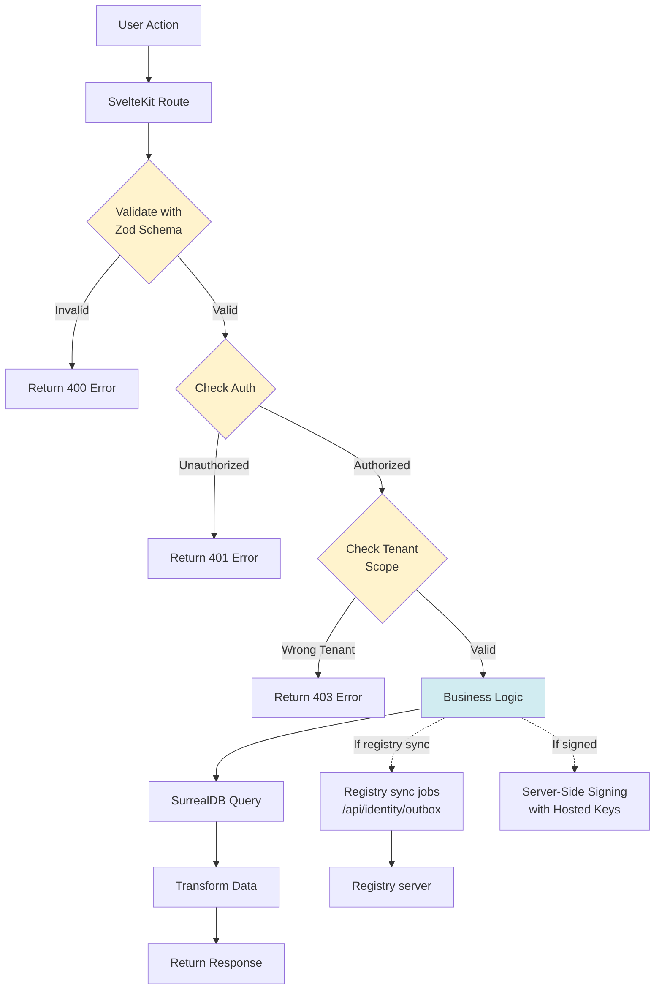

## Security Model

### 1. Authentication Layers

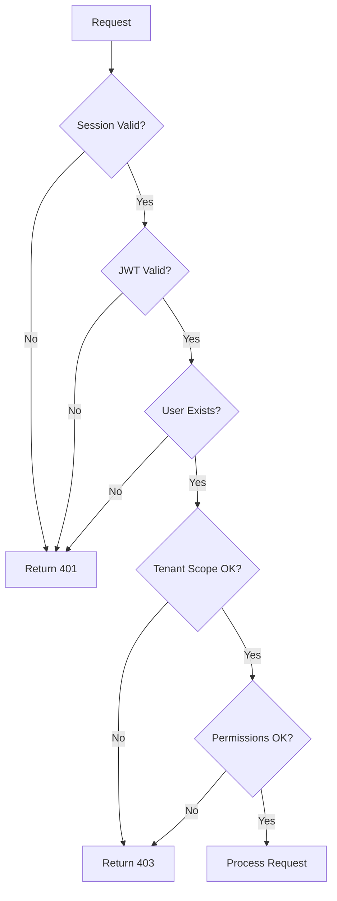

### 2. Cross-provider trust boundaries

When one instance or browser loads **another** provider’s public content:

- **Registry hosting records** are Ed25519-signed; the resolver verifies the signature before trusting `provider` URLs (`@syr-is/resolver`).
- **HTTPS** to peer providers is required in production; treat peer responses as **untrusted** at the HTTP layer (CORS, availability, and content limits apply on the client).
- **Signed profile and post mutations** (where implemented) establish cryptographic integrity of authored content; they are separate from transport trust.

There is no inbox protocol between instances for follows: visibility is **pull** via public endpoints using a **stored** provider base URL on the follow row (or registry resolution when no URL is stored / for discovery). **Manual** URL overrides are not registry-verified.

### 3. Password Security

**Argon2id Configuration**

SYR uses Argon2id, the winner of the Password Hashing Competition, for password hashing:

- **Algorithm**: Argon2id (hybrid mode - resistant to both side-channel and GPU attacks)
- **Memory Cost**: 64 MiB (65536 KiB) - makes GPU cracking expensive
- **Time Cost**: 3 iterations - balances security and performance
- **Parallelism**: 4 threads - leverages multi-core CPUs
- **Output**: 32-byte hash with random salt

**Why Argon2id over bcrypt?**

- More resistant to GPU/ASIC attacks
- Configurable memory hardness
- Modern design (2015 vs bcrypt's 1999)
- OWASP recommended
- Native Rust bindings for Node.js (@node-rs/argon2) - extremely fast

### 4. Key Management Security

- **Server-hosted keys (transitionary)**: Root identity keys are generated and stored server-side, encrypted at rest. This is a convenience for users who are not yet ready for self-custody.
- **Syner-managed keys (canonical, future)**: When Syner is available, keys are generated and stored in platform-native secure keystores (Keychain, DPAPI, libsecret, Android Keystore). The server never sees the private key.
- **Export-bundle**: Users can export their full identity (keys, posts, assets) as a portable zip for migration.
- **Audit trail**: All key operations (generation, delegation, export, revocation) are logged.
- **Delegated keys**: Device-specific keys can be delegated from the root key for multi-device access.

## Package Architecture

```mermaid
graph TB
    subgraph "Monorepo Structure"
        subgraph "apps/"
            App[syr<br/>Main SvelteKit App]
            RegistryApp[registry<br/>NestJS Registry API]
            Docs[docs<br/>Documentation Site]
            SynerApp[syner<br/>Tauri v2 Native App<br/>Future]
        end

        subgraph "packages/"
            Types[types<br/>@syr-is/types<br/>Zod Schemas]
            Crypto[crypto<br/>@syr-is/crypto<br/>Ed25519 Operations]
            DID[did<br/>@syr-is/did<br/>DID Method]
            Resolver[resolver<br/>@syr-is/resolver<br/>DID Resolution]
            SDK[syr-sdk<br/>@syr-is/sdk<br/>Integration Library]
        end
    end

    App --> Types
    App --> Crypto
    App --> DID
    RegistryApp --> Crypto
    SynerApp --> Crypto
    SynerApp --> Types
    Resolver --> Crypto
    Resolver --> DID
    SDK --> Types

    subgraph "External Consumers"
        ThirdParty[Third-party Services]
    end

    ThirdParty --> SDK
```

## Deployment Architecture

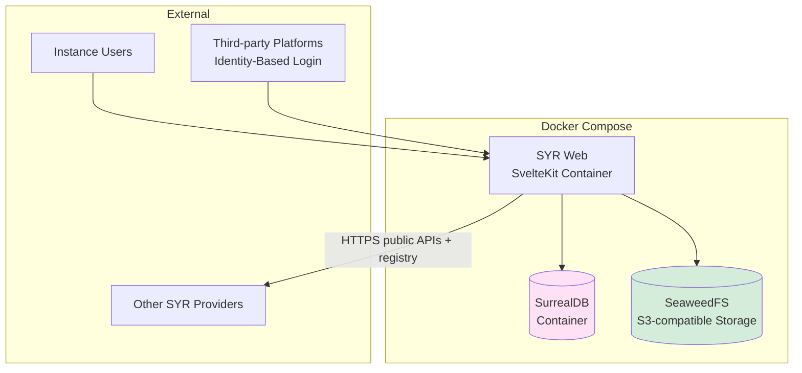

## Integration SDK Design

### SDK Usage Flow

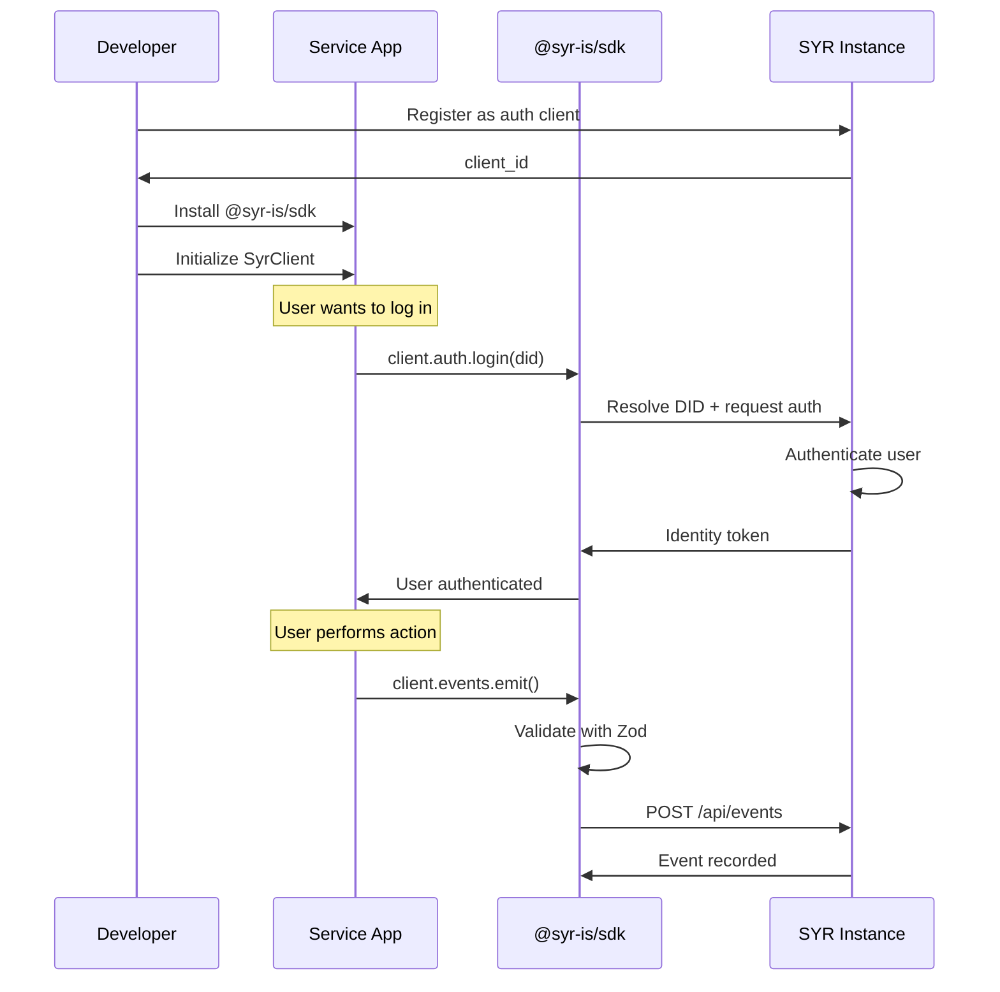

## Future Considerations

### Scalability


### Federation Network

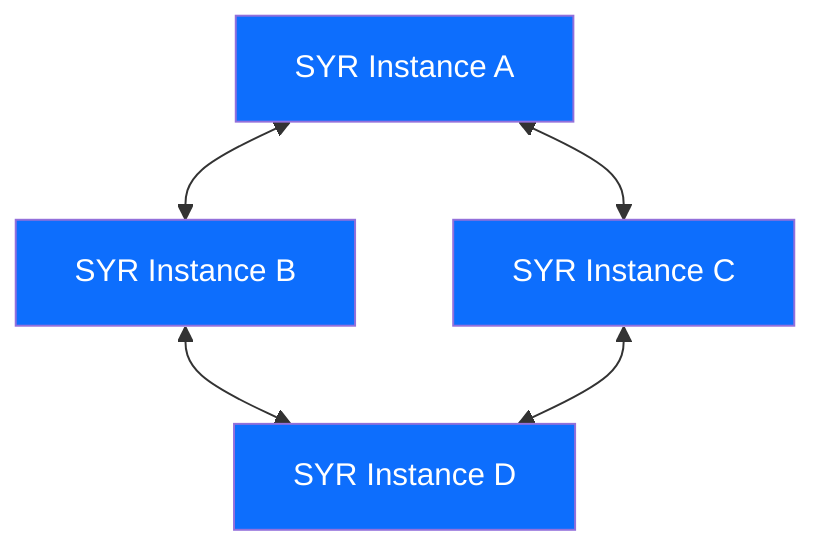

## Implementation Phases

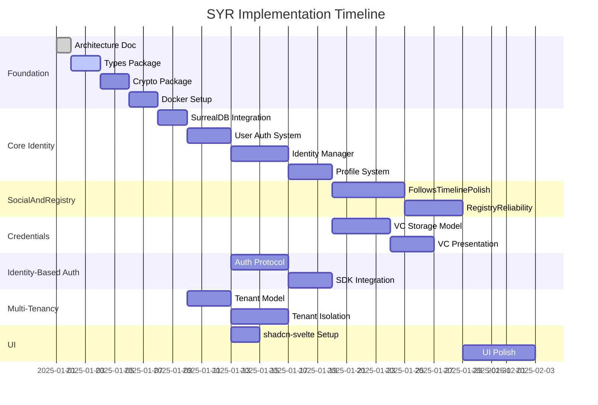

## Glossary

- **Self-Sovereign Identity (SSI)**: Identity model where the individual controls their own identity without relying on a central authority
- **DID**: Decentralized Identifier - a portable, cryptographically verifiable identifier
- **did:syr**: SYR's DID method — key-anchored, registry-resolved, provider-portable
- **Root Key**: Ed25519 keypair that anchors a user's identity — managed server-side, exportable on demand
- **Delegated Key**: Device-specific key authorized by the root key for multi-device access
- **VC**: Verifiable Credential - a credential others issue to you, linked to your identity (W3C VC 2.0 format)
- **VP**: Verifiable Presentation - a collection of VCs shared for verification when joining platforms
- **Identity-Based Login**: Authentication where users enter their SYR instance + username/DID to log into third-party platforms
- **Multi-Tenancy**: A single SYR instance managing isolated identity pools for multiple organizations
- **SurrealDB**: Multi-model database supporting document, graph, and relational models; native composite/object record IDs enable DID-anchored keys for `post` and `upload` tables
- **SeaweedFS**: Distributed S3-compatible object storage for files, images, and media
- **Zod**: TypeScript-first schema validation library (v4)

## References

- [W3C Decentralized Identifiers (DIDs)](https://www.w3.org/TR/did-core/)
- [W3C Verifiable Credentials Data Model 2.0](https://www.w3.org/TR/vc-data-model-2.0/)
- [SurrealDB Documentation](https://surrealdb.com/docs)
- [SeaweedFS Documentation](https://github.com/seaweedfs/seaweedfs)
- [Zod v4 Documentation](https://zod.dev)
- [SYR Vision](https://www.syr.is/)
