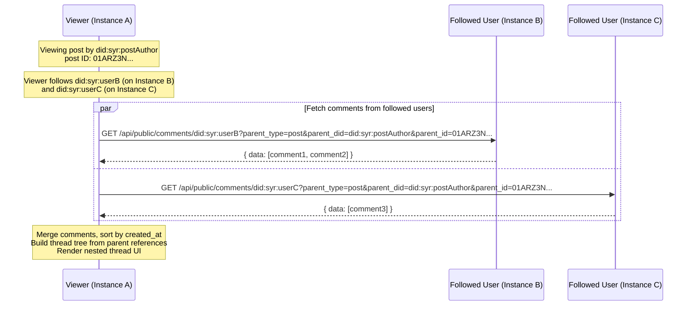

# Comments & Reactions (v1 specification)

## 1. Purpose and phase alignment

This document specifies **comments** and **reactions** for the Syr ecosystem. Comments enable threaded discussions on posts and other comments (Reddit-style infinite nesting). Reactions are emoji/sticker/GIF counters on posts and comments (Discord-style). Both are **self-sovereign**: stored on the author's own instance, discovered through the follow graph.

**Related specs**

- [Emoji & Sticker Store](/architecture/emoji-sticker-store) -- custom emojis and stickers used in comments and reactions.
- [GIF Store](/architecture/gif-store) -- self-hosted GIFs embeddable in comments and usable as reactions.
- [Follows, Discovery & Home Timeline](/architecture/follows-and-timeline) -- cross-instance content aggregation; comments/reactions follow the same per-provider fetch model.
- [Signed profile & post mutations](/architecture/signed-profile-post-mutations) -- comments and reactions support the same signed mutation envelope for cryptographic integrity.
- [Untrusted post content](/architecture/untrusted-post-content) -- comment content (markdown) is subject to the same sanitization pipeline.

---

## 2. Goals and non-goals

### 2.1 Goals

- **Threaded comments**: A comment's parent is either a `post:&#123;did, ulid&#125;` or another `comment:&#123;did, ulid&#125;`, enabling arbitrarily nested (Reddit-style) threads.
- **Self-sovereign storage**: Comments and reactions are stored on the **commenter's/reactor's** instance, not the post author's. The commenter owns their data.
- **Follow-graph scoped**: When viewing a post, the client fetches comments/reactions from **followed users' instances** only. No global comment aggregation.
- **Full markdown content**: Comments support the same markdown rendering as blog posts (headings, lists, code blocks, links, images) plus inline `:emoji:` and `::sticker::` shortcodes.
- **Reactions with any emoji/sticker/GIF**: Users can react with any emoji, custom sticker, or GIF from the instance or personal stores. Reactions are grouped and counted.
- **Visibility system**: Comments mirror posts: `draft` | `completed` status, `public` | `unlisted` | `private` visibility.
- **Signed mutations**: Comments and reactions support the same signed mutation envelope as posts for cryptographic verification.
- **Composite record IDs**: `comment:{ created_by: did, id: ulid }` and `reaction:{ created_by: did, id: ulid }` -- portable, zero-conflict.

### 2.2 Non-goals (v1)

- Global comment aggregation (fetching comments from all instances, not just followed users).
- Comment moderation tools on the post author's instance (the post author has no control over comments stored on other instances).
- Real-time comment streaming (WebSocket/SSE); v1 uses polling or manual refresh.
- Comment voting/scoring (no upvotes/downvotes in v1).
- Rich embeds in comments (link previews, video embeds) beyond images and GIFs.

---

## 3. Data model

### 3.1 Comment

```text
Comment {
  id: composite (comment:{ created_by: did, id: ulid })
  parent_type: 'post' | 'comment'
  parent_did: string                // DID of the parent entity's author
  parent_id: string                 // ULID of the parent entity
  ancestor_chain: string[]          // ordered chain from root comment to immediate parent
  content: string                   // markdown text with emoji shortcodes
  status: 'draft' | 'completed'
  visibility: 'public' | 'unlisted' | 'private'
  created_at, updated_at
  content_signature?: string
  signed_payload_json?: string
  signing_device_public_key?: string
}
```

**Parent reference**: The `(parent_type, parent_did, parent_id)` tuple uniquely identifies the parent entity across instances. This is used for cross-instance querying: "give me all comments by this DID whose parent is `post:{did},{ulid}`".

**Ancestor chain**: The `ancestor_chain` array preserves the full path from the root comment down to the immediate parent. Each entry is a `"{did}:{local_id}"` string. Root comments (parent_type=post) have an empty chain. When a comment replies to another comment, its chain is the parent's chain plus the parent itself.

This enables correct thread reconstruction even when intermediate comments are deleted or unavailable (author not followed). The viewer walks the chain backwards to find the nearest available ancestor and inserts placeholders for missing nodes, preserving the thread hierarchy.

### 3.2 Reaction

```text
Reaction {
  id: composite (reaction:{ created_by: did, id: ulid })
  parent_type: 'post' | 'comment'
  parent_did: string
  parent_id: string
  kind: 'unicode' | 'custom_emoji' | 'sticker' | 'gif'
  value: string                     // Unicode char(s) for 'unicode', shortcode for custom_emoji/sticker/gif
  image_url?: string                // resolved image URL for custom_emoji/sticker/gif (absent for unicode)
  created_at, updated_at
  content_signature?: string
  signed_payload_json?: string
  signing_device_public_key?: string
}
```

**One reaction per user per parent per value**: A user can only have one reaction of a given value on a given parent. Adding the same reaction again is idempotent; adding a different reaction is allowed (multiple distinct reactions per user).

---

## 4. API

### 4.1 Authenticated (comment owner's instance)

```text
POST   /api/comments                           -- create comment
GET    /api/comments                           -- list own comments (paginated)
GET    /api/comments/[did]/[id]                -- get specific comment
PATCH  /api/comments/[did]/[id]                -- update comment content/status/visibility
DELETE /api/comments/[did]/[id]                -- delete comment

POST   /api/reactions                          -- toggle reaction (create or remove)
DELETE /api/reactions/[did]/[id]               -- delete reaction
```

### 4.2 Public (cross-instance reads)

```text
GET /api/public/comments/[did]?parent_type={post|comment}&parent_did={did}&parent_id={ulid}&limit={n}&offset={n}
```

Returns all **public + completed** comments by `[did]` for the specified parent. This is the core cross-instance query. The viewer calls this for each followed DID to collect comments on a post.

An alternative convenience form accepts `post_did` and `post_id` to fetch all comments in a post's thread (root comments on the post plus all comment-type replies by this DID):

```text
GET /api/public/comments/[did]?post_did={did}&post_id={ulid}&limit={n}&offset={n}
```

```json
{
	"status": "success",
	"data": [
		{
			"did": "did:syr:z6Mk...",
			"local_id": "01ARZ3N...",
			"content": "Great post! :party_parrot:",
			"parent_type": "post",
			"parent_did": "did:syr:z6Mk...",
			"parent_id": "01ARZ3N...",
			"ancestor_chain": [],
			"visibility": "public",
			"status": "completed",
			"created_at": "2026-04-09T12:00:00Z",
			"updated_at": "2026-04-09T12:00:00Z",
			"content_signature": null,
			"signed_payload_json": null,
			"signing_device_public_key": null
		}
	],
	"pagination": { "limit": 50, "offset": 0, "total": 1, "has_more": false }
}
```

```text
GET /api/public/reactions/[did]?parent_type={post|comment}&parent_did={did}&parent_id={ulid}&limit={n}&offset={n}
```

Returns all reactions by `[did]` for the specified parent.

```json
{
	"status": "success",
	"data": [
		{
			"did": "did:syr:z6Mk...",
			"local_id": "01ARZ3N...",
			"parent_type": "post",
			"parent_did": "did:syr:z6Mk...",
			"parent_id": "01ARZ3N...",
			"kind": "custom_emoji",
			"value": "party_parrot",
			"image_url": "https://...",
			"created_at": "2026-04-09T12:00:00Z"
		}
	],
	"pagination": { "limit": 50, "offset": 0, "total": 1, "has_more": false }
}
```

---

## 5. Cross-instance comment discovery



### 5.1 Manifest-based endpoint discovery

Before fetching comments or reactions, the viewer resolves each followed DID's endpoint URLs from their **identity manifest** at `/.well-known/syr/&#123;did&#125;`:

```json
{
	"endpoints": {
		"public_comments": "https://instance-b.example/api/public/comments/did:syr:userB",
		"public_reactions": "https://instance-b.example/api/public/reactions/did:syr:userB",
		"public_emojis": "https://instance-b.example/api/public/emojis/did:syr:userB",
		"profile": "https://instance-b.example/api/public/profile/did:syr:userB"
	}
}
```

Clients **must** prefer manifest-discovered URLs over hardcoded path assumptions. Manifests are cached per-DID with a short TTL. If the manifest is unavailable, clients may fall back to constructing URLs from the provider base URL using the standard path patterns.

### 5.2 Fetching strategy

1. The viewer knows their **follow list** (DIDs + provider URLs).
2. For each followed DID, resolve endpoint URLs from their identity manifest.
3. For the current post, query each followed DID's `public_comments` endpoint for comments on that post.
4. Responses are merged client-side, sorted by `created_at`, and organized into a thread tree by parent references.
5. **Nested replies** are fetched iteratively: after root comments are collected, replies to those comments are fetched from all followed DIDs, then replies to replies, up to a reasonable depth limit.
6. **Reactions** follow the same self-sovereign pattern: for each followed DID, resolve their `public_reactions` endpoint from the identity manifest, query with `parent_type`, `parent_did`, `parent_id` filters. Merge and group client-side by `(kind, value)` to produce counters.
7. **Reaction tooltips** show the list of reactors (username@instance) with links to their profile pages, resolved from the `profile` manifest endpoint.
8. **Author profiles** are fetched from each commenter's `profile` endpoint for display (avatar, username).
9. **Emojis** are resolved from each author's `public_emojis` endpoint for shortcode rendering.
10. **No local aggregation**: there is no server-side endpoint that aggregates reactions from multiple instances. All aggregation happens client-side from the follow graph.

### 5.3 Thread tree construction

Given a flat list of comments from multiple instances:

1. Comments whose parent is the post itself are **root-level** comments.
2. Comments whose parent is another comment are nested under that parent.
3. **Orphan comments** (parent missing — deleted or not followed) use their `ancestor_chain` to find the nearest available ancestor in the tree. The viewer walks the chain backwards; the first ancestor found in the fetched set becomes the attachment point.
4. **Placeholders** are inserted for each missing node in the gap between the found ancestor and the orphan, preserving the full thread depth. Placeholders display the unavailable author's DID as a discoverable link.
5. If no ancestor is found at all, the orphan is attached to a root-level placeholder for its immediate parent.

---

## 6. Comment content format

### 6.1 Markdown

Comments use the same markdown pipeline as blog posts:

- Headings, bold, italic, strikethrough
- Links, images (including GIFs via ``)
- Code blocks (inline and fenced)
- Blockquotes, lists (ordered/unordered)
- Tables

### 6.2 Emoji and sticker shortcodes

- `:shortcode:` for inline emojis (rendered at text line height).
- `::shortcode::` for stickers (rendered as larger block-level images).
- Resolution follows the [Emoji & Sticker Store](/architecture/emoji-sticker-store) shortcode resolution order.

### 6.3 Sanitization

Comment content is sanitized using the same pipeline as post content:

- HTML tags stripped or allowed per content trust rules.
- `javascript:` URLs rejected.
- Image URLs subject to content trust (remote media may require consent).

---

## 7. Reaction display

### 7.1 Grouping

Reactions on a post/comment are grouped by `(kind, value)` and displayed as a row of counters:

```text
[party_parrot: 3] [thumbsup: 5] [heart: 2]
```

Each counter shows the emoji/sticker/GIF image and the count of distinct users who reacted with that value.

### 7.2 Interaction

- Clicking a reaction counter **toggles** the viewer's own reaction (add if not present, remove if already reacted with that value).
- A **"+"** button opens the emoji/sticker/GIF picker to add a new reaction type.
- The viewer's own reactions are highlighted.

### 7.3 Cross-instance reaction aggregation

Reactions from followed users are fetched per-instance (same pattern as comments), then merged and grouped client-side. The total count includes reactions from all followed users.

---

## 8. Signed mutations

### 8.1 Comment signed payload

```json
{
	"type": "comment@v1",
	"did": "did:syr:z6Mk...",
	"comment_id": "01ARZ3N...",
	"post_did": "did:syr:z6Mk...",
	"post_id": "01ARZ3N...",
	"ancestor_chain": [],
	"content": "Great post!",
	"visibility": "public",
	"status": "completed",
	"created_at": "2026-04-09T12:00:00Z"
}
```

### 8.2 Reaction signed payload

```json
{
	"type": "reaction@v1",
	"did": "did:syr:z6Mk...",
	"parent_type": "post",
	"parent_did": "did:syr:z6Mk...",
	"parent_id": "01ARZ3N...",
	"kind": "custom_emoji",
	"value": "party_parrot",
	"created_at": "2026-04-09T12:00:00Z"
}
```

---

## 9. Uniqueness constraints

### 9.1 Reactions

One reaction per user per value per parent is enforced: `(author_id, parent_type, parent_did, parent_id, kind, value)` must be unique. Adding the same reaction again is a toggle (removes it).
