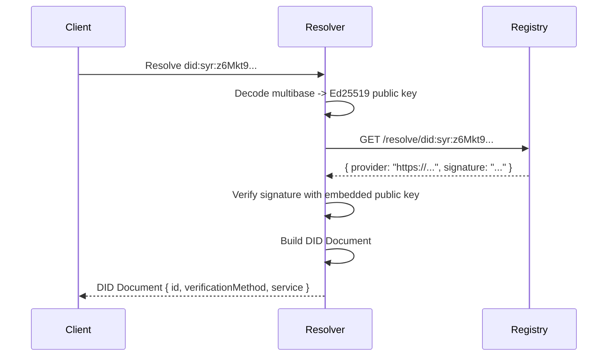

# did:syr Method Specification v0.1

## 1. Overview

The **did:syr** method defines a decentralized identifier for the Syr identity
protocol.

It provides:

- self-sovereign, key-anchored identity
- provider portability via registry resolution
- compatibility with institutional attestations
- traceability for OAuth actions

This document specifies:

- DID syntax
- resolution algorithm
- DID document structure
- update and migration semantics
- security requirements

---

## 2. DID Syntax

### 2.1 Method name

```
did:syr
```

---

### 2.2 Method-specific identifier

```
did:syr:<id>
```

Where:

- `<id>` is the **multibase-encoded Ed25519 public key** of the root identity.
- Encoding MUST use **base58btc multibase**.

Example:

```
did:syr:z6Mkt9…abc
```

---

## 3. Root Identity Binding

The DID is **cryptographically bound** to:

- the Ed25519 public key embedded in the identifier.

Therefore:

- No external registry is required to verify **ownership**.
- Registries are used only for **service discovery**.

---

## 4. DID Resolution

### 4.1 Resolution output

Resolving a `did:syr` MUST return a **DID Document**.

---

### 4.2 Resolution steps

Given:

```
did:syr:<publicKey>
```

Resolver MUST:

1. Decode multibase → obtain Ed25519 public key.
2. Query Syr **registry** for latest hosting record.
3. Construct DID Document using:
   - embedded public key
   - registry-discovered services.



---

## 5. DID Document Structure

A resolved document MUST contain:

```json
{
	"id": "did:syr:...",
	"verificationMethod": [
		{
			"id": "#root",
			"type": "Ed25519VerificationKey2020",
			"controller": "did:syr:...",
			"publicKeyMultibase": "z..."
		}
	],
	"authentication": ["#root"],
	"assertionMethod": ["#root"],
	"service": [
		{
			"id": "#provider",
			"type": "SyrIdentityProvider",
			"serviceEndpoint": "https://provider.example"
		}
	]
}
```

---

## 6. Registry Interaction

### 6.1 Purpose

Registry maps:

```
did:syr → current provider endpoint
```

---

### 6.2 Update authorization

Registry updates MUST:

- include a payload signed by the **root private key**
- be rejected if signature verification fails.

Registry operators:

- **cannot impersonate identities**
- **cannot forge migrations**

---

### 6.3 Minimal hosting record

```json
{
	"did": "did:syr:...",
	"provider": "https://example.org",
	"updatedAt": "...",
	"signature": "..."
}
```

---

## 7. Migration Semantics

Migration occurs when:

- root identity signs a new hosting record
- registry accepts update
- future resolutions return new provider.

Migration MUST NOT:

- change DID identifier
- invalidate past signatures
- break attestations.

---

## 8. Key Rotation (future)

v0.1 assumes:

- root key is stable.

Future versions MAY support:

- rotation via signed key update chain
- recovery mechanisms
- multi-sig guardians.

---

## 9. Security Model

### 9.1 Trust anchor

**Only the root private key** controls:

- identity ownership
- provider migration
- authentication signatures.

---

### 9.2 Registry compromise

If registry is compromised:

- attacker cannot forge signatures
- attacker may censor or delay resolution only.

Mitigations are future work.

---

### 9.3 Provider compromise

If provider is compromised:

- attacker cannot move identity
- cannot sign as root identity.

---

## 10. OAuth Binding

When used with OAuth:

- `sub` MUST equal the **did:syr identifier**.
- Providers MUST NOT substitute usernames or database IDs.

This guarantees **portable accountability**.

---

## 11. Privacy Considerations

Because DID embeds a public key:

- identity is globally correlatable.
- pairwise or blinded identifiers are future work.

---

## 12. Versioning

**Version:** v0.1  
**Status:** Draft  
**Scope:** Minimal viable DID method for Syr identity portability.
