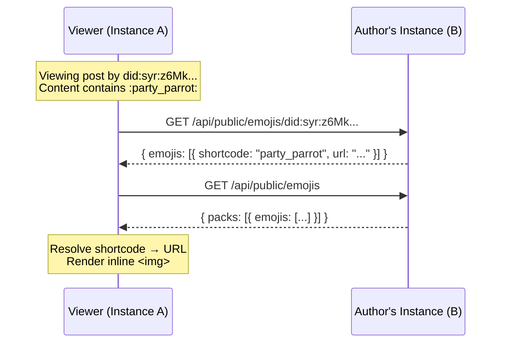

# Emoji & Sticker Store (v1 specification)

## 1. Purpose and phase alignment

This document specifies a **self-hosted custom emoji and sticker system** for Syr instances. Custom emojis and stickers are first-class media assets that can be used in **comments**, **reactions**, and **markdown content** across the ecosystem.

Both **instance-wide** packs (managed by admins) and **per-user** custom emojis are supported. Custom emojis are **discoverable cross-instance** via public APIs, meaning a user on instance A can see and use custom emojis from instance B when viewing content authored by users on that instance.

**Related specs**

- [Comments & Reactions](/architecture/comments-reactions) -- emoji/sticker usage in comments and reactions.
- [GIF Store](/architecture/gif-store) -- self-hosted animated image library, complementary to stickers.
- [Follows, Discovery & Home Timeline](/architecture/follows-and-timeline) -- cross-instance content aggregation.
- [Untrusted post content](/architecture/untrusted-post-content) -- sanitization rules apply to emoji URLs in rendered content.

---

## 2. Goals and non-goals

### 2.1 Goals

- **Instance emoji packs**: Admins can create, manage, and organize emoji/sticker packs for all users on the instance.
- **Per-user custom emojis**: Users can upload personal custom emojis stored in their DID-namespaced storage.
- **Shortcode syntax**: Emojis are referenced in markdown/text via `:shortcode:` syntax (e.g., `:party_parrot:`). Stickers use `::shortcode::` (double-colon) for larger inline display.
- **Cross-instance discovery**: Public API exposes instance and user emoji catalogs so remote viewers can resolve shortcodes to image URLs.
- **Multiple formats**: Support static images (PNG, WebP, SVG) and animated formats (GIF, APNG, animated WebP).
- **Reactions**: Any emoji or sticker can be used as a reaction on posts or comments.

### 2.2 Non-goals (v1)

- Emoji search/discovery across the entire network (only within followed users and their instances).
- Animated sticker packs with frame-by-frame editing tools.
- Emoji marketplace or cross-instance pack importing (users can manually re-upload).
- Unicode emoji rendering customization (standard Unicode emojis use the OS/browser renderer).

---

## 3. Data model

### 3.1 Emoji pack (instance-level)

```
EmojiPack {
  id: RecordId                    // auto-generated
  name: string                    // e.g., "Party Animals"
  slug: string                    // URL-safe identifier, unique per instance
  description?: string
  created_by: RecordId            // admin user who created it
  created_at, updated_at
}
```

### 3.2 Emoji (instance or user)

```
Emoji {
  id: RecordId (emoji:{ created_by: did, id: ulid })
  shortcode: string               // unique within scope (pack or user), alphanumeric + underscores
  image_url: string               // URL to the emoji image (SeaweedFS)
  image_key: string               // S3 object key
  mime_type: string               // image/png, image/gif, image/webp, image/svg+xml, image/apng
  width?: number                  // intrinsic width in pixels
  height?: number                 // intrinsic height in pixels
  file_size: number               // bytes
  is_sticker: boolean             // true = larger display (sticker), false = inline emoji
  pack_id?: RecordId              // if part of an instance pack (null = user personal emoji)
  author_id: RecordId             // user who uploaded
  created_at, updated_at
}
```

### 3.3 Shortcode resolution order

When rendering `:shortcode:` in content authored by a DID:

1. **Author's personal emojis** -- check the content author's custom emojis on their instance.
2. **Author's instance packs** -- check all packs on the author's instance.
3. **Viewer's instance packs** -- fallback to the viewer's own instance packs.
4. **Not found** -- render the literal `:shortcode:` text.

For cross-instance resolution, the viewer's client fetches the author's emoji catalog from the author's instance via the public API.

---

## 4. Storage layout

### 4.1 Instance emojis

```text
emojis/instance/{pack_slug}/{shortcode}.{ext}
```

Stored in the instance's S3 bucket under a dedicated prefix, **not** under any user's DID namespace. Admin-managed.

### 4.2 User emojis

```text
uploads/{did}/emojis/{shortcode}.{ext}
```

Stored under the user's DID-namespaced storage, following the existing upload key pattern. Counts toward the user's storage quota.

---

## 5. Public API

### 5.1 Instance emoji catalog

```
GET /api/public/emojis
```

Returns all instance packs and their emojis. No authentication required.

```json
{
	"packs": [
		{
			"name": "Party Animals",
			"slug": "party-animals",
			"emojis": [{ "shortcode": "party_parrot", "url": "https://...", "is_sticker": false }]
		}
	]
}
```

### 5.2 User emoji catalog

```
GET /api/public/emojis/{did}
```

Returns personal custom emojis for a specific DID. No authentication required.

```json
{
	"did": "did:syr:z6Mkt...",
	"emojis": [{ "shortcode": "my_cat", "url": "https://...", "is_sticker": false }]
}
```

### 5.3 Authenticated management

```
GET    /api/emojis                     -- list user's personal emojis
POST   /api/emojis                     -- upload a new personal emoji
DELETE /api/emojis/[did]/[id]          -- delete a personal emoji
GET    /api/admin/emojis/packs         -- list instance packs (admin)
POST   /api/admin/emojis/packs         -- create pack (admin)
DELETE /api/admin/emojis/packs/[slug]  -- delete pack (admin)
POST   /api/admin/emojis/packs/[slug]  -- add emoji to pack (admin)
DELETE /api/admin/emojis/packs/[slug]/[shortcode] -- remove emoji from pack (admin)
```

---

## 6. Shortcode format

- **Pattern**: `[a-zA-Z0-9_]+`, 2--32 characters.
- **Case-insensitive** matching but stored in original case.
- **Uniqueness**: Within a pack, shortcodes are unique. Within a user's personal emojis, shortcodes are unique. Cross-pack collisions are resolved by pack priority (admin-configurable ordering).

---

## 7. Formats

Allowed MIME types for emoji and sticker images: `image/png`, `image/gif`, `image/webp`, `image/apng`, `image/svg+xml`.

Storage management (quotas, limits, capacity budgeting) is an implementation concern and not defined by this specification.

---

## 8. Rendering

### 8.1 Inline emoji

`:shortcode:` renders as an inline `` element sized to match surrounding text line height (typically 1.2em--1.5em). The `alt` attribute contains the shortcode for accessibility.

### 8.2 Sticker (large)

`::shortcode::` renders as a block-level or large inline image (up to 128px or 256px depending on context). Used primarily in comments and chat-like contexts.

### 8.3 Content trust

Emoji image URLs are subject to the same **content trust** rules as other remote media. Viewers can configure whether to auto-load images from remote instances or require explicit consent per the [untrusted post content](/architecture/untrusted-post-content) spec.

---

## 9. Cross-instance flow



The viewer caches emoji catalogs per-instance with a short TTL (e.g., 5 minutes) to avoid repeated fetches.
