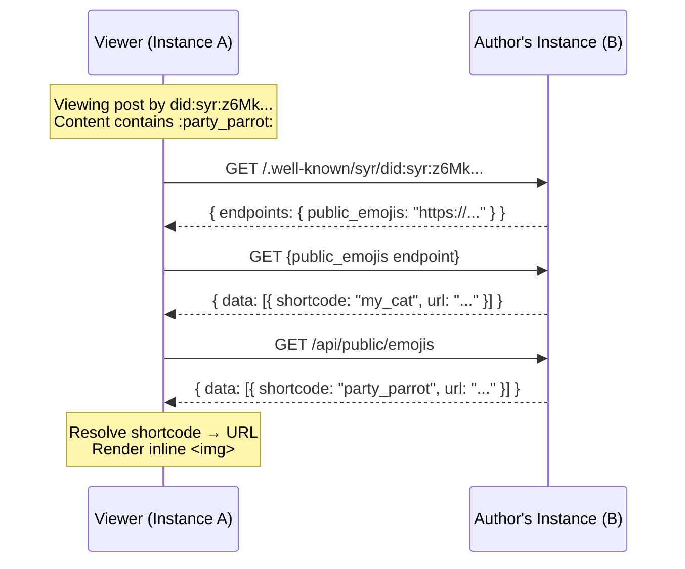

# Emoji & Sticker Store (v1 specification)

## 1. Purpose and phase alignment

This document specifies a **self-hosted custom emoji and sticker system** for Syr instances. Custom emojis and stickers are first-class media assets that can be used in **comments**, **reactions**, and **markdown content** across the ecosystem.

Both **instance-wide** emojis (managed by admins) and **per-user** custom emojis are supported. Custom emojis are **discoverable cross-instance** via public APIs, meaning a user on instance A can see and use custom emojis from instance B when viewing content authored by users on that instance.

**Related specs**

- [Comments & Reactions](/architecture/comments-reactions) -- emoji/sticker usage in comments and reactions.
- [GIF Store](/architecture/gif-store) -- self-hosted animated image library, complementary to stickers.
- [Follows, Discovery & Home Timeline](/architecture/follows-and-timeline) -- cross-instance content aggregation.
- [Untrusted post content](/architecture/untrusted-post-content) -- sanitization rules apply to emoji URLs in rendered content.

---

## 2. Goals and non-goals

### 2.1 Goals

- **Instance emojis**: Admins can manage a flat catalog of emojis and stickers available to all users on the instance.
- **Per-user custom emojis**: Users can create personal custom emojis from their uploaded media.
- **Shortcode syntax**: Emojis are referenced in markdown/text via `:shortcode:` syntax (e.g., `:party_parrot:`). Stickers use `::shortcode::` (double-colon) for larger block-level display.
- **Unicode emoji support**: Pickers include standard unicode emojis alongside custom emojis for use in comments and reactions.
- **Cross-instance discovery**: Public API exposes instance and user emoji catalogs so remote viewers can resolve shortcodes to image URLs.
- **Multiple formats**: Support static images (PNG, WebP, SVG) and animated formats (GIF, APNG, animated WebP).
- **Reactions**: Any emoji (unicode or custom) or sticker can be used as a reaction on posts or comments.

### 2.2 Non-goals (v1)

- Emoji search/discovery across the entire network (only within followed users and their instances).
- Animated sticker packs with frame-by-frame editing tools.
- Emoji marketplace or cross-instance pack importing (users can manually re-upload).

---

## 3. Data model

### 3.1 Emoji

```text
Emoji {
  id: composite (emoji:{ created_by: did, id: ulid })
  shortcode: string               // alphanumeric + underscores, 2-32 chars
  url: string                     // absolute URL to the emoji image
  mime_type: string               // image/png, image/gif, image/webp, image/svg+xml, image/apng
  size: number                    // bytes
  is_sticker: boolean             // true = larger block display (sticker), false = inline emoji
  scope: 'instance' | 'user'     // instance = shared, user = personal
  created_at, updated_at
}
```

### 3.2 Shortcode resolution order

When rendering `:shortcode:` in content authored by a DID:

1. **Author's personal emojis** -- check the content author's custom emojis on their instance.
2. **Author's instance emojis** -- check the instance-wide emojis on the author's instance.
3. **Viewer's instance emojis** -- fallback to the viewer's own instance catalog.
4. **Not found** -- render the literal `:shortcode:` text.

For cross-instance resolution, the viewer's client fetches the author's emoji catalog from the author's instance via the public API.

---

## 4. Public API

### 4.1 Instance emoji catalog

```text
GET /api/public/emojis
```

Returns all instance-scope emojis as a flat array. No authentication required.

```json
{
	"status": "success",
	"data": [
		{
			"shortcode": "party_parrot",
			"url": "https://...",
			"is_sticker": false,
			"did": "did:syr:z6Mk...",
			"local_id": "01ARZ3N..."
		},
		{
			"shortcode": "blob_wave",
			"url": "https://...",
			"is_sticker": false,
			"did": "did:syr:z6Mk...",
			"local_id": "01ARZ3M..."
		}
	]
}
```

### 4.2 User emoji catalog

```text
GET /api/public/emojis/[did]
```

Returns personal custom emojis for a specific DID. No authentication required.

```json
{
	"status": "success",
	"data": [
		{
			"shortcode": "my_cat",
			"url": "https://...",
			"is_sticker": false,
			"did": "did:syr:z6Mk...",
			"local_id": "01ARZ3N..."
		}
	]
}
```

---

## 5. Shortcode format

- **Pattern**: `[a-zA-Z0-9_]+`, 2--32 characters.
- **Case-insensitive** matching but stored in original case.
- **Uniqueness**: Within instance emojis, shortcodes are unique. Within a user's personal emojis, shortcodes are unique. Cross-scope collisions are resolved by the resolution order in section 3.2.
- **Duplicate handling**: When multiple emojis share a shortcode across scopes, the first match wins. Subsequent matches are accessible via suffixed shortcodes (e.g., `:party_parrot~1:`).

---

## 6. Formats

Allowed MIME types for emoji and sticker images: `image/png`, `image/gif`, `image/webp`, `image/apng`, `image/svg+xml`.

Storage management (quotas, limits, capacity budgeting) is an implementation concern and not defined by this specification.

---

## 7. Rendering

### 7.1 Inline emoji

`:shortcode:` renders as an inline `` element sized to match surrounding text line height (typically 1.2em--1.5em). The `alt` attribute contains the shortcode for accessibility.

The regex for matching inline emojis must use negative lookbehind and lookahead to avoid matching sticker syntax: `(?<!:):([a-zA-Z0-9_~+-]+):(?!:)`.

### 7.2 Sticker (large)

`::shortcode::` renders as a block-level image (up to 128px). Used in comments and chat-like contexts. Custom stickers use `` tags; unicode stickers render the character at a larger font size (e.g., 3rem).

### 7.3 Unicode emojis

Standard unicode emojis are inserted directly as characters (not shortcodes). They render using the OS/browser emoji font. In reactions, unicode emojis use `kind: 'unicode'` with the character as the `value`.

### 7.4 Content trust

Emoji image URLs are subject to the same **content trust** rules as other remote media. Viewers can configure whether to auto-load images from remote instances or require explicit consent per the [untrusted post content](/architecture/untrusted-post-content) spec.

---

## 8. Cross-instance flow



The viewer caches emoji catalogs per-instance with a short TTL (e.g., 5 minutes) to avoid repeated fetches. The promise-based caching pattern (store the in-flight promise, not the result) prevents duplicate concurrent requests.

### 8.1 Manifest discovery

Emoji catalog endpoints are advertised in the per-identity manifest at `/.well-known/syr/{did}`:

```json
{
	"endpoints": {
		"public_emojis": "https://instance.example/api/public/emojis/did:syr:z6Mk..."
	}
}
```

And in the instance manifest at `/.well-known/syr`:

```json
{
	"api": {
		"public_emojis": "https://instance.example/api/public/emojis"
	}
}
```

Clients **must** prefer manifest-discovered URLs over hardcoded path assumptions.
