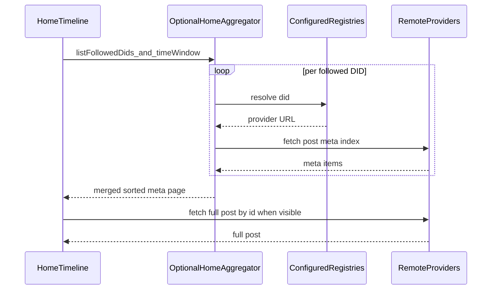

# Follows, Discovery, and Home Timeline

## 1. Purpose and phase alignment

This specification describes **follow relationships**, **discovery** of other users, and a **home timeline** that aggregates posts from followed identities across Syr providers.

It is **beyond Phase 0**. [Phase 0](/implementation/phase-0-blueprint) intentionally excludes social features; this document targets a later phase once identity correctness and signed content ([signed profile/post mutations](/architecture/signed-profile-post-mutations)) are in place.

**Related specs**

- [Registry Protocol](/architecture/registry-protocol) — DID → provider resolution.
- [Identity lifecycle (simplified)](/architecture/identity-lifecycle-simplified) — one DID, one root key; migration instead of rotation.
- [Signed profile/post mutations](/architecture/signed-profile-post-mutations) — integrity of posts shown in feeds.

---

## 2. Goals and non-goals

### 2.1 Goals

- **Follows** keyed only by **`did:syr`** (canonical follow target).
- **Discovery** limited to identities that appear **listed on at least one registry** the viewer has **manually configured** on the client (or equivalent user-controlled registry list).
- **Home timeline** for the logged-in user: merged view of posts from **followed** identities, loading **post metadata** first and **full posts** on demand as the user scrolls.
- Clear **ordering** and **pagination** semantics for a virtualized list.
- UI expectation: use Svelte **await blocks** (or equivalent) for async loads (meta batches, full post fetch, media).

### 2.2 Non-goals (v1 of this spec)

- ActivityPub or other federation protocols.
- Global search without registry or provider participation.
- Trust scoring, moderation, or recommendation algorithms.
- Mandatory server-side aggregation (optional optimization; see §8).

---

## 3. Canonical identity for a follow

- The **follow target** is always a normalized **`did:syr:...`** string.
- **Username** and **display name** are routing and search hints only; a follow is **not** stored against those identifiers.
- **Normalization**: use the canonical DID string as produced by `did:syr` parsing (see [did:syr method](/architecture/did-method)); reject malformed DIDs.
- **Self-follow**: product choice — typically allowed or ignored; document in implementation (dedupe by DID).
- **Duplicate follow**: reject or idempotent accept; implementation must not create multiple follow rows for the same `(follower, followed_did)` pair.

---

## 4. “Followable” and registry gating

### 4.1 Definition

A DID is **followable from this client** only if it is **publicly listed** on at least one registry in the **viewing user’s configured registry list**:

- For a candidate DID, the client (or trusted home API) performs `GET {registryBase}/resolve/{did}` (see [resolver flow](/architecture/registry-protocol)).
- If the response is a **valid hosting record** (signature verifies per registry protocol), the DID is **listed** on that registry.
- **Union across registries**: if the user configured multiple registry URLs, listing on **any** of them satisfies “listed.”

### 4.2 Edge cases

- **Valid DID syntax** but **404 / not found** on all configured registries → **not followable** from this client; UI explains that the user is not found on the viewer’s registries.
- **Unreachable registry** → treat as transient error; do not imply the DID is unlisted globally.
- Registry gating is a **product and discovery rule**, not a cryptographic proof that only those users exist; anyone may add arbitrary registry URLs.

---

## 5. Discovery UX (routes and search)

### 5.1 Profile entry routes

- **`u/<username>`** — resolve to a user profile by **local username** on a provider (after the viewer knows which provider to ask, or via a future search/directory).
- **`u/<did>`** — profile entry by DID. The path segment **must be URL-encoded** (e.g. `:` → `%3A`) so the DID is a single path parameter.

### 5.2 Resolution order for `u/<param>`

To avoid ambiguity between usernames and DIDs:

1. If `<param>` parses as a **valid `did:syr`** after decoding → treat as **DID**.
2. Else treat as **username** (provider-local resolution rules apply).

Implementations should document any reserved username patterns that could collide with DID-like strings.

### 5.3 Search (target contract — not implemented)

The **registry API** today supports **resolve-by-DID** only; there is **no** directory or search in the reference registry service yet. This spec compares **options**; **Syr product direction: Option A** (the registry should act as the directory/search surface for opted-in identities).

| Option                        | Description                                                                                                                                                                     |
| ----------------------------- | ------------------------------------------------------------------------------------------------------------------------------------------------------------------------------- |
| **A — Registry directory**    | Registry exposes search (e.g. by username, display name, DID prefix) for **opted-in** public directory entries. Requires privacy model, indexing, and signed directory records. |
| **B — Provider-local search** | Each Syr instance exposes `GET {provider}/api/public/...` search after DID resolution; clients fan out only when narrowed.                                                      |
| **C — No global search**      | Discovery via direct links, QR, `u/...`, and pasted DIDs only — no registry directory API.                                                                                      |

**Chosen direction:** **A** — implement directory + search on the **registry**; the Syr web app queries each of the user’s configured registry URLs and merges results (see implementation plan).

---

## 6. Data stored for follows

Minimum fields (logical model):

| Field                            | Description                                                  |
| -------------------------------- | ------------------------------------------------------------ |
| `follower_user_id` or equivalent | Local account that follows.                                  |
| `followed_did`                   | Canonical `did:syr:...`.                                     |
| `created_at`                     | When the follow was created.                                 |
| Optional `source_registry`       | Which registry URL was used to confirm listing (audit / UX). |

**Persistence**: **Server-persisted** on the user’s Syr instance is recommended so follows sync across devices; local-only cache is a weaker alternative (document tradeoffs: no multi-device, loss on clear data).

---

## 7. Home timeline architecture

### 7.1 High-level flow

### 7.2 Meta pull and merge

- For each followed DID, resolve **provider base URL** via registry, then request a **post meta** index for a **time window** (e.g. recent N days or cursor-based).
- **Merge** all meta rows into a **single timeline** ordered by **`created_at` descending** (server-issued timestamps on meta).
- Use a **k-way merge** or min-heap over per-author streams so global order stays correct when each author paginates independently.
- **Cursors**: **per-followed-DID cursors** are recommended (robust under uneven post rates). A single global cursor is simpler but can skew ordering.

### 7.3 Full post fetch

- When a row enters (or nears) the **viewport** in a **virtual scroll** list, fetch the **full post** from the resolved provider.
- Requests should be **idempotent**; failures surface **per row** (retry, error state).

### 7.4 Consistency and tie-breakers

- Sort key: **`created_at`** from the **author’s provider** on meta and full payload.
- **Tie-breaker**: `(followed_did, post_composite_id)` lexicographic order so ordering is stable.

---

## 8. Aggregation location (implementation choice)

| Approach                   | Pros                                                                                      | Cons                                                                 |
| -------------------------- | ----------------------------------------------------------------------------------------- | -------------------------------------------------------------------- |
| **Pure client**            | No new server routes; simple mental model.                                                | CORS, many parallel requests, secrets stay in browser patterns only. |
| **Home-server aggregator** | Single place for registry resolution, rate limits, optional caching; can run server-side. | New API surface and operational cost.                                |

The spec does not mandate one; pick before implementation and document in the app.

---

## 9. Provider and public API contracts (targets)

Today, **posts are authenticated** for the owner; **public read** of others’ posts requires **new** endpoints or **capability-scoped** tokens. Target shapes (illustrative names, version under `/api/public/v1/...` or similar):

| Endpoint                                              | Purpose                                                                                                          |
| ----------------------------------------------------- | ---------------------------------------------------------------------------------------------------------------- |
| `GET .../public/users/by-username/:name`              | Resolve username → `{ did }` or 404.                                                                             |
| `GET .../public/users/:did/profile`                   | Minimal public profile card.                                                                                     |
| `GET .../public/users/:did/posts/meta?before=&limit=` | Lightweight rows: `post_id`, `created_at`, title snippet, `has_media`, etc.                                      |
| `GET .../public/posts/:did/:id`                       | Full post + media references + [signature fields](/architecture/signed-profile-post-mutations) for verification. |

Cross-cutting: **rate limits**, **CORS** for browser clients, **Cache-Control** for meta vs full body.

---

## 10. UI — virtual scroll and await blocks

- Use **Svelte await blocks** (or promise-bound components) for:
  - initial timeline **meta** load;
  - **infinite scroll** / older page chunks;
  - **per-row** full post fetch;
  - **media** loads where appropriate.
- **Virtual list**: use a virtualizer with **stable row keys** `(followed_did, post_id)` so order does not jump when async work completes out of order.
- **Skeletons / spinners**: place holders to reduce **layout shift** when meta arrives before full content.

---

## 11. Security and privacy

- Following someone does **not** grant access to private data; only **public** (or capability-gated) resources defined by each provider.
- **Signed posts/profiles**: verifiers use **DID → public key** and the stored **signature** over the canonical payload (see [verification UI](/architecture/signature-verification-ui)).
- **Session auth** authorizes **writes** on the home instance; **signatures** provide **integrity and attribution** for content.

---

## 12. Implementation checklist (post-approval)

- [ ] Follows storage (DB) and CRUD API (`followed_did`, uniqueness, optional registry provenance).
- [ ] `u/<username>` and `u/<did>` routes and resolution rules.
- [ ] Registry-gated follow action (client or server validation).
- [ ] Search (if not option C): registry and/or provider endpoints.
- [ ] Public post meta + full post endpoints on Syr providers.
- [ ] Home page: replace “copy of own posts” with **timeline** virtual list + meta/full pipeline.
- [ ] Resolver usage from browser vs server for timeline aggregation.
- [ ] Integrate [signature verification](/architecture/signature-verification-ui) in post rows where signatures are exposed.

---

## 13. Open decisions before coding

1. Search strategy: **A**, **B**, **C**, or hybrid.
2. Follow persistence: confirmed **server** vs local-only.
3. Timeline aggregation: **client** vs **home-server aggregator**.
4. Final URL paths and JSON shapes for **meta** and **full post** public APIs.
