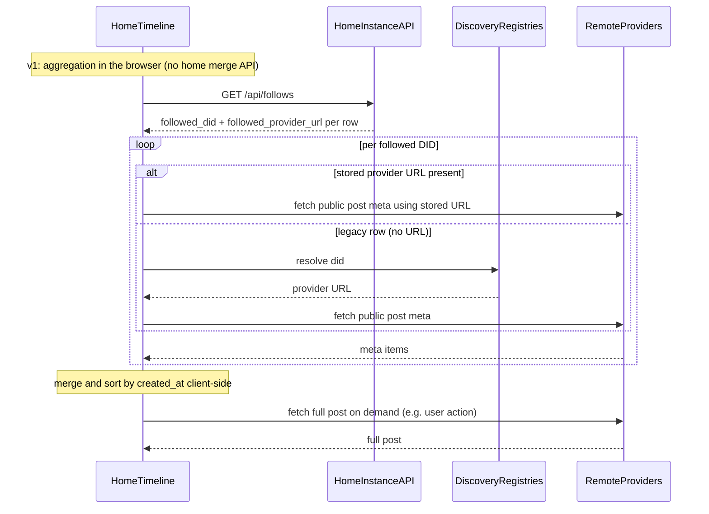

# Follows, Discovery, and Home Timeline

## 1. Purpose and phase alignment

This specification describes **follow relationships**, **discovery** of other users, and a **home timeline** that aggregates posts from followed identities across Syr providers.

It is **beyond Phase 0**. [Phase 0](/implementation/phase-0-blueprint) intentionally excludes social features; this document targets a later phase once identity correctness and signed content ([signed profile/post mutations](/architecture/signed-profile-post-mutations)) are in place.

**Related specs**

- [Registry Protocol](/architecture/registry-protocol) — DID → provider resolution.
- [Identity lifecycle (simplified)](/architecture/identity-lifecycle-simplified) — one DID, one root key; migration instead of rotation.
- [Signed profile/post mutations](/architecture/signed-profile-post-mutations) — integrity of posts shown in feeds.
- [Profile stories (v1)](/architecture/profile-stories) — ephemeral public story reels, UTC storage layout, `GET /api/public/stories/{did}`, home tray + viewer (spec; implementation planned).

---

## 2. Goals and non-goals

### 2.1 Goals

- **Follows** keyed only by **`did:syr`** (canonical follow target).
- **Discovery** limited to identities that appear **listed on at least one registry** in the viewer’s **discovery registry list** (Settings → Discovery), which is **separate** from publication registries (where the viewer’s own DID is registered).
- **Home timeline** for the logged-in user: merged view of posts from **followed** identities, loading **post metadata** first and **full posts** on demand as the user scrolls.
- Clear **ordering** and **pagination** semantics for a virtualized list.
- UI expectation: use Svelte **await blocks** (or equivalent) for async loads (meta batches, full post fetch, media).

### 2.2 Non-goals (v1 of this spec)

- Third-party federation protocols (e.g. fediverse-style inbox/outbox standards).
- Global search without registry or provider participation.
- Trust scoring, moderation, or recommendation algorithms.
- Server-side timeline aggregation on the home instance (out of scope for v1; see §9).

---

## 3. Canonical identity for a follow

- The **follow target** is always a normalized **`did:syr:...`** string.
- **Username** and **display name** are routing and search hints only; a follow is **not** stored against those identifiers.
- **Normalization**: use the canonical DID string as produced by `did:syr` parsing (see [did:syr method](/architecture/did-method)); reject malformed DIDs.
- **Self-follow**: product choice — typically allowed or ignored; document in implementation (dedupe by DID).
- **Duplicate follow**: reject or idempotent accept; implementation must not create multiple follow rows for the same `(follower, followed_did)` pair.
- **Username display**: Remote users are shown as `username@instance.host` to disambiguate identities across providers. Local users use `@username`.
- **Provider param**: Third-party sites linking to `/u/{did}?provider={origin}` or `/follow?target_did={did}&provider={origin}` specify where to fetch the identity's data. When `provider` is given, the instance skips local lookup and fetches from that provider directly. See [Follow on Syr](/implementer-guide/follow-on-syr).

---

## 4. Publication vs discovery registries

Syr keeps two **independent** per-user concepts:

- **Publication registries** (`identity_registry` in the app DB): where **this account’s DID** is registered, synced, and listed for others. These drive outbox jobs (`registry_sync`) and “where I’m hosted” updates.
- **Discovery registries** (`discovery_registry`): registry base URLs the **account** trusts for **directory search** and **follow gating** (whether someone else’s DID resolves with a valid hosting record). This set can be a **subset**, a **superset**, or **disjoint** from publication registries.

UI: **Settings → Identity** manages publication; **Settings → Discovery** manages the discovery list.

---

## 5. “Followable” and registry gating

### 5.1 Definition

A DID is **followable from this client** only if it is **publicly listed** on at least one registry in the **viewing user’s discovery registry list** (not necessarily the same as where the viewer publishes their own DID):

- For a candidate DID, the client (or trusted home API) performs `GET {registryBase}/resolve/{did}` (see [resolver flow](/architecture/registry-protocol)).
- If the response is a **valid hosting record** (signature verifies per registry protocol), the DID is **listed** on that registry.
- **Union across registries**: if the user configured multiple discovery registry URLs, listing on **any** of them satisfies “listed.”

### 5.2 Edge cases

- **Valid DID syntax** but **404 / not found** on all discovery registries → **not followable** from this client; UI explains that the user is not found on the viewer’s discovery registries.
- **Unreachable registry** → treat as transient error; do not imply the DID is unlisted globally.
- Registry gating is a **product and discovery rule**, not a cryptographic proof that only those users exist; anyone may add arbitrary registry URLs.

---

## 6. Discovery UX (routes and search)

### 6.1 Profile entry routes

- **`u/<username>`** — resolve to a user profile by **local username** on a provider (after the viewer knows which provider to ask, or via a future search/directory).
- **`u/<did>`** — profile entry by DID. The path segment **must be URL-encoded** (e.g. `:` → `%3A`) so the DID is a single path parameter.

### 6.2 Resolution order for `u/<param>`

To avoid ambiguity between usernames and DIDs:

1. If `<param>` parses as a **valid `did:syr`** after decoding → treat as **DID**.
2. Else treat as **username** (provider-local resolution rules apply).

Implementations should document any reserved username patterns that could collide with DID-like strings.

### 6.3 Search (registry directory)

**Contract:** The **registry** exposes **directory search** for identities that **opt in** to public listing (`GET …/directory/search` on the registry HTTP API; signed directory upserts per [registry protocol](/architecture/registry-protocol)).

The **Syr web app** calls that endpoint on **each** of the viewer’s **discovery** registry base URLs (normalized to the registry API root), **merges** and **dedupes by DID**, and links results to **`u/<did>`** (and direct profile flows).

**Also:** resolve-by-DID (`GET …/resolve/:did`) remains the source of truth for whether a DID is **listed** for follow gating (§5).

---

## 7. Data stored for follows

Minimum fields (logical model):

| Field                            | Description                                                                                                                                                                                                        |
| -------------------------------- | ------------------------------------------------------------------------------------------------------------------------------------------------------------------------------------------------------------------ |
| `follower_user_id` or equivalent | Local account that follows.                                                                                                                                                                                        |
| `followed_did`                   | Canonical `did:syr:...`.                                                                                                                                                                                           |
| `followed_provider_url`          | Provider **base URL** (http/https, normalized) used for public profile/post fetches. Set from **registry-verified** `resolveProvider` at follow time or via **refresh**; optional on legacy rows until backfilled. |
| `created_at`                     | When the follow was created.                                                                                                                                                                                       |
| Optional `source_registry`       | Which registry URL was used to confirm listing (audit / UX).                                                                                                                                                       |

**Persistence**: **Server-persisted** on the user’s Syr instance is recommended so follows sync across devices; local-only cache is a weaker alternative (document tradeoffs: no multi-device, loss on clear data).

**APIs (Syr app):** `GET/POST/DELETE /api/follows`; `PATCH /api/follows` with `{ followed_did, followed_provider_url }` for **manual** instance URL override (advanced; not registry-verified); `POST /api/follows/refresh` with `{ followed_did }` to re-resolve from discovery registries and update the stored URL.

---

## 8. Home timeline architecture

### 8.1 High-level flow

### 8.2 Meta pull and merge

- For each followed DID, use **`followed_provider_url`** from the follow row when present; otherwise fall back to resolving **provider base URL** via discovery registries, then request a **post meta** index for a **time window** (e.g. recent N days or cursor-based).
- **Merge** all meta rows into a **single timeline** ordered by **`created_at` descending** (server-issued timestamps on meta).
- Use a **k-way merge** or min-heap over per-author streams so global order stays correct when each author paginates independently.
- **Cursors**: **per-followed-DID cursors** are recommended (robust under uneven post rates). A single global cursor is simpler but can skew ordering.

### 8.3 Full post fetch

- Fetch the **full post** from the resolved provider **on demand** (e.g. when the row is expanded or the user taps **Load details**) or when a row enters the **viewport** once a **virtual scroll** list is in place.
- Requests should be **idempotent**; failures surface **per row** (retry, error state). Avoid uncapped automatic cross-origin fetches for every row on initial render.

### 8.4 Consistency and tie-breakers

- Sort key: **`created_at`** from the **author’s provider** on meta and full payload.
- **Tie-breaker**: `(followed_did, post_composite_id)` lexicographic order so ordering is stable.

---

## 9. Aggregation location

**v1 (locked):** Timeline aggregation runs in the **browser** — the client loads follows (including **per-row `followed_provider_url`**), loads **discovery** registries only when a row has no stored URL (legacy) or for other features, fetches each provider’s **public** post APIs using the **stored** (or resolved) base URL, and **merges** streams client-side. Implications: **CORS** and provider availability affect what the user sees; there is **no** `GET /api/timeline/…` merge endpoint on the home instance for this version.

A future **home-server aggregator** (single merge API, optional caching, rate limits) remains a possible optimization but is **not** part of the current product scope described here.

---

## 10. Provider and public API contracts (targets)

Today, **posts are authenticated** for the owner; **public read** of others’ posts requires **new** endpoints or **capability-scoped** tokens. Target shapes (illustrative names, version under `/api/public/v1/...` or similar):

| Endpoint                                              | Purpose                                                                                                          |
| ----------------------------------------------------- | ---------------------------------------------------------------------------------------------------------------- |
| `GET .../public/users/by-username/:name`              | Resolve username → `{ did }` or 404.                                                                             |
| `GET .../public/users/:did/profile`                   | Minimal public profile card.                                                                                     |
| `GET .../public/users/:did/posts/meta?before=&limit=` | Lightweight rows: `post_id`, `created_at`, title snippet, `has_media`, etc.                                      |
| `GET .../public/posts/:did/:id`                       | Full post + media references + [signature fields](/architecture/signed-profile-post-mutations) for verification. |

Cross-cutting: **rate limits**, **CORS** for browser clients, **Cache-Control** for meta vs full body.

---

## 11. UI — virtual scroll and await blocks

- Use **Svelte await blocks** (or promise-bound components) for:
  - initial timeline **meta** load;
  - **infinite scroll** / older page chunks;
  - **per-row** full post fetch when triggered (user action or viewport policy), not necessarily for every row at once;
  - **media** loads where appropriate.
- **Virtual list**: use a virtualizer with **stable row keys** `(followed_did, post_id)` so order does not jump when async work completes out of order.
- **Skeletons / spinners**: place holders to reduce **layout shift** when meta arrives before full content.

---

## 12. Security and privacy

- Following someone does **not** grant access to private data; only **public** (or capability-gated) resources defined by each provider.
- **Signed posts/profiles**: verifiers use **DID → public key** and the stored **signature** over the canonical payload (see [verification UI](/architecture/signature-verification-ui)).
- **Session auth** authorizes **writes** on the home instance; **signatures** provide **integrity and attribution** for content.
- **Stored vs manual provider URL:** Default and **refresh** paths set `followed_provider_url` from **registry-verified** hosting records. **Manual** edits (Following page) only validate URL shape—they do **not** prove the host is canonical for that DID; a wrong URL can break feeds or show unrelated content.

---

## 13. Implementation checklist (post-approval)

- [x] Follows storage (DB) and CRUD API (`followed_did`, `followed_provider_url`, uniqueness, optional registry provenance; `PATCH` manual URL; `POST …/refresh`).
- [ ] `u/<username>` and `u/<did>` routes and resolution rules.
- [ ] Registry-gated follow action (client or server validation).
- [x] Registry directory search + Syr app merged directory query.
- [ ] Public post meta + full post endpoints on Syr providers.
- [ ] Home page: replace “copy of own posts” with **timeline** virtual list + meta/full pipeline.
- [x] Resolver / registry usage from the **browser** for timeline aggregation when **stored provider URL** is missing (legacy); otherwise browser uses URL from `GET /api/follows`.
- [ ] Integrate [signature verification](/architecture/signature-verification-ui) in post rows where signatures are exposed.

---

## 14. Resolved choices (this doc)

1. **Search:** Registry directory (**§6.3**); Syr merges multi-registry results.
2. **Follow persistence:** **Server-persisted** on the home instance (§7).
3. **Timeline aggregation:** **Pure client** for v1 (§9).
4. **Public API paths:** Implementations use shapes such as `GET …/api/public/posts/{did}` and `GET …/api/public/posts/{did}/{localId}`; exact versioning (`/api/public/v1/…`) may evolve — keep provider and client in sync.
