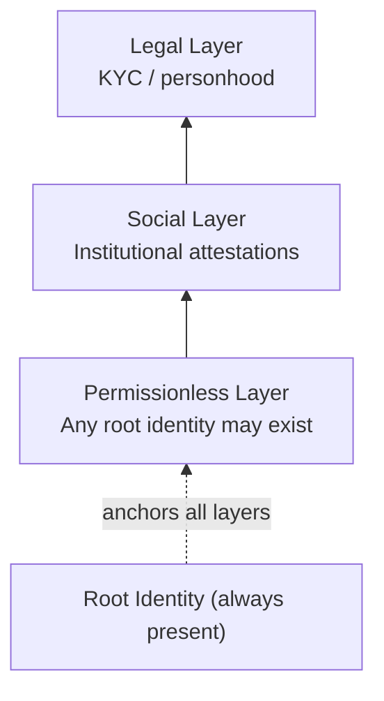
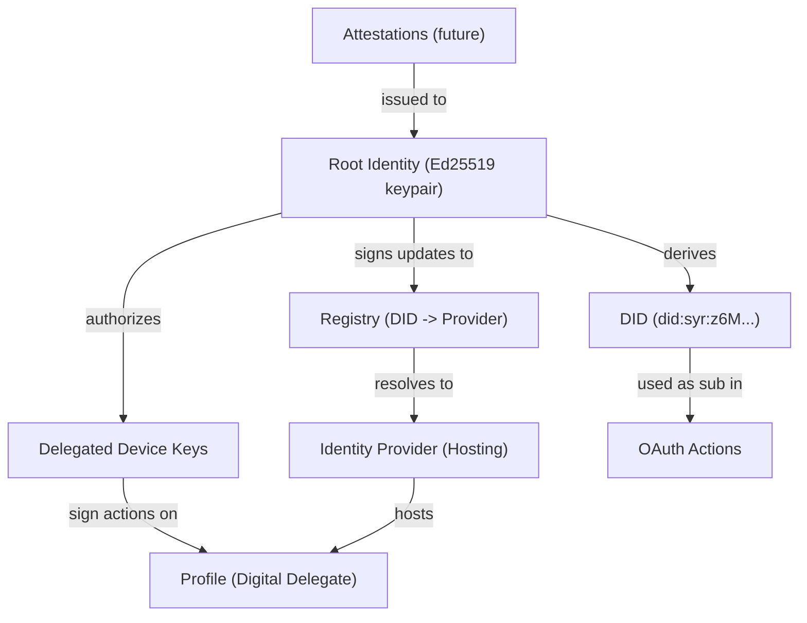
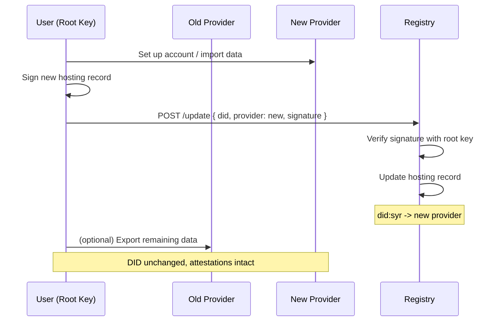

# Syr Identity Model v0.1

## 1. Purpose

Syr defines a **portable, cryptographically rooted individual identity**
that can:

- exist permissionlessly
- be hosted by self or community providers
- migrate between providers without changing identity
- participate in institutions and obtain attestations
- act across external services via identity-based login
- remain traceable to a single root individual
- include posts and thoughts as a first-class part of identity

This document defines the **minimum viable identity architecture** for Syr.

---

## 2. Core Principles

### 2.1 Self-sovereign root identity

- Every identity begins with a **server-generated root keypair** managed by the SYR instance.
- The **private key is stored server-side**, encrypted at rest (custodial generation follows [Aegis](/architecture/aegis)). Users can explicitly export/offload keys on demand (export format follows [Sigil](/architecture/sigil)).
- No external institution may seize the root identity.
- The root identity is the **ultimate trust anchor** for:
  - hosting
  - attestations
  - identity-based auth actions
  - migration

---

### 2.2 Identity is independent of hosting

Identity **must not depend on any single server**.

Therefore:

- Users may **self-host** or **use community providers**.
- Providers may change over time.
- **Changing provider must not change identity**.
- Historical continuity must remain cryptographically verifiable.

---

### 2.3 Institutions provide trust, not ownership

Institutions may:

- host user profiles
- approve memberships
- issue attestations
- provide identity-based authentication infrastructure
- perform optional KYC or personhood verification

Institutions may **not**:

- control root keys
- impersonate the user
- permanently bind identity to a single provider

---

### 2.4 Layered identity assurance

Syr supports multiple assurance levels simultaneously:

| Layer          | Description                                    |
| -------------- | ---------------------------------------------- |
| Permissionless | Any root identity may exist                    |
| Social         | Institutions attest trust, role, or reputation |
| Legal          | Optional KYC/personhood credentials            |

No higher layer replaces the **root identity**.



---

## 3. Identity Components



### 3.1 Root Identity

The **root identity** is defined by:

- a cryptographic keypair generated **server-side** by the SYR instance
- a stable identifier (DID) derived from the public key
- the ability to:
  - rotate delegated keys (future)
  - update hosting provider
  - sign attestations and identity-based auth actions
  - recover through defined recovery mechanisms (future work)

The root identity is the **identity-based auth subject (`sub`)**.

> **Note:** In v0.1, root keys are managed by the SYR instance (per [Aegis](/architecture/aegis)). Users can export their keys to assume self-custody (target format: [Sigil](/architecture/sigil)).

---

### 3.2 Delegated Keys (future phase)

Delegated keys may be created for:

- individual devices
- active sessions
- institutional operations

Delegated keys must be:

- revocable by the root key
- scope-limited
- time-bound (recommended)

Root keys should be used **rarely**.

---

### 3.3 Profiles (Digital Delegates)

Profiles represent the user's **digital presence**, including:

- posts
- assets
- metadata
- vCard or real-world linkage
- institutional roles

All profile actions must be **attributable to the root identity**.
In v0.1, this is enforced via session authentication — the session is tied to the user who owns the identity. Future phases will add cryptographic signing of profile mutations via delegated keys.

---

### 3.4 Identity Providers (Hosting)

A provider is a service that hosts:

- profile data
- APIs
- OAuth endpoints
- storage

Providers may be:

1. **Self-hosted** by the user
2. **Community-hosted** by a trusted operator

Key rule:

> Providers host identity state but **never own identity**.

---

### 3.5 Registry (Identity → Provider Resolution)

Syr defines a **registry layer** that maps:

```
Root Identity → Current Provider Endpoint
```

The registry enables:

- institutions to locate identities
- OAuth clients to resolve providers
- migration without identity change

#### Security invariant

- Only the **root identity key** may update hosting records.
- Registry operators **cannot forge updates**.
- Registry acts as a **signed pointer directory**, not a trust authority.

---

### 3.6 Attestations (future phase)

Attestations are **signed claims** of the form:

```
Institution → Claim → Root Identity
```

Examples:

- membership
- role
- reputation
- KYC/personhood verification

Properties:

- plural (many issuers allowed)
- revocable
- optional
- never replace root identity

---

## 4. OAuth Model

Rules for Syr-based OAuth:

- The **subject (`sub`) MUST equal the root identity identifier**.
- Profiles, institutions, or roles appear only as **claims**.
- Every OAuth action must remain **traceable to the root identity**.

This guarantees **portable accountability across providers and institutions**.

---

## 5. Hosting Modes

### 5.1 Self-hosted

- User runs full infrastructure.
- Maximum independence.
- Rare but essential for legitimacy.

### 5.2 Community-hosted

- Trusted operator hosts identities for a group.
- Expected to be the **dominant real-world mode**.
- Must preserve:
  - root key sovereignty
  - migration capability
  - cryptographic traceability

Both modes are **first-class citizens** of Syr.

---

## 6. Migration Model

Identity migration requires:

1. User selects a new provider.
2. Root key signs an updated **hosting record**.
3. Registry updates provider resolution.
4. Historical continuity remains verifiable.



Migration **must not**:

- change identity identifier
- break attestations
- invalidate OAuth history

---

## 7. Non-Goals for v0.1

To prevent premature complexity, this version **does not define**:

- full Verifiable Credential ecosystem
- ActivityPub federation
- complex moderation or reputation protocols
- decentralized or blockchain registry mechanisms
- advanced privacy or selective disclosure

These may appear in **future versions** after core identity stability.

---

## 8. Design Philosophy Summary

Syr identity combines:

- **self-sovereign root cryptography**
- **portable provider hosting**
- **federated institutional trust**
- **optional legal personhood**
- **web-native OAuth interoperability**

In one coherent model.

---

## 9. Versioning

**Version:** v0.1
**Status:** Draft
**Scope:** Minimal viable identity architecture for implementation in the Syr repository.

Future revisions will expand:

- recovery mechanisms
- delegated key hierarchy
- attestation formats
- privacy-preserving disclosure
- federated registry models
