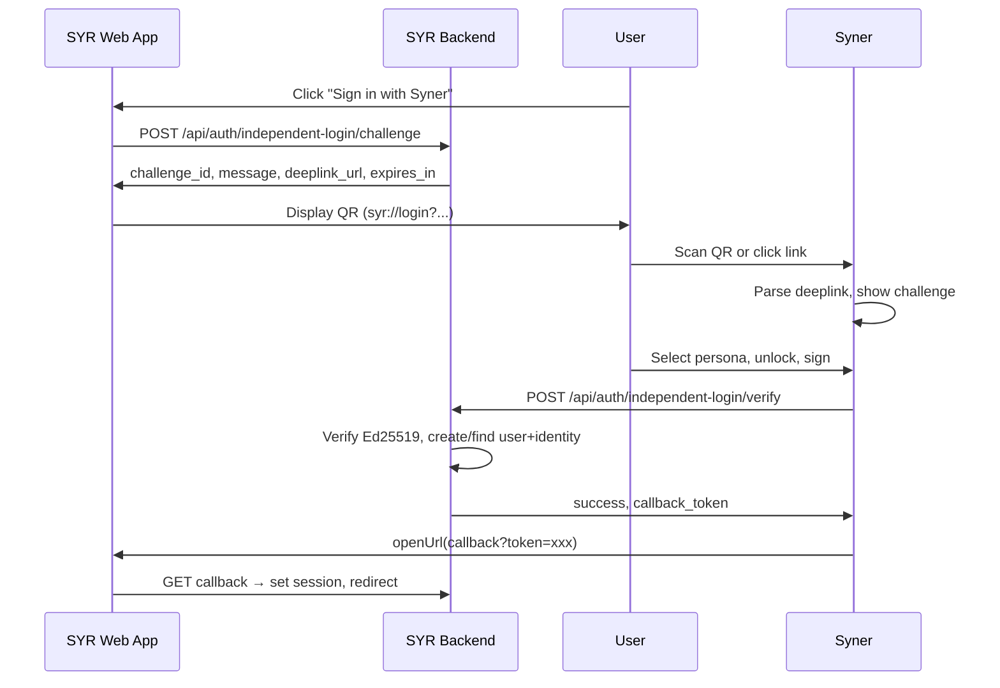

# Independent Login

This document describes the challenge-sign-verify flow for authenticating with SYR using an external key (e.g. Syner) without server-managed credentials.

---

## 1. Overview

**Independent login** lets users prove control of a `did:syr` identity by signing a server-issued challenge. Unlike custodian login (password + Aegis), the server never sees or stores the private key. The flow supports:

- Users who manage keys in Syner or another signing application
- First-time users (create identity on-the-fly when DID is unknown)
- Future invite-only mode (admin-controlled, extensible)

---

## 2. Flow



---

## 3. syr:// Protocol

Custom URL scheme: `syr://`

| Action | URL Pattern                                                | Description                 |
| ------ | ---------------------------------------------------------- | --------------------------- |
| Login  | `syr://login?challenge={id}&instance={url}&callback={url}` | Independent login challenge |

- `challenge` — Challenge ID from the server
- `instance` — SYR instance base URL; **must be URL-encoded** (e.g. `encodeURIComponent`)
- `callback` — Base URL for redirect after verification; **must be URL-encoded**

**Example:** `instance=https%3A%2F%2Fmy.syr.app` and `callback=https%3A%2F%2Fmy.syr.app%2Fauth%2Findependent-callback`

Syner opens via deep link, fetches challenge details, signs, and uses the opener plugin to redirect the browser to the callback URL with a one-time token.

---

## 4. Challenge Message Format

The message the user signs is JCS-canonical JSON (RFC 8785):

```json
{
	"domain": "my.syr.app",
	"nonce": "uuid",
	"action": "login",
	"issued_at": "2026-03-01T12:00:00.000Z",
	"expires_at": "2026-03-01T12:02:00.000Z"
}
```

- **domain** — Instance hostname (domain binding)
- **nonce** — Unique challenge ID (single-use)
- **action** — Always `"login"`
- **issued_at** / **expires_at** — ISO-8601 timestamps

---

## 5. Security Considerations

| Measure                 | Purpose                                     |
| ----------------------- | ------------------------------------------- |
| Domain binding          | Prevents cross-site signature replay        |
| Single-use nonce        | Prevents replay within the challenge window |
| Short TTL (e.g. 120s)   | Limits exposure if challenge leaks          |
| One-time callback token | Prevents token reuse                        |
| Key never leaves client | Server only ever sees signature + DID       |

---

## 6. Comparison

| Flow                  | Mechanism                | Use case             |
| --------------------- | ------------------------ | -------------------- |
| Custodian login       | Password + Aegis decrypt | Server-stored key    |
| Identity-auth (OAuth) | Consent (no signing)     | Third-party apps     |
| Independent login     | Challenge-sign-verify    | Syner / external key |

---

## 7. Invite-Only Extension (Future)

The flow is extensible for admin-controlled invite-only mode:

- Config flag `INVITE_ONLY_MODE`
- When DID is unknown and invite-only: require `invite_code` in the verify request
- Validate against an `invite` table
- Admin UI to generate invites (out of scope for initial implementation)
