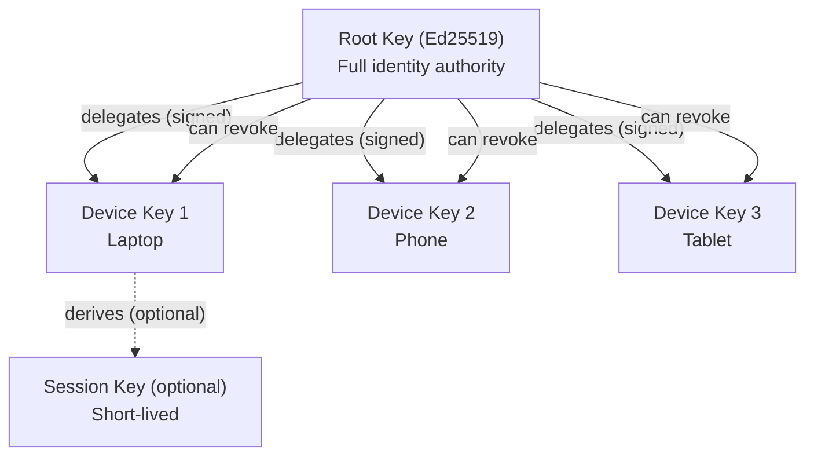
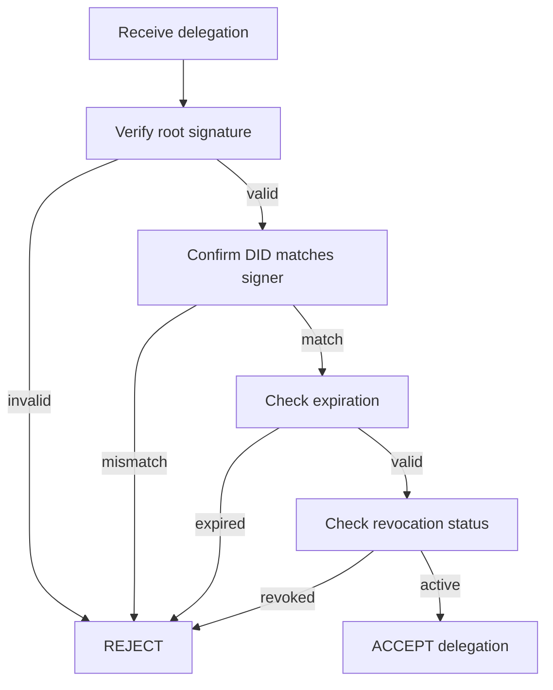

# Syr Key Hierarchy & Delegation Specification v0.1

## 1. Purpose

This specification defines how **cryptographic keys** are structured and used
within the Syr identity system.

Goals:

- protect the **root identity key** from routine exposure
- enable **multi-device usage**
- allow **revocation of compromised devices**
- support future **recovery and rotation mechanisms**

This document establishes the **minimum viable key model** for Syr v0.1.

---

## 2. Design Principles

### 2.1 Root key is managed by the SYR instance

The **root private key**:

- is generated **server-side** by the SYR instance on identity creation
- is stored encrypted at rest on the hosting instance
- can be **exported by the user** to assume self-custody (future phase)
- anchors the identity — compromise equals **identity compromise**

**Why server-hosted?** SYR is designed to be self-hosted (or community-hosted). You trust the instance because _you run it_ (or your community does). Server-side key management provides frictionless onboarding — users get a cryptographic identity without understanding key management. This is consistent with SSI principles: the operator is the user or their trusted delegate, not a third-party platform.

> **Future:** Users will be able to export their root key and manage it client-side. At that point, the server-custody model becomes _optional_, not mandatory.

---

### 2.2 Current: session-based authorization

In v0.1, all routine actions (profile updates, posts, API calls) are authorized via **session authentication** (JWT), not cryptographic signing.

Delegated device keys exist in the data model but are not yet used for routine signing. Client-side signing with delegated keys is **planned for a future phase** when key export and offloading are implemented.

> **Future:** Daily operations will use delegated keys for cryptographic signing. Root keys will be used rarely (registry updates, delegation, recovery).

---

### 2.3 Delegation must be cryptographically provable

Every delegated key MUST be:

- explicitly authorized by the root key
- bound to a scope and purpose
- revocable at any time

No provider or institution may create delegated keys **without root approval**.

---

## 3. Key Types



### 3.1 Root Key

**Algorithm:** Ed25519
**Scope:** Full identity authority

Capabilities:

- registry updates
- delegation creation & revocation
- future recovery configuration
- signing high-authority attestations

In v0.1:

- Root keys are **generated and stored server-side** by the SYR instance
- Users can export keys via the API when ready for self-custody
- Secure hardware storage is a future goal for exported keys

---

### 3.2 Delegated Device Keys

Each user device generates its own keypair and receives
a **delegation signature** from the root key.

Used for:

- authentication to providers
- OAuth authorization flows
- signing routine actions
- session establishment

---

### 3.3 Session Keys (optional in v0.1)

Short-lived keys derived from a device key.

Purpose:

- reduce exposure of long-lived device keys
- enable fast revocation via expiration

Session keys are **recommended but optional** in v0.1.

---

## 4. Delegation Model

### 4.1 Delegation Statement

Delegation is represented as a **signed statement**:

```json
{
	"did": "did:syr:...",
	"delegate": "<publicKeyMultibase>",
	"scope": "device",
	"createdAt": "ISO-8601 timestamp",
	"expiresAt": "ISO-8601 timestamp or null",
	"signature": "<signed by root key>"
}
```

---

### 4.2 Delegation Verification

Providers and clients MUST:

1. Verify root signature.
2. Confirm DID matches signer.
3. Check expiration (if present).
4. Ensure delegation not revoked.

If any check fails → delegation is invalid.



---

### 4.3 Delegation Scope (v0.1)

Allowed scopes:

| Scope   | Meaning                                           |
| ------- | ------------------------------------------------- |
| device  | Full routine user actions                         |
| session | Short-lived derived authority (future refinement) |

Future versions MAY define:

- institution-limited scopes
- OAuth-only scopes
- signing-restricted scopes

---

## 5. Revocation

### 5.1 Root-signed revocation

Delegated keys may be revoked by publishing a **revocation record**
signed by the root key.

Example:

```json
{
	"did": "did:syr:...",
	"revoke": "<delegate public key>",
	"revokedAt": "ISO-8601 timestamp",
	"signature": "<root signature>"
}
```

---

### 5.2 Provider responsibilities

Providers MUST:

- refuse authentication from revoked keys
- propagate revocation state immediately within their system

Cross-provider revocation sync is **future work**.

---

## 6. Multi-Device Operation

Users may have:

- multiple active device delegations
- independent revocation per device
- concurrent sessions across providers

No fixed limit is imposed in v0.1.

---

## 7. Security Considerations

### 7.1 Device compromise

If a delegated device key is compromised:

- attacker gains **limited authority**
- root key can revoke delegation
- identity ownership remains intact

This is the primary safety property of delegation.

---

### 7.2 Root key exposure

If the root key is compromised:

- attacker gains full identity control
- recovery mechanisms are required (future spec)

v0.1 assumes **root key safety**.

---

### 7.3 Provider compromise

A compromised provider:

- cannot forge delegations
- cannot revoke devices without root signature
- cannot rotate root key

---

## 8. Privacy Considerations

Delegation records reveal:

- number of user devices
- delegation timestamps

Future work may include:

- blinded delegation identifiers
- zero-knowledge authorization proofs
- pairwise device keys per provider

Not included in v0.1.

---

## 9. Future Extensions (Not in v0.1)

Planned improvements:

- social recovery guardians
- threshold root keys
- automated rotation chains
- hardware-backed attestation
- encrypted delegation distribution

These are deferred to maintain **minimal implementability**.

---

## 10. Current vs. Future Key Management

### Current (v0.1): Server-custodied keys

| Aspect         | v0.1 Behavior                             |
| -------------- | ----------------------------------------- |
| Key generation | Server-side (SYR instance)                |
| Key storage    | Encrypted at rest on instance             |
| Auth model     | Session-based (JWT)                       |
| Signing        | Not yet implemented for mutations         |
| Delegated keys | Data model exists, not used for signing   |
| Key export     | Available via `/api/identity/export-keys` |

**Rationale:** SYR instances are self-hosted or community-hosted. The operator **is** the user (or their trusted delegate). Server-side keys provide frictionless onboarding without sacrificing the SSI guarantee that no third-party platform controls your identity.

### Future: Client-custodied keys + delegated signing

| Phase                   | Capability                                     |
| ----------------------- | ---------------------------------------------- |
| Key offloading          | User exports root key, server deletes its copy |
| Client-side signing     | Delegated device keys sign mutations locally   |
| Multi-device delegation | Root key authorizes per-device keys            |
| Recovery                | Social recovery guardians, threshold keys      |

The transition is **opt-in** — server-custody remains available for users who prefer managed keys.

---

## 11. Versioning

**Version:** v0.1
**Status:** Draft
**Scope:** Minimal secure key model required for:

- server-side key generation and custody
- identity portability via export
- foundation for future delegated signing

This completes the **core cryptographic control layer** of Syr identity.
