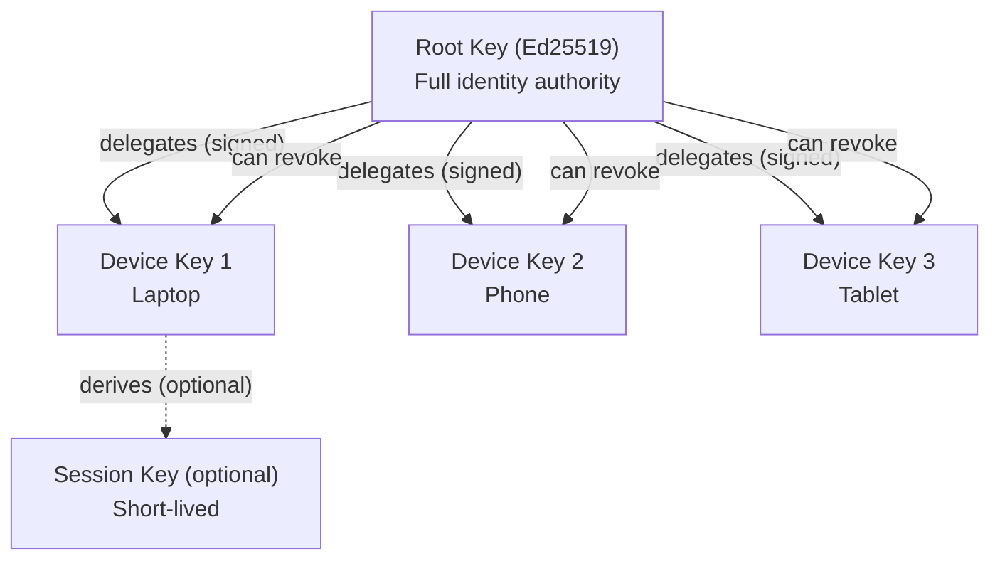
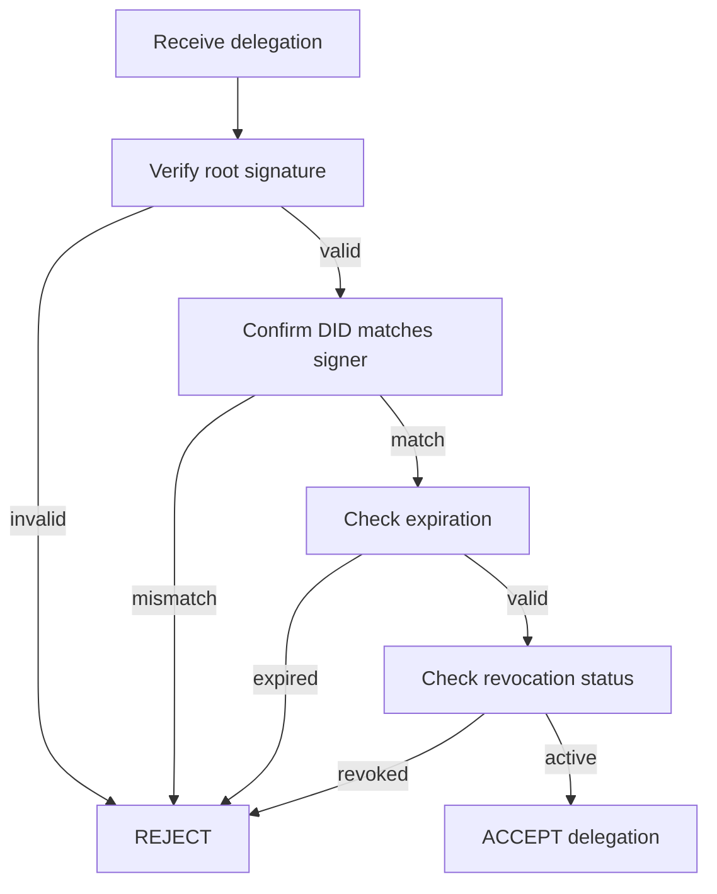

# Syr Key Hierarchy & Delegation Specification v0.1

## 1. Purpose

This specification defines how **cryptographic keys** are structured and used
within the Syr identity system.

Goals:

- protect the **root identity key** from routine exposure
- enable **multi-device usage**
- allow **revocation of compromised devices**
- compose with **root key rotation** (see [rotation spec](/architecture/recovery-rotation)) and future recovery mechanisms

This document establishes the **minimum viable key model** for Syr v0.1.

---

## 2. Design Principles

### 2.1 Root key management

The **root private key** can be managed in two modes:

**Server-managed (current default, transitionary):**

- Generated **server-side** by the SYR instance on identity creation (see [Aegis](/architecture/aegis) for custodial generation and storage semantics)
- Stored encrypted at rest on the hosting instance
- Can be **exported by the user** to assume self-custody (target export format: [Sigil](/architecture/sigil))
- Provides frictionless onboarding — users get a cryptographic identity without understanding key management
- **Why server-hosted?** SYR is designed to be self-hosted (or community-hosted). You trust the instance because _you run it_ (or your community does). This is consistent with SSI principles: the operator is the user or their trusted delegate, not a third-party platform.

**Syner-managed (canonical self-custody method, future):**

- Generated **on the user's device** by the Syner native application (Tauri v2)
- Stored in **platform-native secure keystore** (Keychain, DPAPI, libsecret, Android Keystore)
- Private key **never transmitted** to the SYR instance
- SYR web app communicates with Syner via SSE signing bridge and deep links
- See the [Syner Specification](/architecture/syner) for full details

Once Syner is available, Syner-managed identity is the recommended method. Server-managed keys remain available for users who prefer managed hosting or are not yet ready for self-custody. The transition from server-managed to Syner-managed is supported via a secure key transfer flow.

---

### 2.2 Current: session-based authorization

In v0.1, all routine actions (profile updates, posts, API calls) are authorized via **session authentication** (JWT), not cryptographic signing.

Delegated device keys exist in the data model but are not yet used for routine signing. Client-side signing with delegated keys is **planned for a future phase** when key export and offloading are implemented.

> **Future:** Daily operations will use delegated keys for cryptographic signing. Root keys will be used rarely (registry updates, delegation, recovery).

---

### 2.3 Delegation must be cryptographically provable

Every delegated key MUST be:

- explicitly authorized by the root key
- bound to a scope and purpose
- revocable at any time

No provider or institution may create delegated keys **without root approval**.

---

## 3. Key Types



### 3.1 Root Key

**Algorithm:** Ed25519
**Scope:** Full identity authority

Capabilities:

- registry updates
- delegation creation & revocation
- future recovery configuration
- signing high-authority attestations

In v0.1:

- Root keys are **generated and stored server-side** by the SYR instance (per [Aegis](/architecture/aegis))
- Users can export keys via the API when ready for self-custody (target format: [Sigil](/architecture/sigil))
- Secure hardware storage is a future goal for exported keys

---

### 3.2 Delegated Device Keys

Each user device generates its own keypair and receives
a **delegation signature** from the root key.

Used for:

- authentication to providers
- OAuth authorization flows
- signing routine actions
- session establishment

---

### 3.3 Session Keys (optional in v0.1)

Short-lived keys derived from a device key.

Purpose:

- reduce exposure of long-lived device keys
- enable fast revocation via expiration

Session keys are **recommended but optional** in v0.1.

---

## 4. Delegation Model

### 4.1 Delegation Statement

Delegation is represented as a **signed statement**:

```json
{
	"did": "did:syr:...",
	"delegate": "<publicKeyMultibase>",
	"scope": "device",
	"createdAt": "ISO-8601 timestamp",
	"expiresAt": "ISO-8601 timestamp or null",
	"signature": "<signed by root key>"
}
```

---

### 4.2 Delegation Verification

Providers and clients MUST:

1. Verify the root signature (see 4.2.1 for which root key qualifies).
2. Confirm DID matches signer.
3. Check expiration (if present).
4. Ensure delegation not revoked.

If any check fails → delegation is invalid.

#### 4.2.1 Validity across root key rotation

Root keys rotate via the per-DID [rotation chain](/architecture/recovery-rotation); the DID itself never changes. Delegation signatures are validated against the chain as follows:

- A delegation signed by the **current** root key is valid.
- A delegation signed by a **retired** root key remains valid **iff its `createdAt` is earlier than that key's `rotatedAt`** in the chain (the key was still the root when it authorized the delegate). Verifiers holding the chain perform this timestamp check.
- A retired key can never authorize **new** delegations — anything it signs after its `rotatedAt` is invalid.

**Custodial rotation additionally re-signs** all active (non-revoked, non-expired) delegations with the new root key in the same flow, so verifiers that only track the current key keep accepting them without the timestamp rule. Self-custody (external) rotation cannot re-sign server-side; delegations created before the rotation rely on the timestamp rule above.



---

### 4.3 Delegation Scope (v0.1)

Allowed scopes:

| Scope    | Meaning                                                                                         |
| -------- | ----------------------------------------------------------------------------------------------- |
| device   | Full routine user actions                                                                       |
| session  | Short-lived derived authority (future refinement)                                               |
| platform | Third-party signing-as-a-service (see [Platform Delegation](/architecture/platform-delegation)) |

Future versions MAY define:

- institution-limited scopes
- OAuth-only scopes
- signing-restricted scopes

---

## 5. Revocation

### 5.1 Root-signed revocation

Delegated keys may be revoked by publishing a **revocation record**
signed by the root key.

Example:

```json
{
	"did": "did:syr:...",
	"revoke": "<delegate public key>",
	"revokedAt": "ISO-8601 timestamp",
	"signature": "<root signature>"
}
```

---

### 5.2 Provider responsibilities

Providers MUST:

- refuse authentication from revoked keys
- propagate revocation state immediately within their system

Cross-provider revocation sync is **future work**.

---

## 6. Multi-Device Operation

Users may have:

- multiple active device delegations
- independent revocation per device
- concurrent sessions across providers

No fixed limit is imposed in v0.1.

---

## 7. Security Considerations

### 7.1 Device compromise

If a delegated device key is compromised:

- attacker gains **limited authority**
- root key can revoke delegation
- identity ownership remains intact

This is the primary safety property of delegation.

---

### 7.2 Root key exposure

If the root key is compromised:

- attacker gains full identity control, including the ability to rotate the root away from the owner
- [rotation](/architecture/recovery-rotation) is compromise **hygiene** (rotate aging keys before exposure), not compromise recovery; recovery keys remain out of scope for v1

---

### 7.3 Provider compromise

A compromised provider:

- cannot forge delegations
- cannot revoke devices without root signature
- cannot rotate the root key of a **self-custody** identity (rotation statements must be signed by the current root key, which the provider never holds); custodial (Aegis) identities additionally depend on the password, which the provider does not store in plaintext

---

## 8. Privacy Considerations

Delegation records reveal:

- number of user devices
- delegation timestamps

Future work may include:

- blinded delegation identifiers
- zero-knowledge authorization proofs
- pairwise device keys per provider

Not included in v0.1.

---

## 9. Platform Delegation

Platform delegation extends the key hierarchy to support **third-party consumer applications**. When a user authorizes a platform, the identity provider generates a platform-scoped delegate keypair and offers a signing-as-a-service API.

| Aspect        | Platform delegation                                           |
| ------------- | ------------------------------------------------------------- |
| Scope         | `platform`                                                    |
| Key custody   | Private key stays on identity provider instance               |
| Signing model | Signing-as-a-service (platform sends content, instance signs) |
| Revocation    | Immediate via user settings                                   |
| Export        | Included in identity export with encrypted private key        |

See [Platform Delegation](/architecture/platform-delegation) for the full specification.

---

## 10. Future Extensions (Not in v0.1)

Planned improvements:

- social recovery guardians
- threshold root keys
- hardware-backed attestation
- encrypted delegation distribution

(Root key **rotation chains** shipped — see [Root key rotation](/architecture/recovery-rotation).)

These are deferred to maintain **minimal implementability**.

---

## 11. Current vs. Future Key Management

### Current (v0.1): Server-custodied keys

| Aspect         | v0.1 Behavior                                                                                                             |
| -------------- | ------------------------------------------------------------------------------------------------------------------------- |
| Key generation | Server-side (SYR instance)                                                                                                |
| Key storage    | Encrypted at rest on instance                                                                                             |
| Auth model     | Session-based (JWT)                                                                                                       |
| Signing        | Not yet implemented for mutations                                                                                         |
| Delegated keys | Data model exists, not used for signing                                                                                   |
| Key export     | Available via `/api/identity/export-keys` (target format: [Sigil](/architecture/sigil); current: PKCS#8 PEM transitional) |

**Rationale:** SYR instances are self-hosted or community-hosted. The operator **is** the user (or their trusted delegate). Server-side keys provide frictionless onboarding without sacrificing the SSI guarantee that no third-party platform controls your identity.

### Future: Syner-managed keys + delegated signing

| Phase                   | Capability                                                             |
| ----------------------- | ---------------------------------------------------------------------- |
| Syner key generation    | Root key generated on device, stored in platform-native keystore       |
| SSE signing bridge      | SYR pushes signing requests to Syner via SSE, Syner returns signatures |
| Key transfer            | Server-managed to Syner-managed via encrypted QR code transfer         |
| Client-side signing     | Delegated device keys sign mutations locally via Syner                 |
| Multi-device delegation | Root key (in Syner) authorizes per-device keys                         |
| Recovery                | Social recovery guardians, threshold keys, encrypted backup            |

The transition is **opt-in** — server-custody remains available for users who prefer managed keys. See the [Syner Specification](/architecture/syner) and [Syner Integration](/architecture/syner-integration) docs for implementation details.

---

## 12. Versioning

**Version:** v0.1
**Status:** Draft
**Scope:** Minimal secure key model required for:

- server-side key generation and custody
- identity portability via export
- foundation for future delegated signing

This completes the **core cryptographic control layer** of Syr identity.
