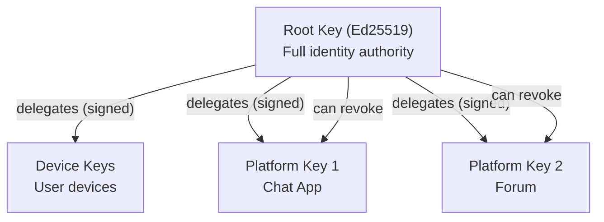
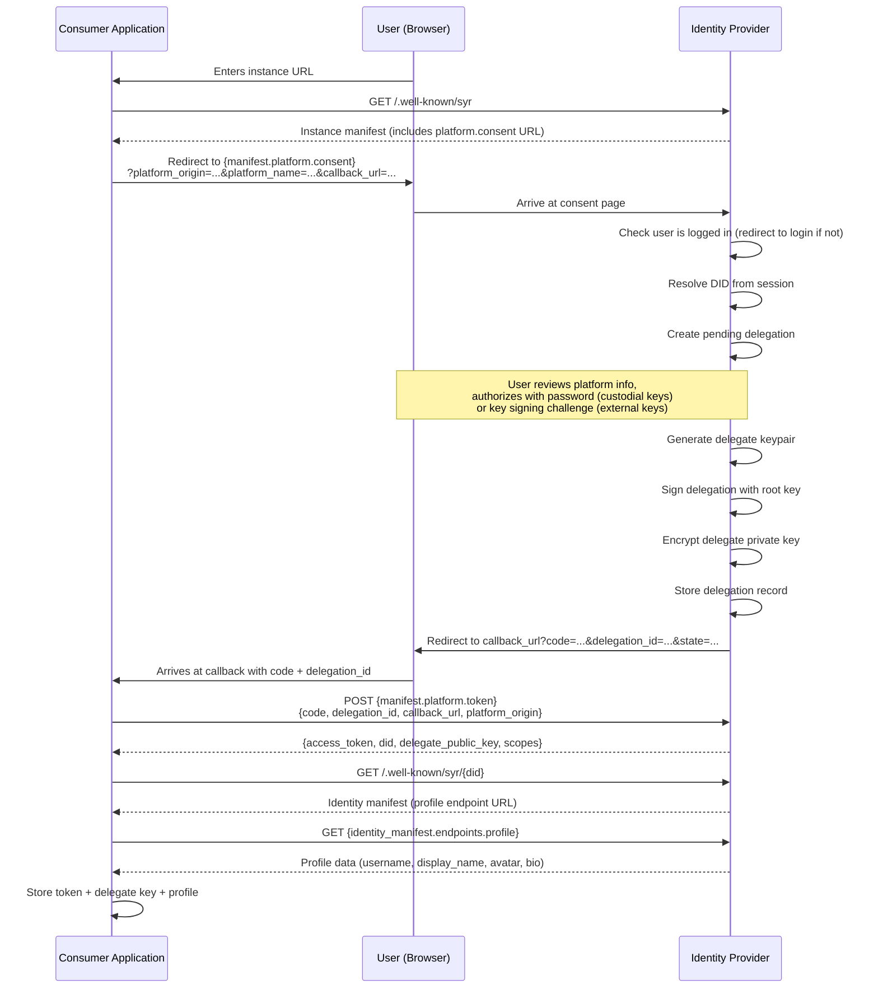
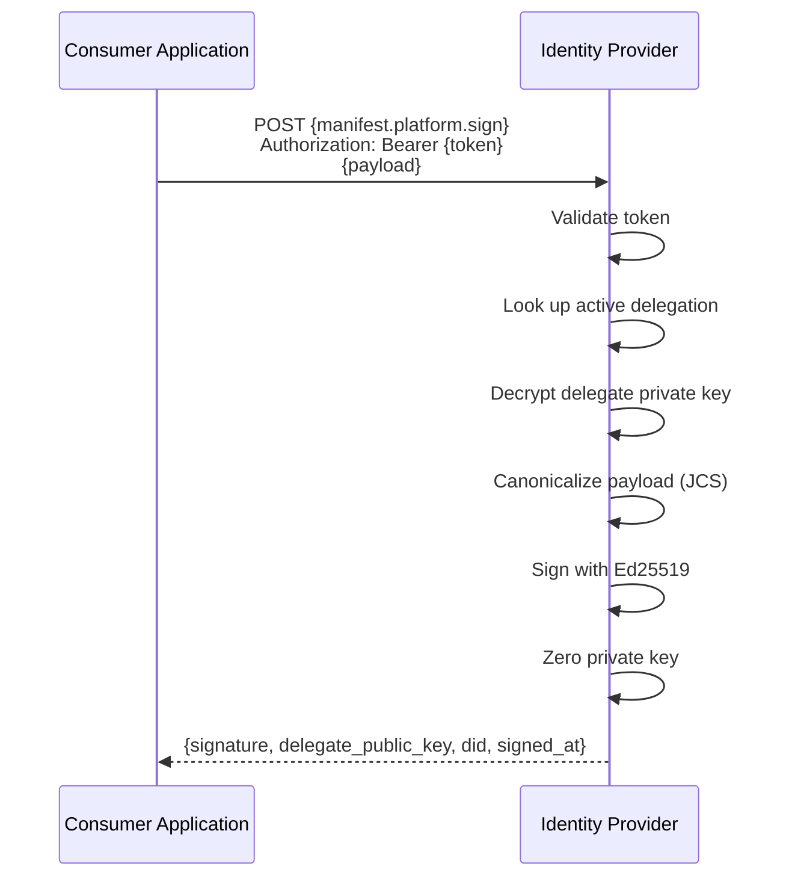
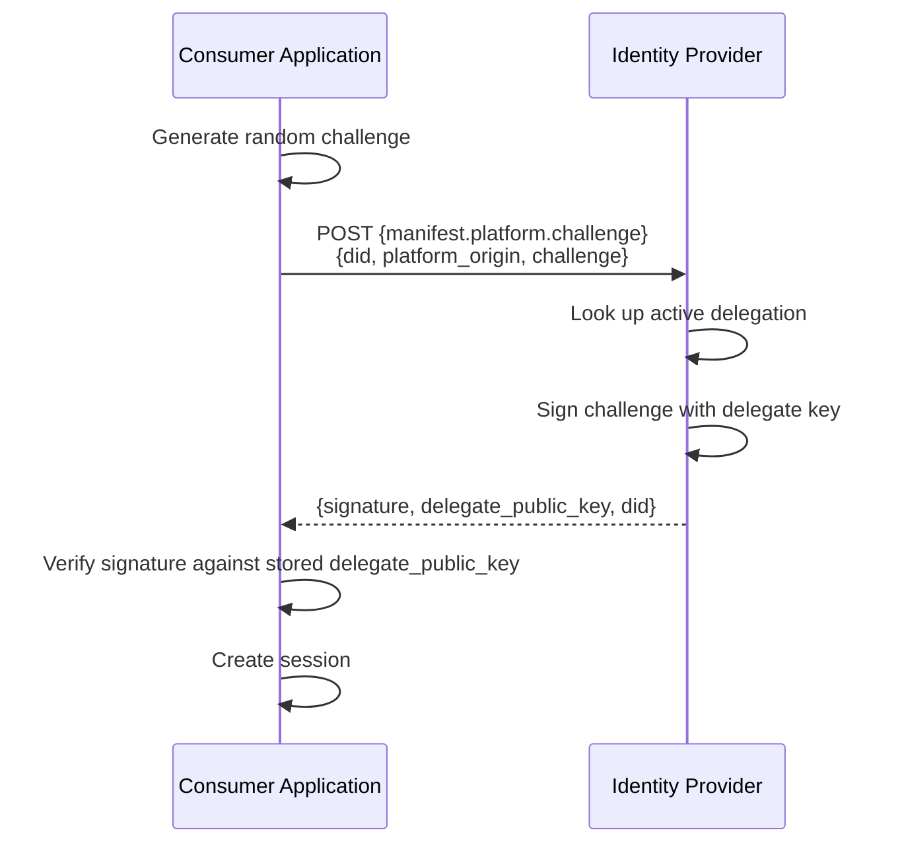

# Platform Delegation v0.1

## 1. Purpose

Platform delegation enables **third-party consumer applications** to sign content on behalf of a user through their identity provider instance. The identity provider generates a delegate keypair, retains the private key, and offers a signing-as-a-service API to authorized platforms.

Goals:

- allow consumer applications to publish **cryptographically verifiable** content on behalf of users
- keep the delegate private key **on the identity provider** (signing-as-a-service)
- enable users to **revoke** platform access at any time
- support **cross-instance verification** of signed content
- integrate with existing key hierarchy and identity export mechanisms

---

## 2. Design Principles

### 2.1 Private key stays on the identity provider

The platform delegate private key is generated and stored exclusively on the identity provider instance. Consumer applications never receive the private key. Instead, they receive an access token that authorizes signing requests via an API.

### 2.2 User-controlled authorization

Users explicitly consent to platform delegation through a consent page on their identity provider. They can view and revoke active delegations at any time.

### 2.3 Verifiable by anyone

The platform delegate **public key** is published on the identity provider and accessible via a public API. Any party can verify the signature of content signed by a platform delegation by fetching the delegate public key and checking revocation status.

### 2.4 No assumed paths — manifest-driven discovery

Consumer applications MUST NOT hardcode any API paths on the identity provider. The **only** static paths in the ecosystem are:

| Path                     | Purpose                                                                     |
| ------------------------ | --------------------------------------------------------------------------- |
| `/.well-known/syr`       | Instance manifest — discovers all platform endpoints                        |
| `/.well-known/syr/{did}` | Identity manifest — discovers profile, posts, stories, delegation endpoints |

Platform delegation endpoints for consumer applications (consent, token exchange, signing, challenge, delegations listing, revocation) use conventional paths on the identity provider. The Syner companion app's delegation endpoints (`delegation_challenge_payload`, `delegation_verify`) are declared in the optional `syner` section of the instance manifest. Consumer applications fetch the instance manifest once and use the discovered URLs where available.

This ensures identity provider instances can host their APIs at any path structure without breaking consumer applications.

### 2.5 Extends existing key hierarchy

Platform delegation uses the existing delegated key model with a new `platform` scope. The delegation statement is signed by the user's root key, maintaining the cryptographic trust chain.

---

## 3. Key Hierarchy Extension



Platform keys are structurally identical to device keys but scoped to `platform` and associated with a specific platform origin URL.

---

## 4. Registration Flow

The user never enters their DID manually. The consumer application redirects the user to their identity provider's consent page, and the provider resolves the DID from the authenticated session.



### Endpoint discovery

The consumer application SHOULD fetch the instance manifest (`GET /.well-known/syr`) before initiating the flow. The following endpoints are used by consumer applications:

| Endpoint                  | Purpose                              |
| ------------------------- | ------------------------------------ |
| Consent page              | User redirect for authorization      |
| Token exchange            | Code → access token exchange         |
| Signing-as-a-service      | Request signatures with access token |
| Re-login challenge        | Challenge-based re-authentication    |
| Public delegation listing | Verification of delegate keys        |
| Revocation                | User revokes platform access         |

The Syner companion app's operational endpoints are declared in the optional `syner` section of the instance manifest:

| Manifest field                       | Purpose                               |
| ------------------------------------ | ------------------------------------- |
| `syner.delegation_challenge_payload` | Fetch canonical statement for signing |
| `syner.delegation_verify`            | Submit signed delegation              |

### Consent page query parameters

| Parameter         | Required | Description                                                       |
| ----------------- | -------- | ----------------------------------------------------------------- |
| `platform_origin` | Yes      | Origin URL of the consumer application                            |
| `platform_name`   | No       | Human-readable name (defaults to hostname)                        |
| `callback_url`    | Yes      | URL to redirect after consent                                     |
| `scopes`          | No       | Comma-separated scopes (defaults to `identity:read,profile:read`) |
| `state`           | No       | CSRF protection token, returned unchanged                         |

---

## 5. Signing-as-a-Service

Once registered, the consumer application can request signatures:



The payload is canonicalized using RFC 8785 (JCS) before signing, ensuring deterministic serialization across implementations.

---

## 6. Re-login Challenge

After initial registration, the consumer application can re-authenticate users without the full consent flow:



---

## 7. Verification Model

Any party can verify content signed by a platform delegation:

1. Fetch the signer's identity manifest: `GET {signer_instance}/.well-known/syr/{did}`
2. Fetch the DID document from the discovered endpoint: `GET {identity_manifest.endpoints.did_document}`
3. Locate the delegate key in the DID document's delegated keys and check that it is **not revoked** and **not expired**.
4. Canonicalize the content payload using JCS (RFC 8785).
5. Verify the Ed25519 signature against the delegate public key.

If any check fails, the signature is invalid. The identity manifest and DID document are the only resources needed for verification — both are discovered from the manifest.

---

## 8. Revocation

Users can revoke platform delegations at any time via their identity provider settings. Revocation is immediate:

- The delegate key is marked as revoked with a timestamp.
- Subsequent signing requests from the platform are rejected.
- Existing signatures remain **cryptographically valid** but are **semantically invalid** — verifiers MUST check revocation status.

The consumer application SHOULD handle revocation gracefully (e.g., degrade to unsigned content, prompt user to re-authorize).

---

## 9. Key Custody and Consent

The consent page handles three identity states:

| State                           | User experience                                                                                                                   |
| ------------------------------- | --------------------------------------------------------------------------------------------------------------------------------- |
| No identity on instance         | User is guided to link their identity first (e.g., via external key manager challenge-sign) before proceeding with delegation     |
| Custodial keys (server-managed) | User enters password to decrypt root key; instance signs delegation server-side                                                   |
| External keys (self-custody)    | Instance creates a signing challenge; user signs with their external key manager via deep link; signature is relayed back via SSE |

The user never needs to enter a DID manually — the consent page resolves it from the authenticated session.

### External key signing (two-round protocol)

When the user's identity is managed externally (e.g., in the Syner companion app), the delegation signing uses a two-round protocol to ensure the stored signature attests to the actual delegate public key:

**Round 1 — Challenge creation** (`POST /api/platform/delegation-challenge`):

1. Consent page sends `{ delegation_id }` to the challenge endpoint.
2. Server generates the Ed25519 delegate keypair upfront.
3. Server builds the canonical delegation statement: `{ did, delegate: realPublicKey, scope: 'platform', platform_origin, platform_name, createdAt }`.
4. Server encrypts the delegate private key and stores it in KV with TTL.
5. Server returns a `syr://delegate` deep link containing the challenge ID, instance URL, platform details, DID, and delegate public key.

**Round 2 — Signing and verification** (`POST /api/platform/delegation-verify`):

1. Syner fetches the canonical statement from `GET /api/platform/delegation-challenge/{id}/payload`.
2. Syner cross-checks the delegate key from the deep link against the server response.
3. Syner shows the user: platform name, origin, and delegate public key for confirmation.
4. User signs the exact canonical bytes with their root key.
5. Syner posts `{ challenge_id, did, signature }` to the verify endpoint.
6. Server verifies the signature against the DID root public key.
7. Server consumes the pre-generated keypair (atomic) and stores the delegation record.
8. The stored signature correctly attests to `{ did, delegate: actualKey, platform_origin, ... }`.

### Deep link format

```text
syr://delegate?challenge={id}&instance={url}&platform_name={name}&platform_origin={origin}&did={did}&delegate={publicKey}
```

Syner can immediately display the platform details from the deep link parameters without a network call, then cross-check against the server's canonical statement.

### Persona delegation tracking

After successful signing, Syner persists the delegation info in the persona's local storage (`delegations.json` alongside `profile.json`). This enables:

- Offline viewing of active delegations per persona
- Skipping a sync roundtrip when the user opens Syner to manage delegations
- Export/import continuity for delegation metadata

All three consent paths (custodial password, external Syner, no identity) produce the same delegation record.

---

## 10. Export and Migration

Platform delegate keys are included in identity exports:

- The delegate **public key**, platform origin, and delegation metadata are included in the delegated keys array of the export bundle.
- The encrypted delegate private key (in CIGP/Aegis format) is included for full portability.
- On instance migration: import the identity on the new instance, and update platform references to point to the new instance URL.

---

## 11. Security Considerations

### 11.1 Token security

Platform access tokens SHOULD be short-lived (24 hours recommended). The **token endpoint** is responsible for minting access tokens (during the initial code exchange). The **challenge endpoint** only performs re-authentication — it signs a caller-provided challenge with the delegate key and returns `{signature, delegate_public_key, did}`, proving the delegation is still active; it does not mint or rotate tokens. Token refresh/rotation is not defined in v0.1; consumer applications that need a new token must re-initiate the consent flow. Tokens MUST be transmitted over TLS and stored securely by the consumer application.

### 11.2 Signing rate limits

Identity provider instances SHOULD rate-limit the signing endpoint to prevent abuse. Recommended: 100 requests per minute per delegation.

### 11.3 Platform compromise

If a consumer application is compromised:

- The attacker gains access to the platform token, not the delegate private key.
- The user can revoke the delegation from their identity provider, immediately stopping all signing.
- Existing signed content remains attributable but verifiers should check revocation.

### 11.4 Instance compromise

If the identity provider instance is compromised:

- The attacker could access encrypted delegate private keys.
- Delegate keys are encrypted with a server-managed secret (distinct from user passwords).
- Revocation remains in the user's control if they have access to another instance or their root key.

---

## 12. Comparison with Other Third-Party Auth Models

| Aspect                          | OAuth 2.0 (traditional)                            | ActivityPub OAuth          | Bluesky App Passwords    | Nostr NIP-46               | Syr Platform Delegation                                |
| ------------------------------- | -------------------------------------------------- | -------------------------- | ------------------------ | -------------------------- | ------------------------------------------------------ |
| **Endpoint discovery**          | `.well-known/openid-configuration` (static schema) | WebFinger + OAuth meta     | Hardcoded PDS paths      | Relay-based                | `/.well-known/syr` manifest (fully dynamic)            |
| **Identity ownership**          | Platform owns identity                             | Instance owns identity     | PLC server + user        | User (raw key)             | User (root key, custodial or self-custody)             |
| **What the app receives**       | Opaque access token                                | Opaque access token        | App-specific password    | Signing relay access       | Signing-as-a-service token + delegate public key       |
| **Content verifiability**       | No — token proves auth, not authorship             | No                         | No                       | Yes — NIP-01 event signing | Yes — Ed25519 signature on every payload               |
| **Revocation**                  | Revoke token at platform                           | Revoke token at instance   | Delete app password      | Disconnect relay           | Revoke delegate key — instant, user-controlled         |
| **User's private key exposed?** | N/A (no user key)                                  | N/A (no user key)          | N/A                      | Key stays with signer      | Key stays on identity provider instance — never leaves |
| **Cross-instance portability**  | None                                               | None (identity = instance) | DID portable but complex | Key is identity            | DID portable, delegate keys included in exports        |
| **Offline verification**        | No — requires introspection                        | No                         | No                       | Yes — check event sig      | Yes — check Ed25519 sig against published delegate key |
| **Path assumptions**            | Standardized paths                                 | Standardized paths         | Hardcoded PDS API        | Relay protocol             | **Zero** — all paths discovered from manifest          |

### Why manifest-driven discovery matters

Most identity protocols define a fixed set of API paths that all implementations must follow. This creates **implicit coupling** — consumer applications assume where endpoints live, and implementations cannot restructure their APIs without breaking consumers.

Syr takes a different approach: the instance manifest declares where everything is. A consumer application asks the instance "where are your platform delegation endpoints?" and the instance answers. This means:

- Instances can host APIs at **any path structure** without breaking consumers.
- Reverse proxies, API gateways, and custom routing work without workarounds.
- The protocol is **truly implementation-agnostic** — any language, any framework, any URL scheme.

---

## 13. Versioning

**Version:** v0.1
**Status:** Draft
**Scope:** Minimal viable platform delegation for signing-as-a-service, consent, and revocation.
