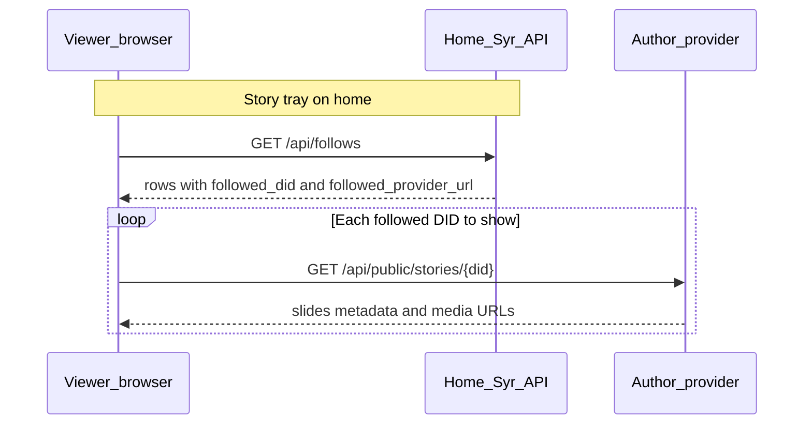

# Profile Stories (v1 specification)

## 1. Purpose and phase alignment

This document specifies **profile stories**: short-lived, **public** visual slides (images and short video) attached to a **`did:syr` identity**, discoverable from the **home feed** and from **profile avatars**, in an Instagram-style **horizontal tray + fullscreen viewer** pattern.

Stories are **beyond Phase 0** and build on existing **DID-scoped object storage**, **`upload` records**, and **cross-provider follows** ([Follows, Discovery, and Home Timeline](/architecture/follows-and-timeline)). This page is a **design spec**; implementation is tracked in the [spec-to-implementation map](/reference/spec-mapping).

**Related specs**

- [Follows, Discovery, and Home Timeline](/architecture/follows-and-timeline) — follow rows, `followed_provider_url`, client-side aggregation to peer providers.
- [Signed profile & post mutations](/architecture/signed-profile-post-mutations) — optional future signing for story publish events (v1 may omit).
- [Untrusted post content](/architecture/untrusted-post-content) — MIME allow-lists and size limits should align for story media.

---

## 2. Goals and non-goals

### 2.1 Goals (v1)

- **Ephemeral reel:** Only slides whose **publish time** falls within the **last 24 hours (rolling, UTC)** appear in APIs and UI.
- **UTC-organized storage:** Objects live under a **UTC calendar-date** prefix derived from completion time (+00:00), for ops and lifecycle.
- **Public read:** Third parties and **followed-identity viewers** fetch story metadata from the **author’s Syr instance** via a **public HTTP API**, analogous to public posts.
- **Home UX:** Logged-in user sees a **story tray** at the **top of the home feed**: own ring + rings for **followed** identities that have at least one active slide.
- **Profile entry:** Opening stories from the author’s **avatar** (feed or profile) launches the same **fullscreen viewer**.

### 2.2 Non-goals (v1)

- Replies, DMs, stickers, music, polls, or **collaborative** stories.
- **Server-side** “merged stories for all follows” API on the home instance (keep **per-provider** fetches like the timeline model).
- **End-to-end encryption** of story media.
- **Private** / followers-only stories (v1 is **public** only; future phase may add visibility).

---

## 3. Rolling 24-hour visibility

**Definition:** A slide is **active** if:

```text
completed_at >= (now_utc - 24 hours)
```

where `completed_at` (or equivalent **`published_at`**) is stored in **UTC** and compared using a **rolling** window.

**Important:** The UTC **folder** for an object (§3) may be **yesterday’s** date while the slide is still active (e.g. uploaded 23 hours ago). Implementations **must not** expose slides using “list today’s prefix only”; they **must** filter by **timestamp** (database query and/or listing multiple date prefixes and filtering).

Expired slides are excluded from the public API. Cleanup of expired media is an implementation concern.

---

## 4. Public API (author’s instance)

**Endpoint (normative target):**

```text
GET /api/public/stories/{did}
```

- `{did}`: **`did:syr:…`** (URL-encoded as required).
- **Auth:** None for v1 (**public** stories).
- **Response:** JSON document listing **active** slides only (§4), ordered by **`published_at` ascending** (oldest first in the reel).

**Suggested response shape (illustrative):**

```json
{
	"status": "success",
	"data": {
		"did": "did:syr:z6Mk…",
		"slides": [
			{
				"id": "01HZ…",
				"mime_type": "image/jpeg",
				"url": "https://…/uploads/did:syr:…/stories/2025-03-26/public/01HZ…",
				"published_at": "2025-03-26T12:00:00.000Z",
				"width": 1080,
				"height": 1920,
				"duration_seconds": null
			}
		]
	}
}
```

Optional query parameter for efficiency: `?since=<ISO8601>` — server may still enforce the 24h cap.

**Errors:** `404` if DID unknown; `200` with empty `slides` if no active stories.

---

## 5. Cross-provider client flow

Aligned with [Follows, Discovery, and Home Timeline](/architecture/follows-and-timeline): the client holds follow rows with provider URLs, resolves each followed DID’s endpoints from their **identity manifest** at `/.well-known/syr/{did}`, and calls the `stories` endpoint:

```text
GET {endpoints.stories}
```

If the manifest is unavailable, clients fall back to `{provider}/api/public/stories/{did}`.



**Trust:** Story media URLs are **author-controlled**; viewers should treat them like **untrusted** remote content (CORS, size caps, codec support). **Seen / unseen** state is **out of scope** for v1 API; clients may use **local storage** or a future **KV** preference (documented as follow-up).

---

## 6. Product UX

| Surface              | Behavior                                                                                                                                                                                      |
| -------------------- | --------------------------------------------------------------------------------------------------------------------------------------------------------------------------------------------- |
| **Home (`/`)**       | If any active slides exist for **self** or **followed** DIDs, show a **horizontal tray** above the feed: avatars with a **ring**; tap opens fullscreen viewer starting at that author’s reel. |
| **Profile / avatar** | Tapping the author’s avatar (from tray, post header, or profile page) opens the **same viewer** for that DID’s active reel.                                                                   |
| **Empty**            | Hide the tray entirely when no active slides; no placeholder row required.                                                                                                                    |
| **Viewer**           | Fullscreen, tap or swipe to advance, dismiss to close; basic accessibility (focus trap, escape) in implementation.                                                                            |

---

## 7. Privacy and abuse

- v1 stories are **world-readable** once published (same exposure model as **public** post media under `public/` paths).
- **Rate limits** and **upload quotas** should apply to story uploads like other **`upload`** usage.
- **Reporting / moderation** is out of scope for v1 but may reuse future content-moderation tooling.

---

## 8. Revision history

| Version | Summary                                                                     |
| ------- | --------------------------------------------------------------------------- |
| v1 spec | Initial architecture: UTC paths, rolling 24h, public API, tray + viewer UX. |
