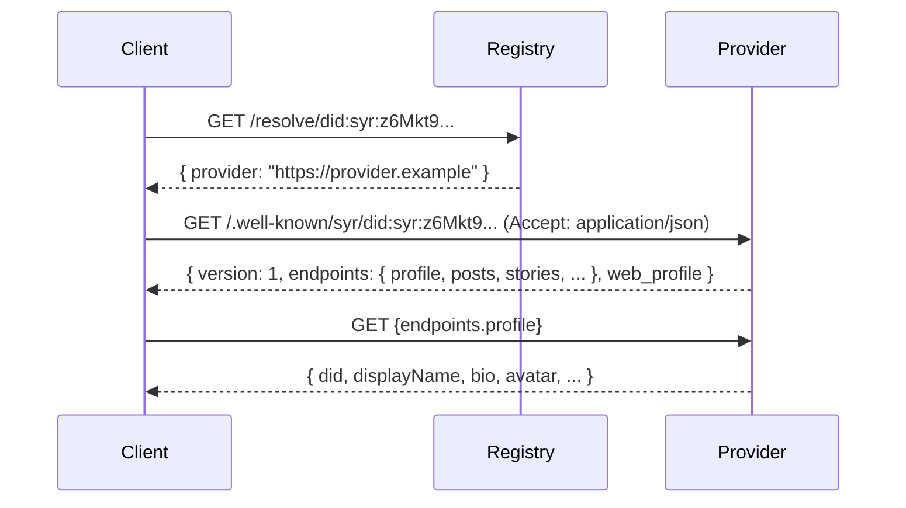

# Syr Provider Service Specification v0.1

## 1. Purpose

A **Syr Identity Provider** is a network service responsible for hosting
the active state of a root identity, including:

- profile data
- public metadata
- identity-based auth endpoints
- delegated signing context (future)
- migration export/import

Providers enable identities to be:

- reachable on the network
- portable across hosts
- usable in external applications

This specification defines the **minimum required HTTP interface**
for interoperability in Syr v0.1.

---

## 2. Design Principles

### 2.1 Providers do not own identity

Providers:

- host identity state
- serve APIs
- participate in identity-based authentication

Providers MUST NOT:

- control the root private key
- prevent migration
- impersonate the identity

---

### 2.2 Providers are replaceable

Any compliant provider must allow:

- export of identity data
- import to another provider
- uninterrupted DID continuity

---

### 2.3 Minimal viable surface

v0.1 defines only:

- public metadata endpoint
- profile retrieval
- identity-based auth endpoints (minimal)
- export endpoint for migration

No:

- federation
- advanced permissions
- streaming sync
- social graph APIs

---

## 3. Provider Discovery

### 3.0 Instance discovery

`GET /.well-known/syr` returns instance-level metadata including API base paths and a template for per-identity manifest URLs:

```json
{
	"name": "syr",
	"public_url": "https://provider.example",
	"api": {
		"public_profile": "https://provider.example/api/public/profile",
		"public_posts": "https://provider.example/api/public/posts",
		"public_stories": "https://provider.example/api/public/stories",
		"public_uploads": "https://provider.example/api/public/uploads",
		"public_following": "https://provider.example/api/public/following",
		"public_emojis": "https://provider.example/api/public/emojis",
		"public_gifs": "https://provider.example/api/public/gifs"
	},
	"identity_manifest_template": "https://provider.example/.well-known/syr/{did}",
	"syner": {
		"independent_login_challenge": "https://provider.example/api/auth/independent-login/challenge/{id}",
		"independent_login_verify": "https://provider.example/api/auth/independent-login/verify",
		"profile_sync": "https://provider.example/api/auth/independent-login/profile-sync",
		"export_challenge": "https://provider.example/api/identity/export-challenge/{id}",
		"export_verify": "https://provider.example/api/identity/export-verify",
		"export_signatures": "https://provider.example/api/identity/export-signatures",
		"sigil_handoff_payload": "https://provider.example/api/user/sigil-handoff/{id}/payload",
		"post_sign_payload": "https://provider.example/api/user/post-sign/{id}/payload",
		"post_sign_signature": "https://provider.example/api/user/post-sign/{id}/signature",
		"registry_sign_payload": "https://provider.example/api/user/registry-sign/{id}/payload",
		"registry_sign_signature": "https://provider.example/api/user/registry-sign/{id}/signature"
	}
}
```

The `syner` object is optional. It provides URL templates for the Syner companion app's operational flows (independent login, export verification, signing). `{id}` is replaced with the actual challenge or session ID. Third-party providers implementing the Syr protocol advertise their own route structure here. If absent, Syner falls back to the default Syr paths.

### 3.1 Per-identity manifest

Each hosted identity has a manifest at `/.well-known/syr/{did}` that advertises the absolute URLs for all public API endpoints. This is the **primary discovery mechanism** for clients interacting with a remote identity.



#### Content negotiation

The manifest URL supports content negotiation via the `Accept` header:

- **`Accept: application/json`** → returns the manifest JSON (for API clients)
- **`Accept: text/html`** (or default) → **302 redirect** to `web_profile` (for browsers)

This means `identity_host_url` can point directly to the manifest URL: browsers clicking it are redirected to the human-readable profile page, while API clients receive the structured manifest.

#### Manifest response

```json
{
	"version": 1,
	"did": "did:syr:...",
	"provider": "https://provider.example",
	"endpoints": {
		"profile": "https://provider.example/api/public/profile/did%3Asyr%3A...",
		"posts": "https://provider.example/api/public/posts/did%3Asyr%3A...",
		"stories": "https://provider.example/api/public/stories/did%3Asyr%3A...",
		"uploads": "https://provider.example/api/public/uploads/did%3Asyr%3A...",
		"did_document": "https://provider.example/api/identity/did%3Asyr%3A.../document",
		"public_following": "https://provider.example/api/public/following/did%3Asyr%3A...",
		"public_emojis": "https://provider.example/api/public/emojis/did%3Asyr%3A...",
		"public_gifs": "https://provider.example/api/public/gifs/did%3Asyr%3A...",
		"public_comments": "https://provider.example/api/public/comments/did%3Asyr%3A...",
		"public_reactions": "https://provider.example/api/public/reactions/did%3Asyr%3A..."
	},
	"web_profile": "https://provider.example/u/did%3Asyr%3A..."
}
```

Rules:

- All URLs are **absolute** — consumers MUST NOT assume the origin.
- Provider MUST ensure `did` matches the served identity.
- Response includes `Cache-Control: public, max-age=300`.
- `version` is `1`; future versions may add fields.

#### Fallback behavior

If a provider does not serve a manifest (404 or non-JSON response), clients SHOULD fall back to the conventional hardcoded paths:

- Profile: `{provider}/api/public/profile/{did}`
- Posts: `{provider}/api/public/posts/{did}`
- Stories: `{provider}/api/public/stories/{did}`
- Uploads: `{provider}/api/public/uploads/{did}`
- DID Document: `{provider}/api/identity/{did}/document`
- Following: `{provider}/api/public/following/{did}`
- Emojis: `{provider}/api/public/emojis/{did}`
- GIFs: `{provider}/api/public/gifs/{did}`
- Comments: `{provider}/api/public/comments/{did}`
- Reactions: `{provider}/api/public/reactions/{did}`

---

## 4. Profile Endpoint

### 4.1 Retrieve profile

```
GET /profile
```

Returns **public profile representation**.

Example:

```json
{
	"did": "did:syr:...",
	"displayName": "Alice",
	"bio": "...",
	"avatar": "https://...",
	"updatedAt": "..."
}
```

Requirements:

- MUST be publicly accessible.
- MUST correspond to the resolved DID.
- MUST NOT expose private data.

---

## 5. Identity-Based Auth Endpoints

Providers MUST implement identity-based authentication endpoints. In v0.1, authentication is password-based (for server-hosted keys). Future phases will support challenge-response signing for users with exported keys.

| Endpoint         | Purpose               |
| ---------------- | --------------------- |
| /oauth/authorize | User authorization    |
| /oauth/token     | Code → token exchange |
| /oauth/userinfo  | Identity claims       |

---

### 5.1 Auth Subject Rule

All tokens MUST use:

```
sub = did:syr identifier
```

Never:

- usernames
- database IDs
- provider-specific identifiers

This guarantees **cross-provider portability**.

---

### 5.2 Required UserInfo claims

```json
{
	"sub": "did:syr:...",
	"did": "did:syr:...",
	"profile": "https://provider.example/profile"
}
```

Additional claims are **optional**.

---

## 6. Migration Support

### 6.1 Export endpoint

```
GET /export
```

**Authentication:** The `/export` endpoint MUST require proof of authorization
before returning the portable identity bundle. Callers MUST present either:

- a signed assertion from the root key, or
- an authorized delegated key

**Accepted proof mechanism:** Providers MUST accept one of:

- `Authorization: Bearer <JWT>` where the JWT is signed by the root or delegated key, or
- `Authorization: Syr-Signature <base64>` with a signed HTTP Authorization header
  containing a timestamped assertion from the root or delegated key

**Failure responses:**

| Code | Meaning                                                           |
| ---- | ----------------------------------------------------------------- |
| 401  | Unauthorized — missing or invalid proof                           |
| 403  | Forbidden — insufficient delegation (e.g. key lacks export scope) |

Returns a **portable identity bundle** containing:

- profile data
- public assets metadata
- provider-specific state needed for migration

Example:

```json
{
  "did": "did:syr:...",
  "profile": { ... },
  "assets": [ ... ],
  "exportedAt": "..."
}
```

---

### 6.2 Import (out of scope for v0.1)

Import behavior is **provider-implementation specific** in v0.1,
but future specs will standardize it.

---

### 6.3 Migration invariants

Providers MUST NOT:

- refuse export
- lock identity data
- alter DID identifier
- invalidate signatures

---

## 7. Security Model

### 7.1 Root key authority

In v0.1, the SYR instance holds the root private key as **custodian**. The provider generates and manages keys on behalf of the user.

This is acceptable because SYR instances are **self-hosted or community-hosted** — the operator is the user or their trusted delegate, not a third-party platform.

> **Future:** When users export their root key, providers will treat externally-held root key signatures as the only authority for registry updates, delegation, and sensitive actions. The provider will no longer hold the root key.

---

### 7.2 Provider compromise

If compromised:

- attacker MAY serve incorrect profile data
- attacker MUST NOT be able to:
  - migrate identity
  - forge root signatures
  - change DID

---

### 7.3 TLS requirement

Providers MUST:

- serve all endpoints over **HTTPS**
- use valid TLS certificates

Plain HTTP is **not permitted**.

---

## 8. Privacy Considerations

Public profile endpoint reveals:

- existence of identity
- chosen public metadata

Providers SHOULD:

- minimize exposed data
- avoid leaking private activity

Advanced privacy controls are **future work**.

---

## 9. Future Extensions (Not in v0.1)

Planned provider capabilities:

- **client-side key offloading** — users export root keys, provider deletes its copy
- **delegated device key signing** — mutations signed client-side with delegated keys
- signed activity streams
- federation sync
- selective disclosure
- encrypted private storage
- institutional role APIs

These are intentionally excluded from v0.1.

---

## 10. Versioning

**Version:** v0.1
**Status:** Draft
**Scope:** Minimum provider interface required to support:

- DID resolution
- profile hosting
- OAuth acting identity
- identity migration

Future versions will expand toward **full federated identity hosting**.
