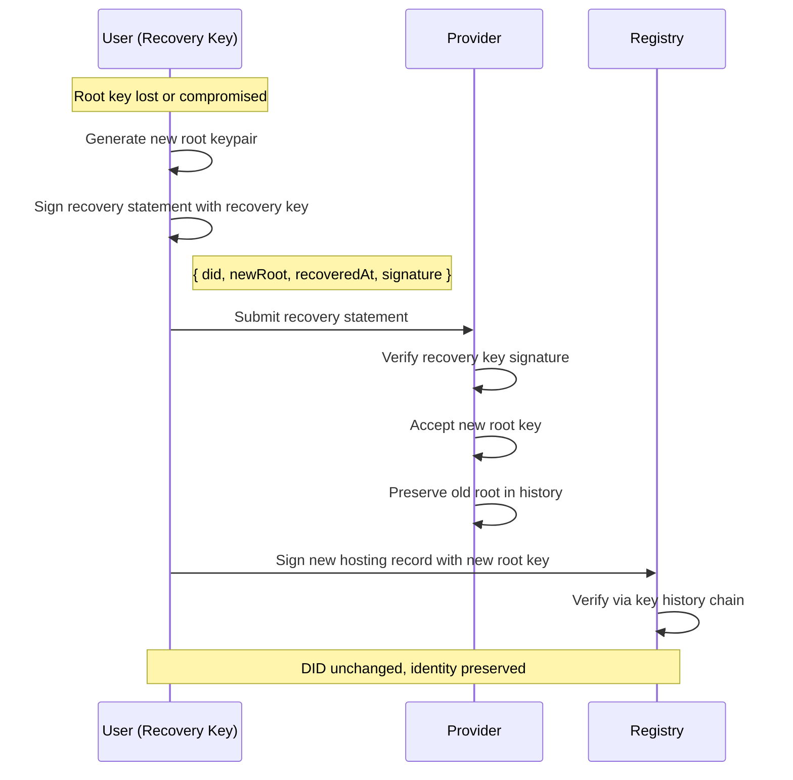
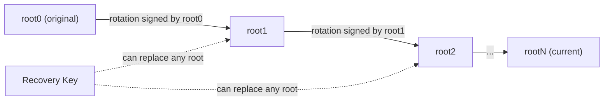

# Syr Recovery & Key Rotation Specification v0.1

## 1. Purpose

This specification defines how a Syr identity can:

- recover from **lost root keys**
- rotate compromised or aging root keys
- maintain **continuous identity ownership**
- preserve **DID stability** across recovery events

Without recovery and rotation, Syr identities would be
**permanently fragile** and unusable in real-world conditions.

---

## 2. Design Principles

### 2.1 Identity continuity is paramount

Recovery and rotation MUST:

- preserve the same `did:syr` identifier
- maintain verifiable ownership history
- avoid dependence on any single institution or provider

---

### 2.2 Recovery must not enable silent takeover

Any recovery mechanism MUST ensure:

- attackers cannot replace the root key undetected
- recovery requires **independent trust factors**
- recovery events are **cryptographically auditable**

---

### 2.3 Minimal viable recovery for v0.1

v0.1 defines only:

- **recovery key method**
- **root key rotation via signed chain**

Social recovery, guardians, and threshold cryptography
are **future extensions**.

---

## 3. Recovery Key Model

### 3.1 Recovery key definition

A **recovery key** is a secondary keypair that:

- is generated at identity creation
- is stored separately from the root key
- can authorize **root key replacement**

The recovery key MUST:

- never be used for routine authentication
- be protected with strong offline storage

---

### 3.2 Recovery statement format



Root key replacement is expressed as:

```json
{
	"did": "did:syr:...",
	"newRoot": "<newRootPublicKey>",
	"recoveredAt": "ISO-8601 timestamp",
	"signature": "<signed by recovery key>"
}
```

---

### 3.3 Recovery verification rules

Resolvers and providers MUST:

1. Verify signature using the registered recovery public key.
2. Confirm timestamp freshness.
3. Accept the **new root key** as authoritative.
4. Preserve previous root keys in **history** (for auditability).

---

## 4. Root Key Rotation (Non-compromise)

Rotation may occur without compromise for:

- key aging
- cryptographic upgrades
- security hygiene

---

### 4.1 Rotation statement

```json
{
	"did": "did:syr:...",
	"newRoot": "<newRootPublicKey>",
	"rotatedAt": "ISO-8601 timestamp",
	"signature": "<signed by current root key>"
}
```

---

### 4.2 Rotation verification

Systems MUST:

- verify signature using **current root key**
- update root key reference
- append rotation event to **key history**

---

## 5. Key History Chain

Each identity maintains a **verifiable chain** of root keys:



```text
root₀ → root₁ → root₂ → ...
```

Rules:

- Each transition MUST be signed by:
  - previous root key **OR**
  - recovery key
- History MUST be append-only.
- Historical signatures MUST remain valid.

---

## 6. Registry Interaction During Rotation

After recovery or rotation:

1. Identity signs **new hosting record** using the **new root key**.
2. Registry verifies using updated key history.
3. Provider resolution continues unchanged.

This ensures:

> **provider portability survives key changes**.

---

## 7. Security Considerations

### 7.1 Lost root key

If root key is lost:

- recovery key enables identity restoration
- DID identifier remains unchanged
- prior signatures remain auditable

---

### 7.2 Recovery key compromise

If recovery key is compromised:

- attacker MAY replace root key
- mitigation requires **future social/threshold recovery**

v0.1 assumes secure recovery key storage.

---

### 7.3 Simultaneous compromise

If both:

- root key
- recovery key

are compromised → identity loss is unavoidable.

Future multi-party recovery will mitigate this.

---

## 8. Privacy Considerations

Recovery and rotation reveal:

- timing of security events
- number of key transitions

Future work MAY include:

- encrypted recovery metadata
- privacy-preserving rotation proofs

Not included in v0.1.

---

## 9. Future Extensions (Not in v0.1)

Planned improvements:

- social recovery guardians
- threshold signatures
- time-locked recovery
- institutional recovery attestations
- hardware-bound recovery approval

These are deferred to maintain **implementability**.

---

## 10. Versioning

**Version:** v0.1  
**Status:** Draft  
**Scope:** Minimal recovery and rotation sufficient for:

- real-world identity survivability
- safe root key replacement
- uninterrupted DID continuity

This completes the **core cryptographic resilience layer** of Syr.
