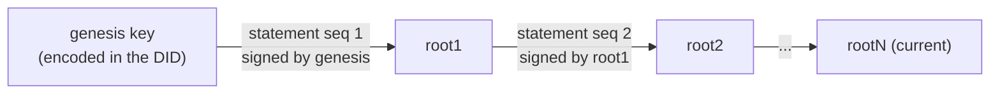
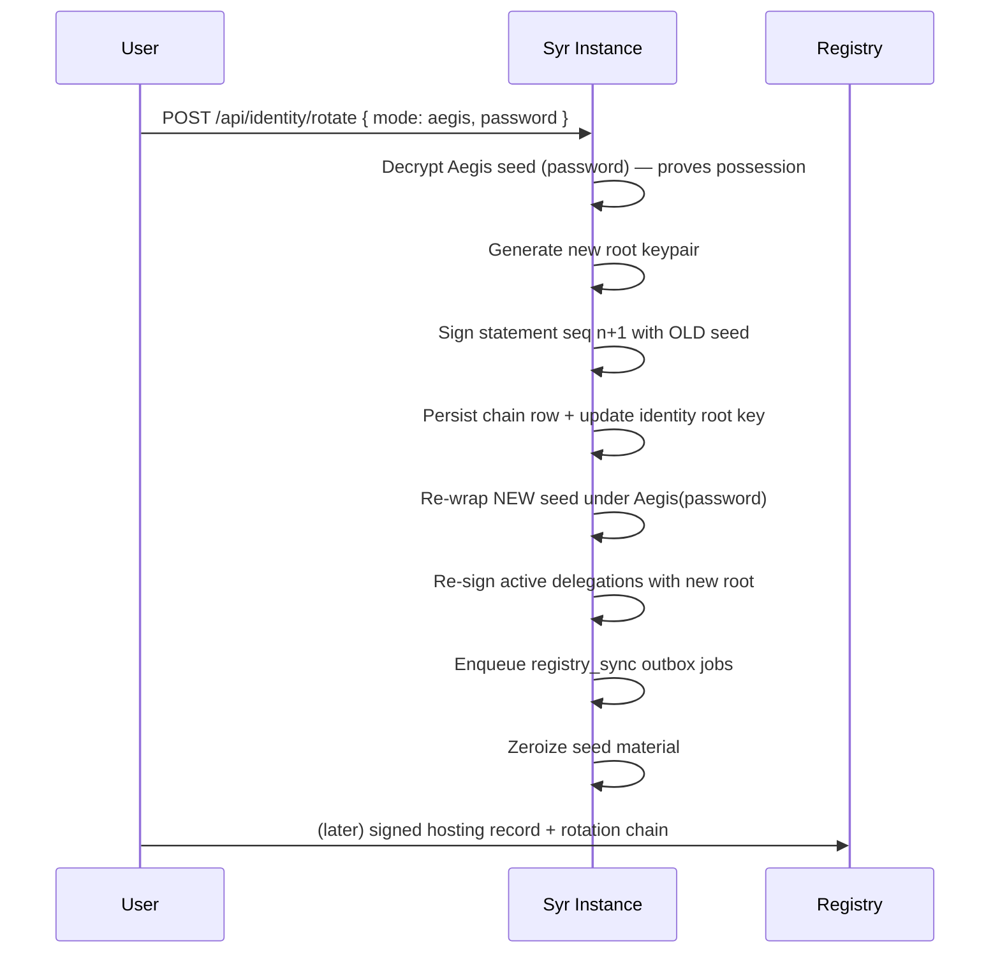

# Syr Root Key Rotation Specification v1

> **Product status:** Root key rotation via a per-DID signed chain is **implemented**. Recovery keys (rotating away a _lost_ root key) remain **out of scope** for v1 — see §8.

## 1. Purpose

This specification defines how a Syr identity rotates its **root key** while keeping the same `did:syr` identifier:

- the DID is **genesis-key-derived and never changes**
- rotation appends **signed statements** to a per-DID **rotation chain**
- any verifier holding the chain can derive the **current root key** from the DID alone
- past signatures stay auditable; delegations survive rotation under an explicit validity policy

Rotation requires **possession of the current root key** — either the Aegis password (custodial seed) or an external signer such as Syner (self-custody). There is no recovery path for a lost key in v1.

---

## 2. Chain Model



- The **genesis key** is the Ed25519 public key encoded in `did:syr:z…`. It is the chain's anchor; no external registry is needed to establish it.
- Each **rotation statement** retires one key (`prevRoot`) and installs its successor (`newRoot`), signed by the retiring key's private half — _the retiring key authorizes its successor_.
- The **current root key** is the `newRoot` of the last statement, or the genesis key when the chain is empty.
- The chain is **append-only**: statements are never edited or removed.

---

## 3. Rotation Statement (payload v2)

```json
{
	"did": "did:syr:z6Mk…",
	"seq": 2,
	"prevRoot": "z6Mk…",
	"newRoot": "z6Mk…",
	"rotatedAt": "2026-01-01T00:00:00.000Z",
	"signature": "z…"
}
```

| Field       | Meaning                                                                                       |
| ----------- | --------------------------------------------------------------------------------------------- |
| `did`       | The identity's DID. Included in the signed payload — chains cannot be replayed across DIDs.   |
| `seq`       | 1-based chain position. Strictly increasing, **no gaps**.                                     |
| `prevRoot`  | Multibase key being retired. Statement 1's `prevRoot` MUST equal the genesis key.             |
| `newRoot`   | Multibase key taking over as root.                                                            |
| `rotatedAt` | ISO-8601 timestamp. Non-decreasing along the chain.                                           |
| `signature` | Multibase Ed25519 signature by **`prevRoot`'s private key** over the canonical payload below. |

**Canonical signing payload** — the RFC 8785 (JCS) serialization of:

```
{ "did", "seq", "prevRoot", "newRoot", "rotatedAt" }
```

Implementations MUST byte-match the JCS output between Rust (`syr-crypto-core::rotation`) and TS (`@syr-is/crypto`). Statements created by Syr instances use millisecond-precision UTC `Z` timestamps (`2026-01-01T00:00:00.000Z`) so the signed `rotatedAt` survives datetime storage roundtrips losslessly; externally submitted statements MUST use the same form.

---

## 4. Chain Validation Rules

`verify_rotation_chain(did, statements) → current key` MUST enforce, per statement _i_ (1-based):

1. **DID match** — `statement.did == did` (rejects cross-DID replay).
2. **Seq continuity** — `statement.seq == i`; 1-based, strictly increasing, no gaps.
3. **Link check** — `statement.prevRoot` equals the prior statement's `newRoot`, or the **genesis key** for statement 1 (rejects forks).
4. **Signature check** — `signature` verifies under `prevRoot` over the JCS canonical payload.
5. **Timestamp monotonicity** — `rotatedAt` is non-decreasing along the chain.

The result is the last `newRoot` (genesis when the chain is empty). Any failure invalidates the whole chain — verifiers MUST NOT accept a prefix.

---

## 5. Rotation Flows

### 5.1 Custodial rotation (`mode: "aegis"`)

`POST /api/identity/rotate` `{ "mode": "aegis", "password": "…" }` (session-authenticated, own DID only):



In one flow, rolled back on any mid-step failure (rollback ledger):

1. verify the password by decrypting the Aegis seed (the seed MUST match the current root),
2. generate the new root keypair,
3. create the statement **signed by the old key**,
4. persist the chain row and move `identity.public_key` to the new root,
5. re-wrap the **new** seed under Aegis(password), replacing the old `aegis_*` columns,
6. **re-sign active delegations** (non-revoked, non-expired) with the new root,
7. enqueue the `registry_sync` outbox jobs so every publication registry gets a hosting record re-signed under the new root (the push includes the chain),
8. zeroize all seed material.

### 5.2 Self-custody rotation (`mode: "external"`)

`POST /api/identity/rotate` `{ "mode": "external", "statement": { … } }`:

The client (Syner or any external signer) builds and signs the fully-formed statement itself; **no server-side key material is involved**. The instance validates the statement against the stored chain — `seq = n+1`, `prevRoot` = current root, valid signature, genesis linkage, monotonic `rotatedAt` — then persists the row and updates the identity's current key. Registry re-sync jobs are enqueued; the user signs them with the new key via the existing Syner signing session flow.

A dedicated Syner rotation UI is planned; until then external statements can be produced by any tool implementing this spec.

Identities that still hold an Aegis bundle MUST rotate via `mode: "aegis"` (or remove Aegis first) — otherwise the stored custodial seed would silently stop matching the root key.

---

## 6. Delegation Validity Across Rotation

A delegation signed by a **retired** root key remains valid **iff it was created before that key's `rotatedAt`** (verifiers holding the chain check the delegation's `createdAt` against the retiring statement's `rotatedAt`). A retired key can never mint _new_ delegations.

Additionally, **custodial rotation re-signs** all active (non-revoked, non-expired) delegations with the new root, so verifiers that only track the current key keep accepting them without consulting timestamps. External (self-custody) rotation cannot re-sign server-side; those delegations rely on the timestamp policy above.

See [Key hierarchy & delegation](/architecture/key-hierarchy-delegation).

---

## 7. Publication & Discovery

- **`GET /api/identity/{did}/rotations`** — public, per-identity ordered chain (see [Public API](/reference/public-api)). Advertised in the [per-identity manifest](/reference/public-api) as `endpoints.rotations`.
- **DID document** — `#root` always presents the **current** key ([did:syr method](/architecture/did-method)).
- **Registries** — hosting-record updates attach the chain; registries verify it from genesis, check the record signature under the current key, and keep a per-DID seq high-water mark for rollback protection ([registry protocol](/architecture/registry-protocol)).

Trust-anchor rule for implementations: **never verify a root signature against the raw genesis key parsed from the DID** — always resolve genesis + chain to the current key first.

---

## 8. Recovery Keys — Out of Scope (v1)

v1 rotation **requires possession** of the current root key: the Aegis password (custodial) or the external signer holding the seed (self-custody). There is deliberately **no recovery-key mechanism**:

- A recovery key is a second long-lived secret with root-replacement power; it doubles the theft surface while being stored _less_ carefully than the root key in practice.
- Custodial identities already have a working possession path (the password); self-custody users chose to hold their own keys, and a server-side recovery override would undermine exactly that guarantee.
- Doing recovery _well_ (social guardians, thresholds, time-locks) is a protocol of its own; shipping a naive single-recovery-key scheme would freeze a weak design into the trust model.

If both the root key and (for custodial identities) the password are lost, the identity cannot be rotated; the practical path is a new DID plus [export](/architecture/export)/[import](/architecture/import) of content. Social/threshold recovery remains a candidate for a future phase.

---

## 9. Security Considerations

- **Compromised current key** — the attacker can extend the chain and take the identity; rotation is not a compromise-_recovery_ mechanism, it is compromise _hygiene_ (rotate before, not after). Registries' seq high-water mark prevents the _previous_ holder from rolling the chain back.
- **Fork attempts** — two statements with the same `seq` cannot both verify against one chain; verifiers reject any chain whose links don't match, and registries reject seq regressions.
- **Cross-DID replay** — impossible: `did` is inside every signed payload.
- **Chain withholding** — a verifier that has never seen the chain resolves the genesis key and will reject current-key signatures; publishing the chain (rotations endpoint, manifest, registry records) is therefore part of rotation, which the implementation automates.

---

## 10. Versioning

**Version:** v1
**Status:** Implemented — `syr-crypto-core::rotation`, `@syr-is/crypto`, `POST /api/identity/rotate`, `GET /api/identity/{did}/rotations`, chain-aware registry + resolver.
**Out of scope:** recovery keys, social/threshold recovery, encrypted rotation metadata.
