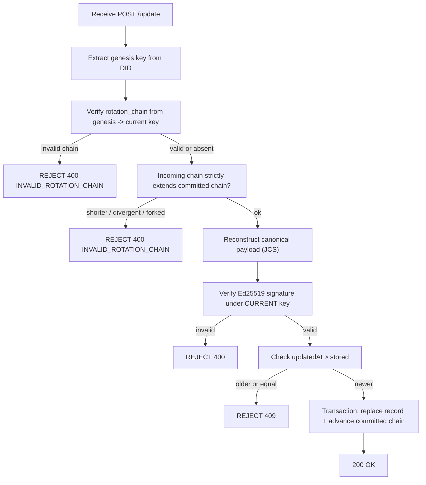
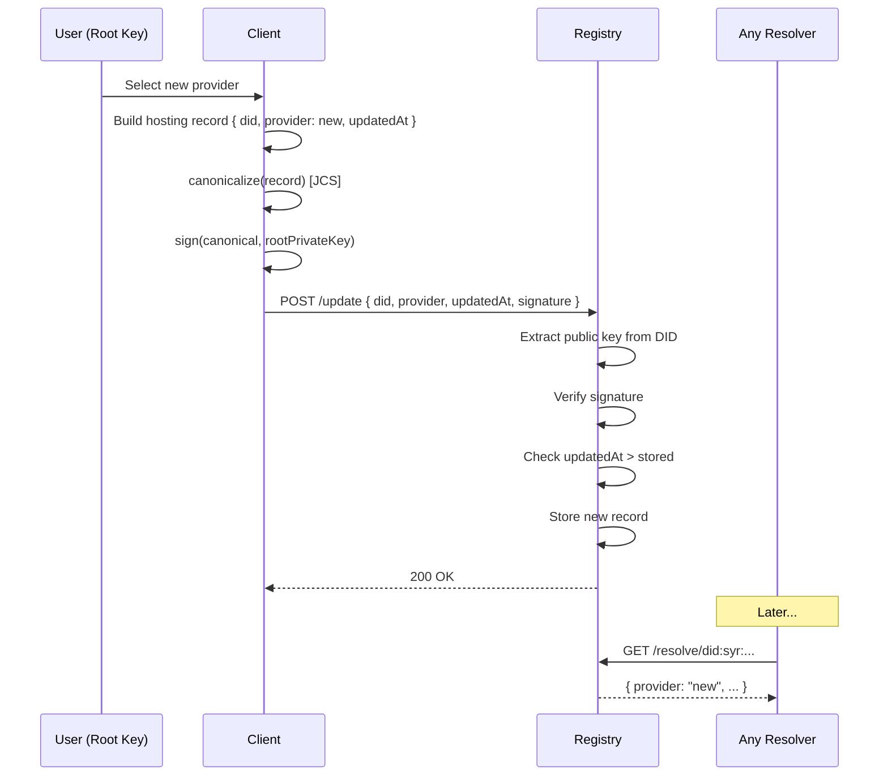

# Syr Registry Protocol v0.1

## 1. Purpose

A **Syr Registry** provides a cryptographically verifiable mapping from:

```
did:syr → current identity provider endpoint
```

It enables:

- DID resolution
- provider portability
- identity migration without identifier change
- institutional and OAuth discovery

A registry is **not a trust authority**.  
It is a **signed pointer directory** whose correctness depends solely on
**root identity signatures**.

---

## 2. Design Principles

### 2.1 Identity ownership is cryptographic

- Only the **current root private key** may update hosting records (the current key is the genesis key advanced through the [rotation chain](/architecture/recovery-rotation)).
- Registry operators **cannot impersonate identities**.
- Registry compromise must **not allow identity takeover**.

---

### 2.2 Registries are plural by design

Many registries are expected to coexist — operated under different national
jurisdictions, communities, and governance models. Users become visible on
the registries they (or their platforms) publish to; platforms may operate
their own registries and add their registered users to them.

- **No single registry is assumed to be followed by every platform.**
- **No registry is required for identity verification** — ownership is proven
  by root signatures alone; a registry is a **discovery convenience, never a
  trust authority**.
- Any registry may be replicated or replaced without affecting identity
  validity.

---

### 2.3 Minimal viable surface

v0.1 intentionally supports only:

- single active provider record per DID
- signed updates
- basic resolution

No:

- multi-provider routing
- gossip sync
- blockchain anchoring
- advanced revocation logic

---

## 3. Data Model

### 3.1 Hosting Record

Each DID maps to a **single latest hosting record** per registry.

```json
{
	"did": "did:syr:...",
	"provider": "https://provider.example",
	"updatedAt": "ISO-8601 timestamp",
	"signature": "multibase signature by the CURRENT root key",
	"rotation_chain": [
		{
			"did": "did:syr:...",
			"seq": 1,
			"prevRoot": "z6Mk… (genesis)",
			"newRoot": "z6Mk…",
			"rotatedAt": "ISO-8601 timestamp",
			"signature": "z… (by prevRoot)"
		}
	]
}
```

`rotation_chain` is optional: it is present when the identity has rotated its
root key. The registry stores the chain with the record and returns it from
`/resolve` so resolvers can verify the signature under the current key.

---

### 3.2 Canonical Signing Payload

The signed payload MUST be the **UTF-8 JCS (RFC 8785)** deterministic JSON
serialization of the object `{ "did", "provider", "updatedAt" }`.

This means:

- **Lexicographically sorted object keys** (e.g. `did`, `provider`, `updatedAt`).
- **Compact JSON** — no insignificant whitespace.
- **UTF-8** — no BOM.
- **No trailing newline**.
- **Deterministic number formatting** — integers and floats per RFC 8785.

Both signers and verifiers MUST apply the same canonicalization algorithm
(reference RFC 8785) before signing or verifying to avoid ambiguity.

Signature uses **Ed25519**.

---

## 4. Registry API

### 4.1 Resolve Identity

```
GET /resolve/{did}
```

**Response:**

```json
{
	"did": "...",
	"provider": "...",
	"updatedAt": "...",
	"signature": "...",
	"rotation_chain": ["… (present only for rotated identities)"]
}
```

Errors:

| Code | Meaning                             |
| ---- | ----------------------------------- |
| 404  | DID not found                       |
| 410  | DID explicitly deactivated (future) |

---

### 4.2 Update Hosting Record

```
POST /update
```

**Request body:**

```json
{
	"did": "...",
	"provider": "...",
	"updatedAt": "...",
	"signature": "...",
	"rotation_chain": ["… (optional; required once the identity has rotated)"]
}
```

---

### 4.3 Verification Rules (chain-aware)

Registry MUST:

1. Extract the **genesis** public key from the DID.
2. If `rotation_chain` is present, **verify the chain** from the genesis key
   (DID match, seq continuity from 1, prevRoot linkage, per-hop signatures,
   non-decreasing `rotatedAt`) → derive the **current root key**. Absent
   chain ⇒ current key = genesis key.
3. **Rollback + fork protection (prefix pinning):** persist the committed
   rotation chain per DID. Require the incoming chain to **exactly extend** it —
   every committed statement must be reproduced identically (same
   `did`/`seq`/`prevRoot`/`newRoot`/`signature`) as a prefix of the incoming
   chain. Reject a **shorter** chain (rollback), a **same-length divergence**,
   and any **prefix mismatch** (a fork below the committed tip, e.g. forged from
   a stolen RETIRED key) as `INVALID_ROTATION_CHAIN` — even with a valid
   signature under a retired key.
4. Reconstruct the canonical payload (JCS).
5. Verify the Ed25519 signature under the **current** root key.
6. Ensure `updatedAt` is **strictly newer** than the stored record.
7. On success, persist the record write and advance the committed chain in a
   **single transaction** (commit or fail together).



Reject if:

- rotation chain invalid (bad link, seq gap, bad per-hop signature, cross-DID)
- chain does not strictly extend the committed chain — shorter, same-length
  divergence, or forked prefix (rollback/fork) → `INVALID_ROTATION_CHAIN`
- signature invalid under the current key
- timestamp older or equal
- malformed DID
- invalid provider URL

The same chain-aware verification applies to `POST /delete` and
`POST /directory/upsert`.

---

## 5. Resolution Semantics

### 5.1 Freshness

Resolvers SHOULD:

- cache responses briefly
- revalidate periodically

Exact caching strategy is **out of scope** for v0.1.

---

### 5.2 Provider Trust

Registry guarantees only:

> **Which provider the identity selected.**

It does **not** guarantee:

- provider honesty
- provider availability
- profile correctness

Those are handled by:

- cryptographic signatures
- institutional attestations
- application logic

---

## 6. Migration Flow

Identity migration occurs when:

1. User selects new provider.
2. Root key signs new hosting record.
3. Client submits `POST /update`.
4. Registry verifies and stores.
5. Future `/resolve` calls return new provider.



---

### 6.1 Migration Invariants

Migration MUST NOT:

- change DID identifier
- invalidate past signatures
- remove historical attestations
- require provider permission

---

## 7. Security Model

### 7.1 Registry compromise

If registry is compromised:

- attacker **cannot forge updates** without root key
- attacker **may censor or delay resolution**

Mitigations are future work.

---

### 7.2 Replay and rollback attacks

Prevented by:

- strictly increasing `updatedAt` timestamps (record replay)
- **prefix pinning** the per-DID committed rotation chain (chain rollback/fork:
  an incoming chain that does not exactly extend the committed one — shorter, a
  same-length divergence, or a fork below the committed tip presented by whoever
  holds a stolen retired key — is rejected even with a valid signature under
  that retired key)

---

### 7.3 Provider compromise

Does NOT allow:

- registry update
- identity takeover
- signature forgery.

---

## 8. Privacy Considerations

Registry reveals:

- that a DID exists
- its current provider

It does NOT reveal:

- real-world identity
- attestations
- activity history

Advanced privacy mechanisms are **future work**.

---

## 9. Future Extensions (Not in v0.1)

Planned evolution areas:

- registry mirroring / replication protocols
- append-only transparency logs
- decentralized consensus or gossip
- provider history tracking
- DID deactivation
- privacy-preserving resolution

These are intentionally deferred to keep v0.1 **minimal and implementable**.

---

## 10. Versioning

**Version:** v0.1  
**Status:** Draft  
**Scope:** Minimal registry protocol sufficient for:

- DID resolution
- provider portability
- identity migration
- rotation-chain-aware verification with rollback + fork (prefix-pinning) protection

Registries remain plural, independently operated discovery services; future versions expand toward **federated and trust-minimized resolution**.
