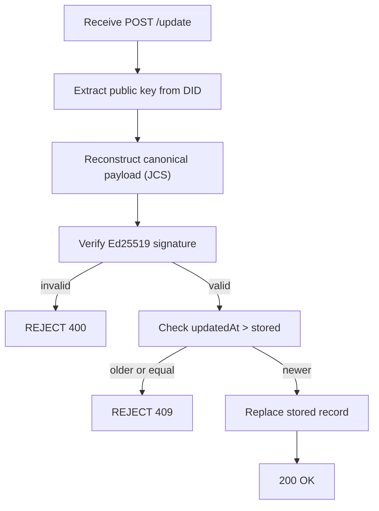
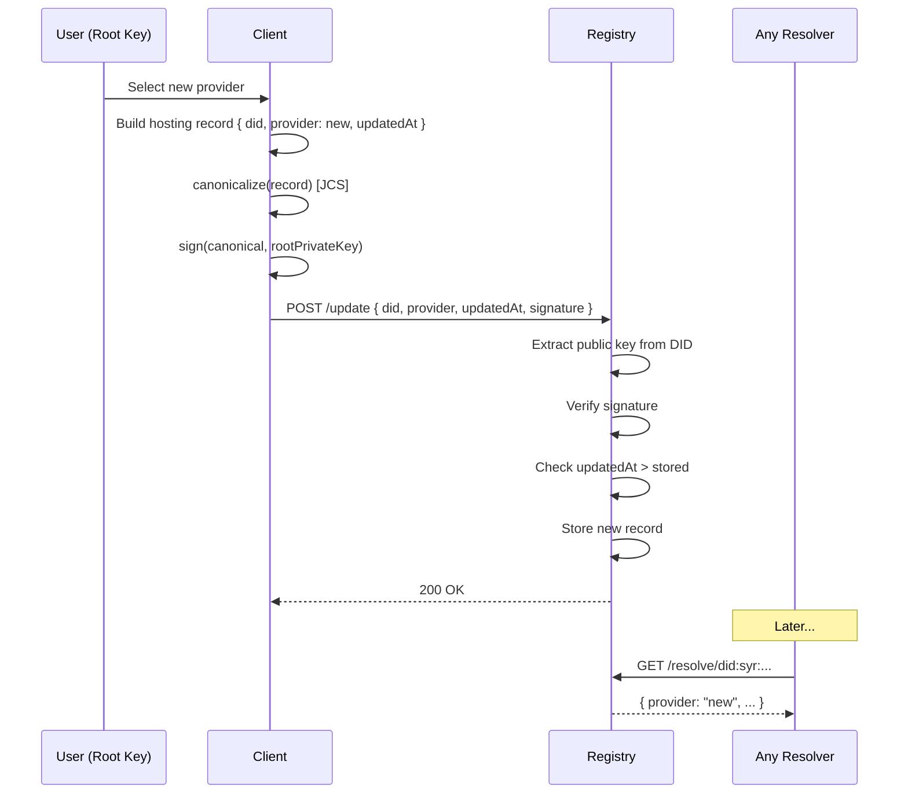

# Syr Registry Protocol v0.1

## 1. Purpose

The **Syr Registry** provides a cryptographically verifiable mapping from:

```
did:syr → current identity provider endpoint
```

It enables:

- DID resolution
- provider portability
- identity migration without identifier change
- institutional and OAuth discovery

The registry is **not a trust authority**.  
It is a **signed pointer directory** whose correctness depends solely on
**root identity signatures**.

---

## 2. Design Principles

### 2.1 Identity ownership is cryptographic

- Only the **root private key** may update hosting records.
- Registry operators **cannot impersonate identities**.
- Registry compromise must **not allow identity takeover**.

---

### 2.2 Registry is replaceable infrastructure

The registry:

- must not be the root of trust
- may be replicated or replaced in future versions
- exists only for **resolution convenience**

Future decentralization is **explicitly out of scope for v0.1**.

---

### 2.3 Minimal viable surface

v0.1 intentionally supports only:

- single active provider record per DID
- signed updates
- basic resolution

No:

- multi-provider routing
- gossip sync
- blockchain anchoring
- advanced revocation logic

---

## 3. Data Model

### 3.1 Hosting Record

Each DID maps to a **single latest hosting record**.

```json
{
	"did": "did:syr:...",
	"provider": "https://provider.example",
	"updatedAt": "ISO-8601 timestamp",
	"signature": "multibase signature by root key"
}
```

---

### 3.2 Canonical Signing Payload

The signed payload MUST be the **UTF-8 JCS (RFC 8785)** deterministic JSON
serialization of the object `{ "did", "provider", "updatedAt" }`.

This means:

- **Lexicographically sorted object keys** (e.g. `did`, `provider`, `updatedAt`).
- **Compact JSON** — no insignificant whitespace.
- **UTF-8** — no BOM.
- **No trailing newline**.
- **Deterministic number formatting** — integers and floats per RFC 8785.

Both signers and verifiers MUST apply the same canonicalization algorithm
(reference RFC 8785) before signing or verifying to avoid ambiguity.

Signature uses **Ed25519**.

---

## 4. Registry API

### 4.1 Resolve Identity

```
GET /resolve/{did}
```

**Response:**

```json
{
	"did": "...",
	"provider": "...",
	"updatedAt": "...",
	"signature": "..."
}
```

Errors:

| Code | Meaning                             |
| ---- | ----------------------------------- |
| 404  | DID not found                       |
| 410  | DID explicitly deactivated (future) |

---

### 4.2 Update Hosting Record

```
POST /update
```

**Request body:**

```json
{
	"did": "...",
	"provider": "...",
	"updatedAt": "...",
	"signature": "..."
}
```

---

### 4.3 Verification Rules

Registry MUST:

1. Extract root public key from DID.
2. Reconstruct canonical payload.
3. Verify Ed25519 signature.
4. Ensure `updatedAt` is **strictly newer** than stored record.
5. Replace existing record if valid.



Reject if:

- signature invalid
- timestamp older or equal
- malformed DID
- invalid provider URL

---

## 5. Resolution Semantics

### 5.1 Freshness

Resolvers SHOULD:

- cache responses briefly
- revalidate periodically

Exact caching strategy is **out of scope** for v0.1.

---

### 5.2 Provider Trust

Registry guarantees only:

> **Which provider the identity selected.**

It does **not** guarantee:

- provider honesty
- provider availability
- profile correctness

Those are handled by:

- cryptographic signatures
- institutional attestations
- application logic

---

## 6. Migration Flow

Identity migration occurs when:

1. User selects new provider.
2. Root key signs new hosting record.
3. Client submits `POST /update`.
4. Registry verifies and stores.
5. Future `/resolve` calls return new provider.



---

### 6.1 Migration Invariants

Migration MUST NOT:

- change DID identifier
- invalidate past signatures
- remove historical attestations
- require provider permission

---

## 7. Security Model

### 7.1 Registry compromise

If registry is compromised:

- attacker **cannot forge updates** without root key
- attacker **may censor or delay resolution**

Mitigations are future work.

---

### 7.2 Replay attacks

Prevented by:

- strictly increasing `updatedAt` timestamps.

Future versions MAY include:

- sequence numbers
- hash chains.

---

### 7.3 Provider compromise

Does NOT allow:

- registry update
- identity takeover
- signature forgery.

---

## 8. Privacy Considerations

Registry reveals:

- that a DID exists
- its current provider

It does NOT reveal:

- real-world identity
- attestations
- activity history

Advanced privacy mechanisms are **future work**.

---

## 9. Future Extensions (Not in v0.1)

Planned evolution areas:

- multiple registry mirrors
- append-only transparency logs
- decentralized consensus or gossip
- provider history tracking
- DID deactivation
- privacy-preserving resolution

These are intentionally deferred to keep v0.1 **minimal and implementable**.

---

## 10. Versioning

**Version:** v0.1  
**Status:** Draft  
**Scope:** Minimal centralized registry sufficient for:

- DID resolution
- provider portability
- identity migration

Future versions will expand toward **federated and trust-minimized resolution**.
