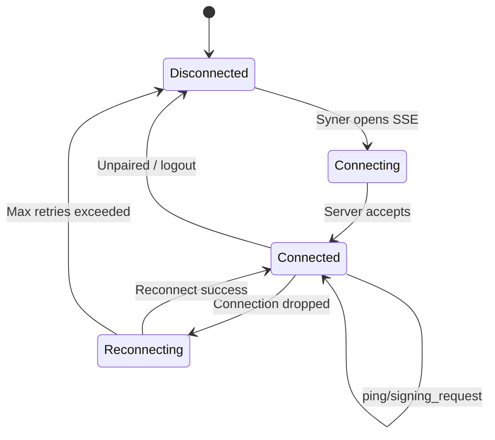
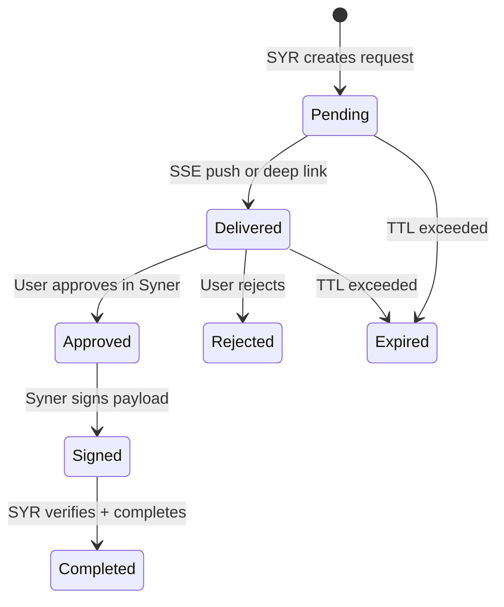
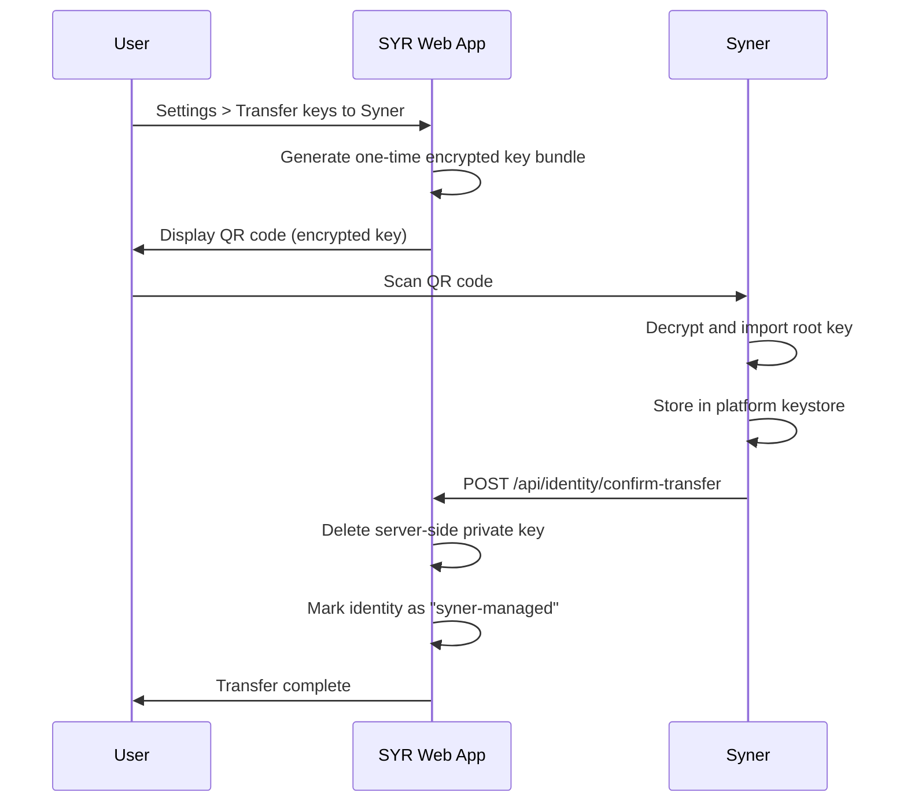
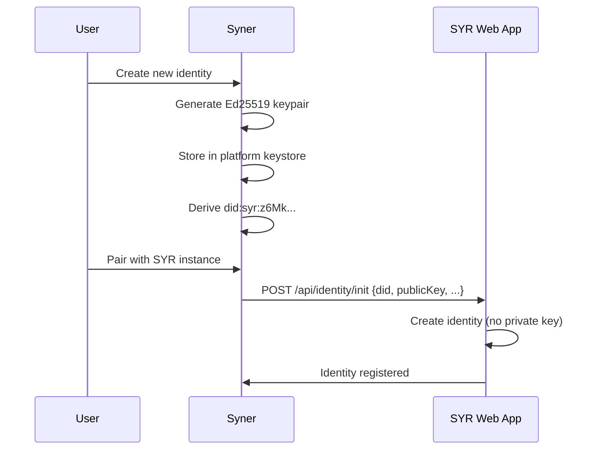

# Syner Integration with SYR

This document specifies the API contracts, data flows, and implementation requirements for integrating Syner (the native companion app) with the SYR web application.

---

## 1. SYR-Side Endpoints

The following API endpoints must be implemented on the SYR web application to support Syner.

### 1.1 Device Pairing

**`POST /api/syner/pair`**

Registers a Syner device with the SYR instance.

Request:

```json
{
	"pairing_code": "ABC123",
	"device_public_key": "z6Mk...(multibase Ed25519)",
	"device_info": {
		"name": "Alice's MacBook",
		"os": "macos",
		"model": "MacBook Pro"
	}
}
```

Response:

```json
{
	"device_token": "jwt...",
	"instance_url": "https://my.syr.is",
	"user_did": "did:syr:z6Mk..."
}
```

**`DELETE /api/syner/pair`**

Unpairs the device authenticated by the JWT in the `Authorization: Bearer <token>` header.

---

### 1.2 SSE Signing Bridge

**`GET /api/syner/events`**

Server-Sent Events stream for pushing signing requests to Syner.

Authentication: Device JWT in `Authorization: Bearer <token>` header.

Events:

The SSE discriminant comes from the `event:` line and must be merged with the parsed JSON body. Clients should construct events as:

```typescript
const ev = { type: eventName, ...JSON.parse(data) };
```

```text
event: connected
data: {"device_id": "uuid", "instance": "https://my.syr.is"}

event: signing_request
data: {"id": "uuid", "request_type": "registry_update", "payload": {...}, "payload_hash": "sha256hex", "created_at": "...", "expires_at": "..."}

event: ping
data: {"timestamp": "..."}
```

**`GET /api/syner/requests/:id`**

Fetch a specific signing request by ID. Used by the deep link fallback flow.

Authentication: Device JWT in `Authorization: Bearer <token>` header. Implementers must enforce ownership checks when resolving the signing request by ID.

Response:

```json
{
	"id": "uuid",
	"request_type": "delegation",
	"payload": { "did": "...", "delegate": "...", "scope": "device", "createdAt": "..." },
	"payload_hash": "sha256hex",
	"created_at": "...",
	"expires_at": "...",
	"status": "pending"
}
```

The `status` field (`"pending" | "signed" | "expired" | "cancelled"`) tells deep-link fallback consumers whether the request is terminal. The payload shape mirrors the `SigningRequest` interface and the SSE event format.

---

### 1.3 Signature Submission

**`POST /api/syner/sign/:id`**

Submit a signature for a pending signing request.

Authentication: Device JWT.

Request:

```json
{
	"signature": "z...(multibase-encoded Ed25519 signature)",
	"signed_at": "ISO-8601"
}
```

Response:

```json
{
	"status": "accepted",
	"request_id": "uuid"
}
```

The SYR backend verifies the signature against the user's root public key and completes the pending operation.

---

### 1.4 Pairing Code Generation

**`POST /api/syner/pairing-code`**

Generates a one-time pairing code for device enrollment.

Authentication: User session (standard SYR auth).

Response:

```json
{
	"code": "ABC123",
	"qr_data": "syr://pair?code=ABC123&instance=https://my.syr.is",
	"expires_at": "ISO-8601"
}
```

### 1.5 Identity Transfer Confirmation

**`POST /api/identity/confirm-transfer`**

Confirms that Syner has successfully imported the identity's private key. Called by Syner after the user scans the encrypted key bundle QR and imports the key into the platform keystore.

Authentication: Device JWT in `Authorization: Bearer <token>` header (or user session if appropriate). Callers must be authorized for the identity being transferred.

Request body:

```json
{
	"identityId": "did:syr:z6Mk...",
	"synerImportReceipt": {
		"challenge": "server-issued-nonce",
		"signature": "z...(multibase Ed25519 signature over challenge)"
	},
	"timestamp": "ISO-8601"
}
```

- `identityId` (required): The DID of the identity being transferred
- `synerImportReceipt` (required): A defined structure containing a server-issued challenge signed by the Syner device. Plain nonces are not accepted. The receipt must include:
  - `challenge` (required): The challenge issued by the server (e.g. during the transfer initiation flow)
  - `signature` (required): Ed25519 signature over the challenge, produced using the Syner device's private key
- `timestamp` (required): When the import occurred

Responses:

- **200 OK**: Transfer confirmed. Identity is now marked "syner-managed".
- **400 Bad Request**: Invalid payload, missing fields, receipt verification failed, or malformed receipt.
- **401 Unauthorized**: Missing or invalid auth token.
- **403 Forbidden**: Caller not authorized for this identity.
- **409 Conflict**: Identity already syner-managed or transfer already confirmed (idempotency).

Semantics:

- The server MUST verify the receipt signature using the device's `device_public_key` (from the paired device record) before marking the identity as "syner-managed" or deleting any server-side private key.
- The server deletes the server-side private key ONLY after `synerImportReceipt` verification succeeds. If verification fails, the key remains and the request returns 400.
- The identity is marked "syner-managed" only upon successful confirmation.
- The operation should be idempotent: repeated confirmations for the same identity return 409 or 200 with no side effects.
- Audit logging must record the transfer event (who, when, identity).

### 1.6 Syner-First Identity Init

**`POST /api/identity/init`**

Registers a new identity that was created and key-managed entirely by Syner. Called by Syner when the user creates an identity in the app and pairs with a SYR instance (see sequence diagram in §4.2).

Request:

```json
{
	"did": "did:syr:z6Mk...",
	"publicKey": "z6Mk...(multibase Ed25519)",
	"deviceId": "uuid",
	"deviceSignature": "z...(multibase Ed25519, optional)"
}
```

- `did` (required): The DID derived from the Syner-managed public key
- `publicKey` (required): Multibase-encoded Ed25519 public key
- `deviceId` (optional): ID of the paired device making the request (for device-binding)
- `deviceSignature` (optional): Signature over the request body using the device's private key

Response (success):

```json
{
	"id": "record_id",
	"did": "did:syr:z6Mk...",
	"publicKey": "z6Mk...",
	"createdAt": "ISO-8601"
}
```

Alternatively, a simple ACK with `identityId` may be returned.

Authentication/bootstrapping: Syner authenticates pre-identity using one of: anonymous bootstrap (new user flow), one-time bootstrap token, or device-signed request (when device is already paired). Implementers must enforce at least one of these mechanisms.

Error cases:

| Condition                | HTTP Status | Code / Message                        |
| ------------------------ | ----------- | ------------------------------------- |
| Duplicate DID            | 409         | Identity with this DID already exists |
| Invalid publicKey format | 400         | Invalid or malformed public key       |
| Missing required fields  | 400         | did and publicKey are required        |
| Unauthorized bootstrap   | 401         | Invalid or expired bootstrap token    |

This endpoint corresponds to the `POST /api/identity/init {did, publicKey, ...}` step in the Syner-First Identity Creation sequence diagram (§4.2).

---

## 2. Database Schema Extensions

### 2.1 Paired Device Table

```sql
DEFINE TABLE paired_device SCHEMAFULL;

DEFINE FIELD user_id ON paired_device TYPE record<user>;
DEFINE FIELD device_public_key ON paired_device TYPE string;
DEFINE FIELD device_name ON paired_device TYPE string;
DEFINE FIELD device_os ON paired_device TYPE string;
DEFINE FIELD device_model ON paired_device TYPE option<string>;
DEFINE FIELD device_token_hash ON paired_device TYPE string;
DEFINE FIELD paired_at ON paired_device TYPE datetime DEFAULT time::now();
DEFINE FIELD last_active ON paired_device TYPE datetime DEFAULT time::now();
DEFINE FIELD is_active ON paired_device TYPE bool DEFAULT true;

DEFINE INDEX idx_paired_device_user ON paired_device FIELDS user_id;
DEFINE INDEX idx_paired_device_device_token_hash ON paired_device FIELDS device_token_hash UNIQUE;
```

### 2.2 Signing Request Table

```sql
DEFINE TABLE signing_request SCHEMAFULL;

DEFINE FIELD user_id ON signing_request TYPE record<user>;
DEFINE FIELD device_id ON signing_request TYPE option<record<paired_device>>;
DEFINE FIELD request_type ON signing_request TYPE string
  ASSERT $value IN ['registry_update', 'delegation', 'post_sign', 'rotation'];
DEFINE FIELD payload ON signing_request FLEXIBLE TYPE object;
DEFINE FIELD payload_hash ON signing_request TYPE string;
DEFINE FIELD status ON signing_request TYPE string
  DEFAULT 'pending'
  ASSERT $value IN ['pending', 'signed', 'expired', 'cancelled'];
DEFINE FIELD signature ON signing_request TYPE option<string>;
DEFINE FIELD created_at ON signing_request TYPE datetime DEFAULT time::now();
DEFINE FIELD expires_at ON signing_request TYPE datetime;
DEFINE FIELD signed_at ON signing_request TYPE option<datetime>;

DEFINE INDEX idx_signing_request_user ON signing_request FIELDS user_id;
DEFINE INDEX idx_signing_request_status ON signing_request FIELDS status;
```

---

## 3. Communication Flow Details

### 3.1 SSE Connection Lifecycle



Syner maintains the SSE connection with:

- Automatic reconnection with exponential backoff (1s, 2s, 4s, 8s, max 30s)
- Server-side ping every 30 seconds to keep the connection alive
- Connection state displayed in Syner UI

### 3.2 Signing Request Lifecycle



### 3.3 Deep Link Protocol

Custom URL scheme: `syr://`

| Action | URL Pattern                                                     | Description             |
| ------ | --------------------------------------------------------------- | ----------------------- |
| Pair   | `syr://pair?code={code}&instance={url}`                         | Initiate device pairing |
| Sign   | `syr://sign?request_id={id}&instance={url}&payload_hash={hash}` | Open a signing request  |
| Login  | `syr://login?challenge={id}&instance={url}&callback={url}`      | Independent login flow  |

**Trusted-instance validation:** The `instance` URL from deep links MUST be validated against a user-configured trusted-instance whitelist before Syner connects. Syner MUST reject or prompt the user for any `instance` not on the trusted list. Canonicalize and percent-decode the URL before comparison. When an untrusted `instance` is encountered, Syner may: reject (refuse to connect), warn (show confirmation dialog), or prompt (ask user to add to whitelist). The chosen behavior should be documented in Syner's UX.

---

## 4. Identity Transition Flow

### 4.1 Server-Managed to Syner-Managed



The encrypted key bundle uses:

- X25519 key exchange (Syner's device key + ephemeral SYR key)
- ChaCha20-Poly1305 encryption
- One-time use, expires after 5 minutes

### 4.2 Syner-First Identity Creation



---

## 5. Notification Strategy

### 5.1 Desktop (macOS, Windows, Linux)

- System tray icon shows connection status
- Native OS notification for incoming signing requests
- Clicking notification opens Syner to the signing request

### 5.2 Android

- Foreground service maintains SSE connection
- Push notification for signing requests via persistent notification channel
- Tap notification opens signing approval screen

### 5.3 iOS

- SSE connection active while app is in foreground
- When backgrounded, SSE disconnects after ~30 seconds
- Deep link fallback: SYR web app opens `syr://sign?...` which triggers iOS to open Syner
- Future: APNs push notification to wake Syner (requires Apple Developer account + server infra)

---

## 6. Error Handling

| Error                   | Syner Behavior                                    | SYR Behavior                                            |
| ----------------------- | ------------------------------------------------- | ------------------------------------------------------- |
| SSE disconnected        | Reconnect with backoff. Show "offline" indicator. | Queue signing requests. Fall back to deep links.        |
| Signing request expired | Discard. Show "expired" in history.               | Return error to the originating action. User can retry. |
| Invalid payload hash    | Reject request. Alert user.                       | Log security event.                                     |
| Device unpaired         | Clear instance config. Show pairing screen.       | Remove device from active list. Revoke device JWT.      |
| Keystore unavailable    | Show error. Cannot sign.                          | Fall back to server-managed keys if available.          |

---

## 7. Type Definitions

The following types should be added to `@syr-is/types` when implementing Syner support:

```typescript
// Paired device record
interface PairedDevice {
	id: RecordId;
	user_id: RecordId;
	device_public_key: string;
	device_name: string;
	device_os: 'macos' | 'windows' | 'linux' | 'android' | 'ios';
	device_model?: string;
	paired_at: Date;
	last_active: Date;
	is_active: boolean;
}

// Signing request
interface SigningRequest {
	id: RecordId;
	user_id: RecordId;
	device_id?: RecordId;
	request_type: 'registry_update' | 'delegation' | 'post_sign' | 'rotation';
	payload: Record<string, unknown>;
	payload_hash: string;
	status: 'pending' | 'signed' | 'expired' | 'cancelled';
	signature?: string;
	created_at: Date;
	expires_at: Date;
	signed_at?: Date;
}

// SSE event types. The discriminant comes from the event: line; merge with data:
// const ev = { type: eventName, ...JSON.parse(data) };
// For signing_request, the flat payload matches SigningRequest (request_type field).
type SynerEvent =
	| { type: 'connected'; device_id: string; instance: string }
	| ({ type: 'signing_request' } & SigningRequest)
	| { type: 'ping'; timestamp: string };
```

---

## 8. Implementation Checklist

When implementing Syner integration:

1. Add `paired_device` and `signing_request` tables to SurrealDB schema
2. Create `@syr-is/types` schemas for `PairedDevice`, `SigningRequest`
3. Implement pairing endpoints (`/api/syner/pair`, `/api/syner/pairing-code`)
4. Implement SSE bridge (`/api/syner/events`)
5. Implement signing endpoints (`/api/syner/sign/:id`, `/api/syner/requests/:id`)
6. Add "Devices" section to SYR Settings UI
7. Build Syner Tauri app with Svelte frontend
8. Implement platform keystore bindings in Rust
9. Implement SSE client in Syner
10. Implement deep link handler (`syr://` protocol)
11. Add identity transfer flow (server-managed to Syner-managed)
12. End-to-end integration testing
