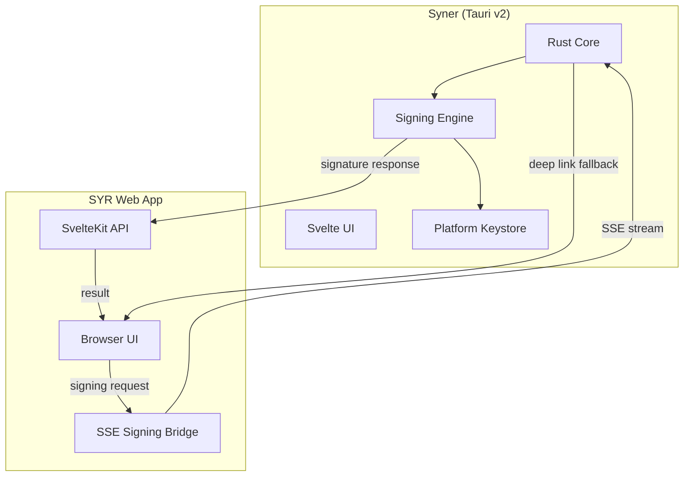
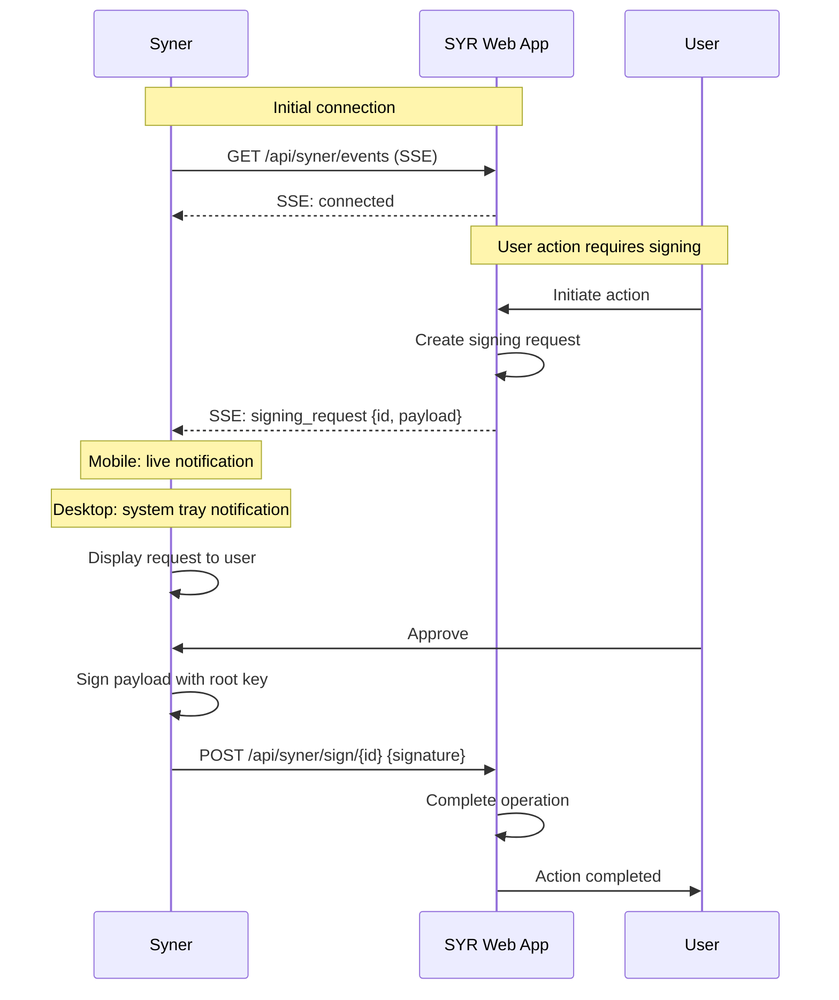
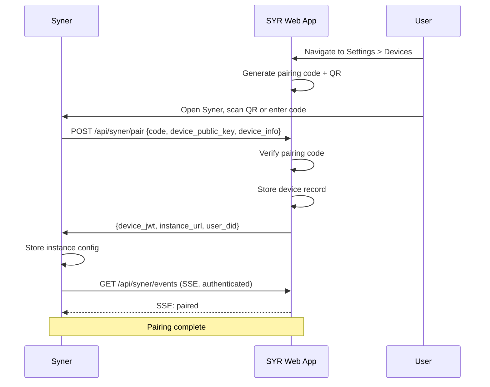

# Syner Specification v0.1

## 1. Overview

**Syner** is a cross-platform native application built with Tauri v2 that serves as the self-custody key management companion for SYR. It enables users to hold their root identity keys on their own device, sign operations locally, and interact with their SYR web application without exposing private keys to the server.

Once Syner is fully operational, Syner-managed identity becomes the **canonical self-custody method** for SYR. Server-managed keys remain available as a transitionary convenience for users who are not yet ready for self-custody.

---

## 2. Design Principles

1. **Keys never leave the device** -- The root private key is generated on and stored in platform-native secure storage. It is never transmitted to the SYR instance.
2. **Minimal trust surface** -- Syner signs payloads locally. The SYR web app sends signing requests; Syner returns signatures. The server never sees the private key.
3. **Cross-platform** -- Tauri v2 targets desktop (macOS, Windows, Linux) and mobile (Android, iOS).
4. **Graceful degradation** -- If Syner is unavailable, users can fall back to server-managed keys. Syner is additive, not exclusive.
5. **User sovereignty** -- Users can export their identity from Syner and re-import elsewhere. No vendor lock-in.

---

## 3. Target Platforms

| Platform | Keystore                        | Background Process | Communication        |
| -------- | ------------------------------- | ------------------ | -------------------- |
| macOS    | Keychain Services               | Supported          | SSE + deep links     |
| Windows  | DPAPI / Credential Manager      | Supported          | SSE + deep links     |
| Linux    | libsecret (GNOME Keyring / KDE) | Supported          | SSE + deep links     |
| Android  | Android Keystore                | Supported          | SSE + deep links     |
| iOS      | Keychain Services               | Limited            | Deep links (primary) |

---

## 4. Architecture



### 4.1 Components

**Svelte UI**: The user-facing interface within Syner. Displays signing requests, pairing status, identity details, and settings. Built with Svelte 5 and shared UI components from `@syr-is/ui`.

**Rust Core**: The Tauri backend. Handles:

- Key generation and storage via platform-native keystore bindings
- Ed25519 signing using `ed25519-dalek` or equivalent
- SSE client for receiving signing requests
- Deep link handler for `syr://` protocol
- Multibase encoding/decoding

**Platform Keystore**: Abstraction over platform-specific secure storage:

- **macOS/iOS**: `security-framework` crate binding to Keychain Services
- **Windows**: `windows-rs` binding to DPAPI
- **Linux**: `secret-service` crate binding to libsecret
- **Android**: JNI bridge to Android Keystore via Tauri's mobile plugin system

**Signing Engine**: Receives a payload (canonicalized JSON string), signs it with the stored private key, and returns the multibase-encoded signature.

---

## 5. Key Management

### 5.1 Key Generation

On first launch, Syner generates an Ed25519 keypair:

1. Generate 32-byte random seed using platform CSPRNG
2. Derive Ed25519 keypair from seed
3. Derive DID from public key: `did:syr:z6Mk...`
4. Store private key in platform keystore with label `syr:root:<did>`
5. Display DID and public key to user

### 5.2 Key Storage

Private keys are stored using the strongest available mechanism on each platform:

- Hardware-backed storage where available (Secure Enclave on Apple, StrongBox on Android)
- Software-backed secure storage as fallback

Keys are labeled with `syr:root:<did>` for the root key and `syr:device:<did>:<device-id>` for device keys.

### 5.3 Key Export

Users can export their identity from Syner:

- Export produces the same `IdentityExportBundle` format used by the SYR web app
- Private key export requires explicit user confirmation and biometric/PIN verification
- Exported bundle can be imported on another Syner instance or back to server-managed mode

---

## 6. Communication Protocol

### 6.1 Primary: SSE + Conditional HTTP Requests

The primary communication channel uses Server-Sent Events for push notifications combined with HTTP requests for responses.



**Why SSE?**

- Persistent connection allows real-time push of signing requests
- Works on all platforms (desktop and mobile)
- On Android, can use foreground service to maintain connection
- On iOS, limited background execution means SSE may disconnect when app is backgrounded — deep links serve as fallback

### 6.2 Fallback: Deep Links

For platforms where background processes are restricted (primarily iOS), or as a universal fallback:

```text
syr://sign?request_id=abc123&instance=https%3A%2F%2Fmy.syr.is&payload_hash=sha256hex
```

> The `instance` query parameter must be percent-encoded (e.g. `https%3A%2F%2Fmy.syr.is`) so the raw URL does not break parsing on some platforms.

Deep link flow:

1. SYR web app generates a signing request and stores it server-side
2. Web app opens `syr://sign?...` deep link
3. OS routes to Syner
4. Syner fetches the full payload from `GET /api/syner/requests/{id}`
5. User approves
6. Syner signs and submits via `POST /api/syner/sign/{id}`
7. Syner returns focus to the browser via redirect

### 6.3 Communication Security

- All SSE and HTTP communication occurs over TLS
- Syner authenticates to the SYR instance using a device JWT (`device_jwt`), a JWT issued during pairing
- Signing requests include a nonce to prevent replay attacks (see §7.1 for nonce requirements)
- Request payloads are integrity-checked (SHA-256 hash in the request matches the canonical payload)

**Nonce enforcement:** The server stores nonces per `device_jwt` and rejects duplicate nonces until the request's `expires_at` window. Both `id` and `nonce` are required but serve distinct roles: `id` provides idempotent routing and tracking (UUID), while `nonce` provides cryptographic replay protection.

---

## 7. Signing API

### 7.1 Signing Request Format

```json
{
  "id": "uuid",
  "nonce": "<hex or base64 string, see below>",
  "request_type": "registry_update | delegation | post_sign | rotation",
  "payload": {
    "...canonicalized JSON payload..."
  },
  "payload_hash": "sha256hex",
  "created_at": "ISO-8601",
  "expires_at": "ISO-8601"
}
```

- **nonce**: The client (Syner) MUST include a CSPRNG-derived nonce of at least 16 bytes (128 bits), encoded as hex or base64. The server MUST track nonces and reject reuse within the request's `expires_at` window.

### 7.2 Signing Response Format

```json
{
	"request_id": "uuid",
	"signature": "z...(multibase-encoded Ed25519 signature)",
	"signed_at": "ISO-8601"
}
```

### 7.3 Request Types

| request_type      | Description                                | Payload                                |
| ----------------- | ------------------------------------------ | -------------------------------------- |
| `registry_update` | Update DID-to-provider mapping in registry | `{ did, provider, updated_at }`        |
| `delegation`      | Delegate authority to a device key         | `{ did, delegate, scope, created_at }` |
| `post_sign`       | Sign a post or content mutation            | `{ did, action, content_hash, ... }`   |
| `rotation`        | Rotate root key (chain statement)          | `{ did, seq, prevRoot, newRoot, rotatedAt }` |

---

## 8. Device Pairing

Pairing links a Syner instance to a SYR web app instance.

### 8.1 Pairing Flow



### 8.2 Pairing Data

**Stored on SYR instance:**

- Device public key
- Device name/info (OS, model)
- Pairing timestamp
- Last active timestamp
- Device JWT (`device_jwt`) for authentication

**Stored on Syner:**

- Instance URL
- Device JWT (`device_jwt`)
- User DID
- Instance name (for display)

### 8.3 Unpairing

- User can unpair from either SYR web app or Syner
- Unpairing revokes the device JWT
- Unpairing does NOT delete keys from Syner (user retains their identity)

---

## 9. Identity Lifecycle with Syner

### 9.1 New Identity (Syner-First)

1. User installs Syner
2. Syner generates root keypair, stores in platform keystore
3. User pairs Syner with their SYR instance
4. Syner submits public key to SYR: `POST /api/identity/init`
5. SYR creates identity record (no private key stored server-side)
6. User's identity is now fully Syner-managed

### 9.2 Migration from Server-Managed to Syner-Managed

1. User installs Syner
2. SYR instance exports the root private key (encrypted, one-time)
3. User scans QR code in Syner to receive the key
4. Syner imports the key into platform keystore
5. Syner proves possession by signing a server-generated challenge (challenge-response verification); the SYR instance verifies the signature before proceeding. The verification result is persisted atomically on both sides. Only after successful verification may the next step run.
6. SYR instance deletes its copy of the private key
7. Identity transitions to Syner-managed

On any verification or persistence failure, abort deletion and surface a clear error/retry path so the SYR instance never destroys the root private key without explicit verified acknowledgement from Syner.

### 9.3 Identity Backup

Syner supports encrypted backup of the root key:

- Export as encrypted file (passphrase-protected)
- Platform backup integration (iCloud Keychain, Google Backup)
- Future: social recovery guardians

---

## 10. Security Considerations

### 10.1 Threat Model

| Threat                  | Mitigation                                                       |
| ----------------------- | ---------------------------------------------------------------- |
| SYR instance compromise | Private key never on server. Attacker cannot forge signatures.   |
| Network interception    | TLS for all communication. Payload integrity via SHA-256 hashes. |
| Syner device theft      | Platform keystore requires biometric/PIN to access keys.         |
| Replay attacks          | Nonce in signing requests. Strictly increasing timestamps.       |
| Deep link hijacking     | Payload hash verification. Syner verifies instance URL.          |

### 10.2 Trust Boundaries

- Syner trusts the platform keystore for key protection
- SYR web app trusts Syner signatures (verified against known public key)
- Neither trusts the network (TLS required)
- The registry trusts root key signatures only

---

## 11. Versioning

**Version:** v0.1
**Status:** Specification
**Scope:** Architecture, key management, communication protocol, pairing flow, signing API
