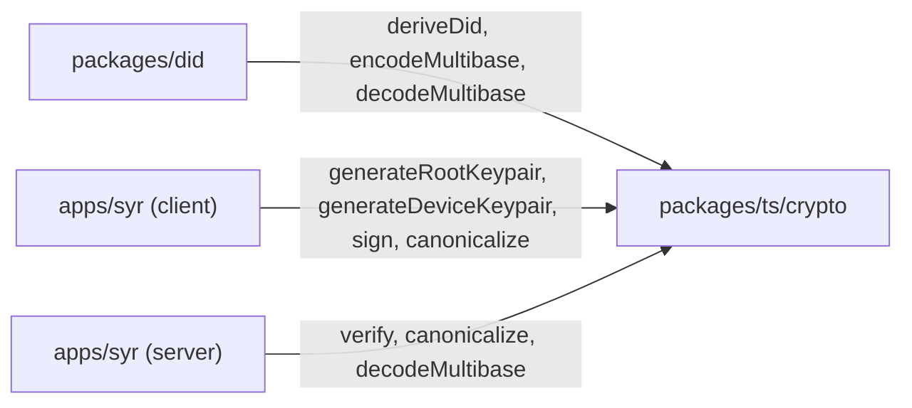

# Phase 0: packages/ts/crypto

`@syr-is/crypto` is the cryptographic foundation for Syr identity. It provides Ed25519 key generation, multibase encoding, signing, verification, and canonical serialization.

**Package:** `@syr-is/crypto`
**Location:** `packages/ts/crypto/`
**Dependencies:** the WASM build of the Rust crypto crates (`packages/rust/syr-crypto-*` via `syr-crypto-wasm`); no JS crypto dependencies

---

## Design Principles

1. **Pure cryptography.** No app logic, no network calls, no database access.
2. **Browser + Node compatible.** All operations work in both environments.
3. **Single crypto implementation.** Ed25519, JCS, and multibase live in the `syr-crypto-*` Rust crates and are consumed through `syr-crypto-wasm` — no separate JS crypto dependency.
4. **Deterministic.** Same input always produces same output (except key generation).

---

## Dependency Rationale

| Package                  | Purpose                                                         | Why this one                                                         |
| ------------------------ | --------------------------------------------------------------- | -------------------------------------------------------------------- |
| `syr-crypto-core` (Rust) | Ed25519 keygen/sign/verify, RFC 8785 JCS, multibase (base58btc) | Single cryptographic source of truth; Rust and TS byte-match         |
| `syr-crypto-wasm`        | wasm-bindgen surface exposing the Rust crypto crates to TS      | One WASM build consumed by every `@syr-is/*` package, browser + Node |

---

## Public API

### Key Generation

```typescript
function generateRootKeypair(): Promise<{
	publicKey: Uint8Array;
	privateKey: Uint8Array;
}>;

function generateDeviceKeypair(): Promise<{
	publicKey: Uint8Array;
	privateKey: Uint8Array;
}>;
```

Both use Ed25519. Functionally identical but named differently for clarity of intent.

### DID Derivation

```typescript
function deriveDid(publicKey: Uint8Array): string;
// Returns: "did:syr:z6Mkt9..."
```

Process:

1. Take Ed25519 public key (32 bytes)
2. Prepend multicodec prefix for Ed25519 public key (`0xed01`)
3. Encode as base58btc multibase (prefix `z`)
4. Prepend `did:syr:`

### Multibase Encoding

```typescript
function encodeMultibase(bytes: Uint8Array): string;
// Returns: "z6Mkt9..." (base58btc with 'z' prefix)

function decodeMultibase(encoded: string): Uint8Array;
// Input: "z6Mkt9..." -> Uint8Array
```

### Signing and Verification

```typescript
function sign(payload: Uint8Array | string, privateKey: Uint8Array): Promise<Uint8Array>;

function verify(
	payload: Uint8Array | string,
	signature: Uint8Array,
	publicKey: Uint8Array
): Promise<boolean>;
```

If payload is a string, it is encoded as UTF-8 before signing/verifying.

### Canonical Serialization

```typescript
function canonicalize(obj: Record<string, unknown>): string;
```

Implements RFC 8785 JSON Canonicalization Scheme (JCS):

- Lexicographically sorted object keys
- Compact JSON (no insignificant whitespace)
- UTF-8 encoding
- No trailing newline
- Deterministic number formatting

Used for creating canonical signing payloads for delegation statements, rotation statements, and profile mutations.

---

## Key Rotation Primitives

```typescript
function createRotationStatement(
	did: string,
	seq: number,
	newPublicKey: Uint8Array,
	currentPrivateKey: Uint8Array
): Promise<RotationStatement>;

function verifyRotationStatement(
	statement: RotationStatement,
	currentPublicKey: Uint8Array
): Promise<boolean>;

function verifyRotationChain(did: string, statements: RotationStatement[]): Promise<Uint8Array>; // current root key
```

Started as Phase 0 stubs; now the implemented v1 rotation chain — see [Root key rotation](/architecture/recovery-rotation) for the statement format, validation rules, and the `POST /api/identity/rotate` flows.

---

## Integration Points



- **`packages/did`** uses `deriveDid()` and multibase functions
- **`apps/syr` client** generates keys and signs payloads
- **`apps/syr` server** verifies signatures and canonicalizes payloads for comparison
