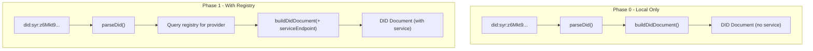

# Phase 0: packages/did

`@syr-is/did` implements the `did:syr` method logic. It provides DID parsing, validation, and DID Document construction.

**Package:** `@syr-is/did`
**Location:** `packages/did/`
**Dependencies:** `@syr-is/crypto` (workspace)

---

## Design Principles

1. **No network calls.** Phase 0 resolution is local only. Registry resolution is Phase 1.
2. **Spec-compliant.** Follows the [did:syr Method Specification](/architecture/did-method).
3. **Pure functions.** Stateless, deterministic, no side effects.

---

## Public API

### DID Parsing

```typescript
interface ParsedDid {
	method: 'syr';
	id: string; // multibase-encoded public key
	publicKey: Uint8Array; // decoded Ed25519 public key
}

function parseDid(did: string): ParsedDid;
```

Parsing steps:

1. Validate format: `did:syr:<multibase>`
2. Extract method-specific identifier
3. Decode multibase to obtain public key bytes
4. Strip multicodec prefix (`0xed01`)
5. Return structured result

Throws if:

- Format is invalid
- Multibase decoding fails
- Public key is not 32 bytes (Ed25519)

### DID Validation

```typescript
function isValidSyrDid(did: string): boolean;
```

Returns `true` if the DID is syntactically valid and the embedded public key can be decoded. Does not perform resolution.

### DID Document Construction

```typescript
interface DidDocument {
	id: string;
	verificationMethod: VerificationMethod[];
	authentication: string[];
	assertionMethod: string[];
	service?: ServiceEndpoint[];
}

function buildDidDocument(input: {
	did: string;
	publicKeyMultibase: string;
	serviceEndpoint?: string;
}): DidDocument;
```

Produces a DID Document conforming to the [did:syr specification](/architecture/did-method):

```json
{
	"id": "did:syr:z6Mkt9...",
	"verificationMethod": [
		{
			"id": "#root",
			"type": "Ed25519VerificationKey2020",
			"controller": "did:syr:z6Mkt9...",
			"publicKeyMultibase": "z6Mkt9..."
		}
	],
	"authentication": ["#root"],
	"assertionMethod": ["#root"],
	"service": [
		{
			"id": "#provider",
			"type": "SyrIdentityProvider",
			"serviceEndpoint": "https://provider.example"
		}
	]
}
```

The `service` array is only included if `serviceEndpoint` is provided. In Phase 0, identities may not have a registered provider yet.

---

## Resolution Flow (Phase 0 vs Phase 1)



---

## Integration Points

- **`packages/crypto`**: Uses `decodeMultibase()` for DID parsing, `encodeMultibase()` for document construction
- **`packages/types`**: Uses `DidSyrSchema` for validation
- **`apps/syr` server**: Calls `parseDid()` to extract public keys from DIDs for signature verification
