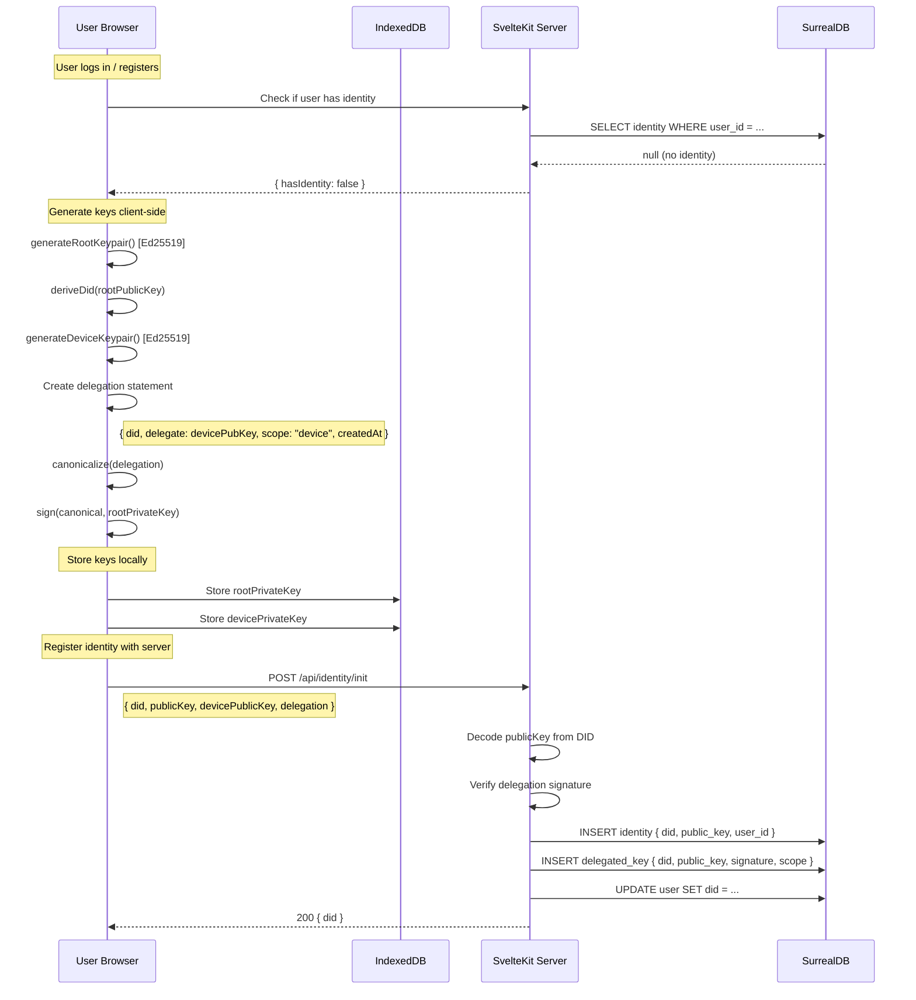
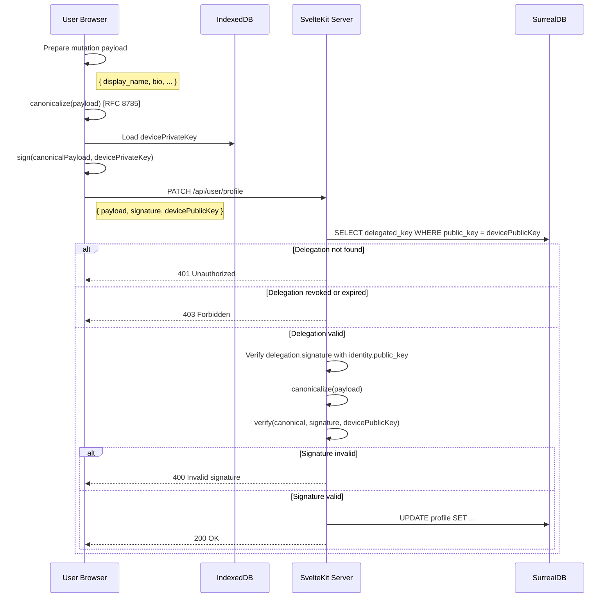
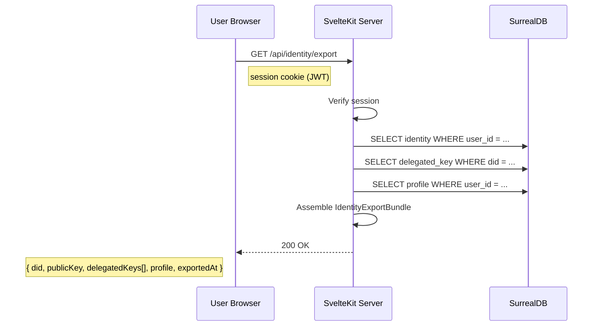
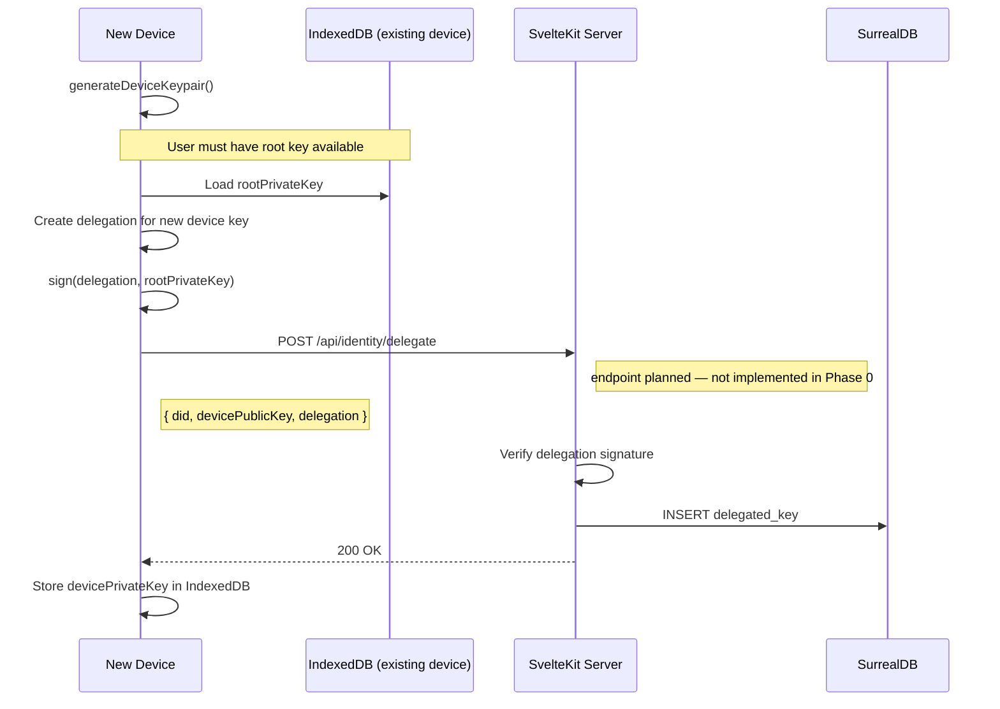

# Phase 0: Identity Flows

This page documents the end-to-end flows for identity creation, signed mutations, and identity export as implemented in Phase 0.

> **Note:** This page documents the **client-managed** identity flow only (see [§ Identity Creation Flow](#1-identity-creation-flow): "The server never sees or stores private keys"). For server-managed identities, key generation and storage follow [Aegis v1](/architecture/aegis). The target export format is [Sigil v1](/architecture/sigil); current export uses PKCS#8 PEM (transitional).

---

## 1. Identity Creation Flow

Identity creation happens **client-side** after a user registers or logs in for the first time. The server never sees or stores private keys.

### Trigger

After login/register, the client checks if the user has a DID. If not, the identity creation flow begins automatically.

### Steps



### Key Storage

In Phase 0, private keys are stored in **IndexedDB** in the browser. This is acceptable for the MVP but is not considered secure storage. Future phases will support:

- Native secure enclaves (WebAuthn / platform authenticators)
- Hardware security keys
- Encrypted key backup

### Error Handling

- If key generation fails: show error, allow retry
- If server rejects delegation: likely signature mismatch, regenerate keys
- If identity already exists: skip creation, load existing DID

---

## 2. Signed Profile Mutation Flow

Every profile mutation is signed by the delegated device key. The server verifies the full delegation chain before accepting any write.

### Steps



### Verification Chain

The server performs a **two-step verification**:

1. **Delegation verification:** The delegated device key was authorized by the root identity key. The `delegated_key.signature` is verified against the `identity.public_key`.
2. **Payload verification:** The mutation payload was signed by the device key. The request `signature` is verified against the `devicePublicKey`.

This ensures that:

- The device key is legitimately delegated by the root identity
- The specific mutation was authored by the holder of the device key
- No one can forge mutations without possessing the device private key

---

## 3. Identity Export Flow

Export produces a portable bundle that can be verified offline and imported to another provider.

### Steps



### Export Bundle Schema

```typescript
{
  did: string;              // "did:syr:z6Mkt9..."
  publicKey: string;        // multibase-encoded root public key
  delegatedKeys: [{
    publicKey: string;      // multibase-encoded device key
    scope: string;          // "device"
    createdAt: string;      // ISO 8601
    expiresAt?: string;     // ISO 8601 or null
    revokedAt?: string;     // ISO 8601 or null
    signature: string;      // multibase-encoded signature
  }];
  profile: {
    displayName: string;
    bio?: string;
    avatarUrl?: string;
    bannerUrl?: string;
  };
  exportedAt: string;       // ISO 8601
}
```

### What is NOT included

- **Root private key** -- never leaves the client device
- **Device private keys** -- never leaves the client device
- **Password hash** -- not part of identity
- **Session tokens** -- ephemeral, not portable

### Offline Verification

An exported bundle can be verified by:

1. Parsing the DID to extract the root public key
2. For each delegated key, verifying the delegation signature against the root public key
3. Confirming the DID matches the embedded public key

This verification requires only the `@syr-is/crypto` and `@syr-is/did` packages. No network access or server is needed.

---

## 4. Multi-Device Support

Phase 0 supports multiple delegated device keys per identity. Each device:

1. Generates its own Ed25519 keypair
2. Receives a delegation signed by the root key
3. Signs its own mutations independently
4. Can be revoked independently without affecting other devices

### Device Addition Flow



> **Note:** In Phase 0, the root private key must be available on the device that creates the delegation. Cross-device root key transfer is future work.
