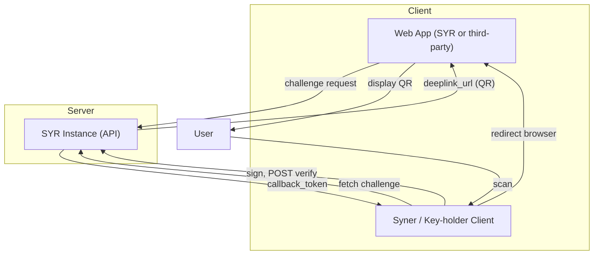

# Implementer Guide

This guide enables developers to build **interoperable Syner clients** and **SYR-compatible platforms**. If you want to implement your own key-holding app, your own SYR instance, or integrate Syr identity into another application, this is the place to start.

---

## Audience

- Developers building alternative Syner clients (key holders, signers)
- Developers building alternative SYR instances (identity hosts)
- Developers integrating Syr identity into third-party apps

---

## Architecture Overview

The flow is **challenge-sign-verify**:

1. Web app requests a challenge from the SYR instance.
2. Instance returns `challenge_id`, `message`, and `deeplink_url` (for QR).
3. User scans QR with Syner (or key-holder app).
4. Syner fetches challenge details, user signs, Syner POSTs to verify.
5. Instance verifies signature and returns a token (e.g. `callback_token` or `export_token`).

---

## Guide Sections

| Section                                                                 | Purpose                                                         |
| ----------------------------------------------------------------------- | --------------------------------------------------------------- |
| [syr:// Scheme and QR Exchange](/implementer-guide/scheme-and-qr)       | Deep link patterns, QR generation, validation rules             |
| [Export Formats and Data Structures](/implementer-guide/export-formats) | .syr, .sigil, .persona formats and API contracts                |
| [Challenge-Sign Flows](/implementer-guide/challenge-sign-flows)         | Independent login, export verify, import verify, delete account |
| [Profile Sync API](/implementer-guide/profile-sync)                     | Syncing profile from Syner to SYR                               |
| [Follow on Syr](/implementer-guide/follow-on-syr)                       | Third-party “follow intent” URL (`/follow?target_did=`)         |

---

## Related Docs

- [Independent Login](/architecture/independent-login) — Challenge-sign flow for Syner users
- [Identity Import](/architecture/import) — Full vs data-only import
- [Export Formats](/architecture/export) — SYR, Sigil, Persona overview
- [Sigil v1](/architecture/sigil) — Portable identity export format spec
