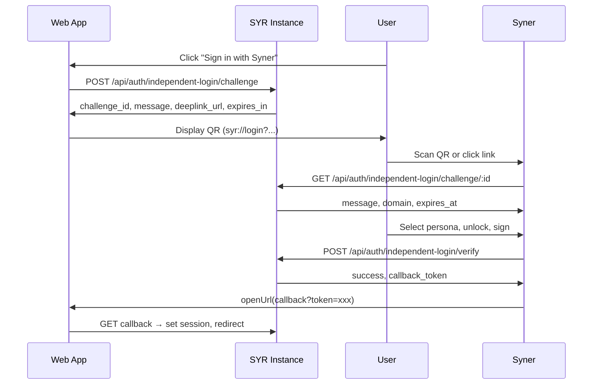

# Challenge-Sign Flows

All SYR-Syner interoperability uses challenge-sign-verify: the server issues a challenge, the key holder signs it, and the server verifies to prove key control.

---

## Independent Login

Login without password by proving key control via Syner.

### Flow



### APIs

| Endpoint                                    | Method | Auth | Purpose                                                                                                |
| ------------------------------------------- | ------ | ---- | ------------------------------------------------------------------------------------------------------ |
| `/api/auth/independent-login/challenge`     | POST   | No   | Create challenge. Body: `{ origin }`. Returns `challenge_id`, `message`, `deeplink_url`, `expires_in`. |
| `/api/auth/independent-login/challenge/:id` | GET    | No   | Fetch challenge for Syner. Returns `message`, `domain`, `expires_at`.                                  |
| `/api/auth/independent-login/verify`        | POST   | No   | Verify signature. Body: `{ challenge_id, did, signature, profile? }`. Returns `callback_token`.        |
| `/api/auth/independent-login/heartbeat`     | GET    | No   | SSE stream; emits `verified` with `callback_token` when Syner verifies.                                |
| `/auth/independent-callback`                | GET    | No   | Page. Query `?token=` exchanges callback token for session cookie, redirects to `/`.                   |

### Message format (JCS canonical)

```json
{
	"domain": "my.syr.app",
	"nonce": "uuid",
	"action": "login",
	"issued_at": "2026-03-01T12:00:00.000Z",
	"expires_at": "2026-03-01T12:02:00.000Z"
}
```

### Verify request

```json
{
	"challenge_id": "uuid",
	"did": "did:syr:z6Mk...",
	"signature": "z...",
	"profile": { "display_name": "...", "bio": "..." }
}
```

`profile` is optional; used to create/update profile for new users.

---

## Export Verification

Authenticated user wants to export; must prove key control via Syner for data-only users or when exporting with Sigil.

### Flow

1. User requests export in SYR web app.
2. Web app calls **POST** `/api/identity/export-challenge` (auth required).
3. Server returns `challenge_id`, `message`, `deeplink_url`.
4. User scans QR (`syr://export?...`) with Syner.
5. Syner fetches **GET** `/api/identity/export-challenge/:id`.
6. Syner signs and POSTs to **POST** `/api/identity/export-verify`.
7. Server returns `export_token`.
8. Web app uses `export_token` to call **POST** `/api/identity/export-bundle-data`.

### APIs

| Endpoint                             | Method | Auth | Purpose                                                                                               |
| ------------------------------------ | ------ | ---- | ----------------------------------------------------------------------------------------------------- |
| `/api/identity/export-challenge`     | POST   | Yes  | Create export challenge. Returns `challenge_id`, `message`, `deeplink_url`, `expires_in`.             |
| `/api/identity/export-challenge/:id` | GET    | No   | Fetch challenge (unified endpoint for export and import).                                             |
| `/api/identity/export-verify`        | POST   | No   | Verify signature. Body: `{ challenge_id, did, signature }`. Returns `export_token` or `import_token`. |
| `/api/identity/export-heartbeat`     | GET    | No   | SSE; emits when export verified.                                                                      |

### Message format

Same structure as login, but `action: "export"`.

---

## Import Verification

User has data-only .syr (no identity.sigil). Must prove key control via Syner to import.

### Flow

1. User selects .syr file in import dialog.
2. Client parses bundle, extracts `did` from identity.json.
3. Web app calls **POST** `/api/identity/import-challenge` with `{ did }` (auth required).
4. Server returns `challenge_id`, `message`, `deeplink_url`.
5. User scans QR (`syr://export?...`) with Syner (no `did` in URL for import — Syner selects persona).
6. Syner fetches **GET** `/api/identity/export-challenge/:id` (same endpoint as export).
7. Syner signs and POSTs to **POST** `/api/identity/export-verify` (same endpoint).
8. Server returns `import_token`.
9. Web app submits bundle + `import_token` to **POST** `/api/identity/import`.

### APIs

| Endpoint                             | Method | Auth | Purpose                                                                    |
| ------------------------------------ | ------ | ---- | -------------------------------------------------------------------------- |
| `/api/identity/import-challenge`     | POST   | Yes  | Create import challenge. Body: `{ did }`.                                  |
| `/api/identity/export-challenge/:id` | GET    | No   | Fetch challenge (shared with export).                                      |
| `/api/identity/export-verify`        | POST   | No   | Verify signature. Server returns `import_token` when challenge was import. |
| `/api/identity/import-heartbeat`     | GET    | No   | SSE; emits when import verified.                                           |

The **verify** endpoint is shared: the server distinguishes export vs import by challenge type (export challenge vs import challenge).
