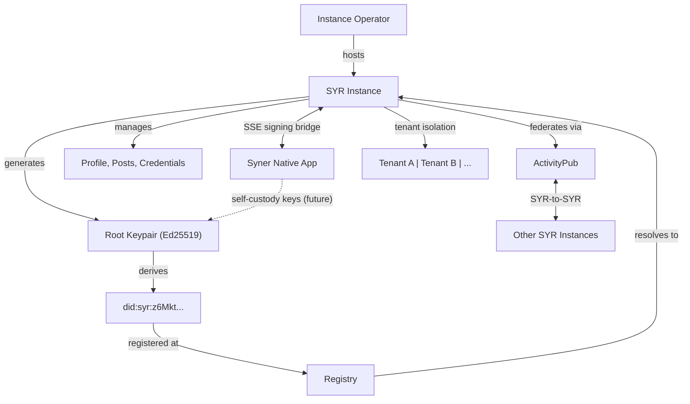

# What is Syr?

**Syr** stands for **Self Yield Identity Representation**.

It is a self-hosted multi-tenant self-sovereign identity manager. Your SYR instance generates, stores, and manages your cryptographic identity — including your posts and thoughts, which are a first-class part of who you are. You can federate with other SYR instances to view each other's activity, and you can export your keys on demand if you want to take them elsewhere.

---

## The Problem

Most identity systems today work like this:

- A platform creates an account for you.
- The platform owns your username, your data, and your login.
- If the platform disappears, your identity disappears with it.
- If you want to move, you start over.

This is not ownership. It is tenancy.

---

## The Syr Approach

Syr inverts the model with a self-hosted identity manager:

1. **Your SYR instance generates a root keypair** (Ed25519) and manages it server-side.
2. **Your identity is derived** from your public key as a DID (`did:syr:z6Mkt...`).
3. **Your instance hosts** your profile, posts, credentials, and assets.
4. **You can export your keys** at any time. This is an explicit, user-initiated action — not the default.
5. **You can migrate** to a different SYR instance. Your DID never changes.
6. **Your posts are part of your identity** — what you think and share is integral to who you are. User data (posts, uploads) carries cryptographic ownership via DID-embedded record IDs.
7. **You federate** with other SYR instances via ActivityPub to view each other's activity.

No platform owns you. If your instance disappears, you export your identity bundle and set up somewhere else.

---

## High-Level Architecture



---

## Core Concepts

### Root Identity

Every Syr identity starts with an **Ed25519 keypair**. In the current phase, keys are **generated server-side** by the SYR instance and stored encrypted at rest. The public key is encoded as a multibase string and embedded in the DID identifier. This keypair is the ultimate trust anchor for everything: hosting decisions, delegated keys, signed actions, and migrations.

Users can **export their full identity** (keys, posts, assets) as a portable zip bundle. In the future, **Syner** — a cross-platform native companion app — will enable users to generate and manage their root keys on their own devices using platform-native secure keystores, making Syner-managed identity the canonical self-custody method.

### Posts as Identity

In SYR, your posts and thoughts are an integral part of your identity. What you create and share defines who you are, and this content travels with your identity when you migrate between instances. Posts are federated across SYR instances via ActivityPub.

### Decentralized Identifier (DID)

Syr uses the `did:syr` method. The DID is deterministically derived from the root public key:

```text
did:syr:z6Mkt9...abc
```

Because the DID is derived from the key itself, no external authority is needed to verify ownership. Registries exist only for service discovery, not for trust.

### Delegated Device Keys

The root key is sacred and used rarely. For daily operations (signing posts, authenticating sessions), Syr creates **delegated device keys**. Each device generates its own keypair, which is then authorized by the root key via a signed delegation statement. Delegated keys can be revoked at any time without affecting the root identity.

### Multi-Tenancy

A single SYR instance can manage identities for **multiple organizations or groups (tenants)**, each with isolated identity pools. An instance operator creates tenants and assigns identity management to them. Tenants cannot see or interact with each other's identity data.

### Providers

A provider is a SYR instance that hosts your profile data, APIs, and storage. In SYR's model, the primary mode is **self-hosted** — you or your organization run a SYR instance. Providers host your identity state but never own your identity. You can migrate between providers without changing your DID.

### Registry

The registry maps DIDs to their current provider endpoints:

```text
did:syr:z6Mkt... → https://provider.example
```

Only the root key can update this mapping. Registry operators cannot impersonate identities or forge migrations.

### Verifiable Credentials

VCs in SYR are **credentials that others issue to you**, linked to your identity — things like memberships, roles, KYC verifications, or qualifications. They enrich your identity with attestations from trusted parties. In the future, platforms may require specific VCs to join, and SYR will support exchanging credentials to meet those requirements.

### Identity-Based Login

Third-party platforms can authenticate users through their SYR instance. Instead of generic OAuth, a user enters their instance name and username (or DID), which is resolved via the registry to locate their SYR instance and authenticate them.

### Identity Export

At any time, you can export your identity as a portable bundle containing your DID, public keys, delegated keys, credentials, and a signed profile snapshot. This bundle can be verified offline and imported to a new provider.

### Syr Ecosystem Naming

Syr uses mythic, evocative names for its core identity primitives:

- **Aegis** — Custodial identity protection. When your identity is born and shielded on a hosting instance (server generates, encrypts, stores; keys never leave encrypted).
- **Sigil** — Portable identity export format. When you take your identity with you — the moment it becomes self-owned.

_Identity is born in Aegis; when you're ready, you carry the Sigil._

---

## What Syr is Not

Syr is **not** a blockchain or a centralized identity platform. It is a **self-hosted identity manager** that provides:

- Cryptographic identity generation and management (server-side)
- Posts as a first-class part of identity
- SYR-to-SYR federation via ActivityPub
- Provider-portable identity with DID stability
- Verifiable credentials linked to identity
- Identity-based login for third-party platforms
- Multi-tenant isolation for organizations
- Explicit key export and offloading

---

## Implementation Phases

| Phase         | Focus                                  | Status      |
| ------------- | -------------------------------------- | ----------- |
| **Phase 0**   | Cryptographic identity correctness     | In progress |
| **Phase 0.5** | Testing & hardening                    | In progress |
| Phase 1       | Registry & provider portability        | Planned     |
| Phase 2       | Verifiable credentials & enhanced auth | Planned     |
| Phase 3       | Federation & Syner native app          | Planned     |
| Phase 4       | Backend migration & observability      | Planned     |
| Phase 5       | Production hardening                   | Planned     |

See the full [Roadmap](/roadmap) for details on each phase.

---

## Next Steps

- Read the [Identity Model specification](/architecture/identity-model) for the full technical design.
- Refer to [Sigil (Export Format)](/architecture/sigil) and [Aegis (Custodial Identity)](/architecture/aegis) for the export and custodial specs.
- Consult the [Phase 0 Blueprint](/implementation/phase-0-blueprint) for implementation details.
- Review the [Syner Specification](/architecture/syner) for the native companion app design.
- Check the [Roadmap](/roadmap) for the full implementation timeline.
- Browse the [Reference](/reference/types) section for current codebase documentation.
