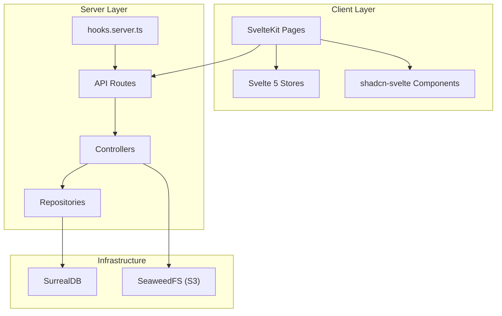
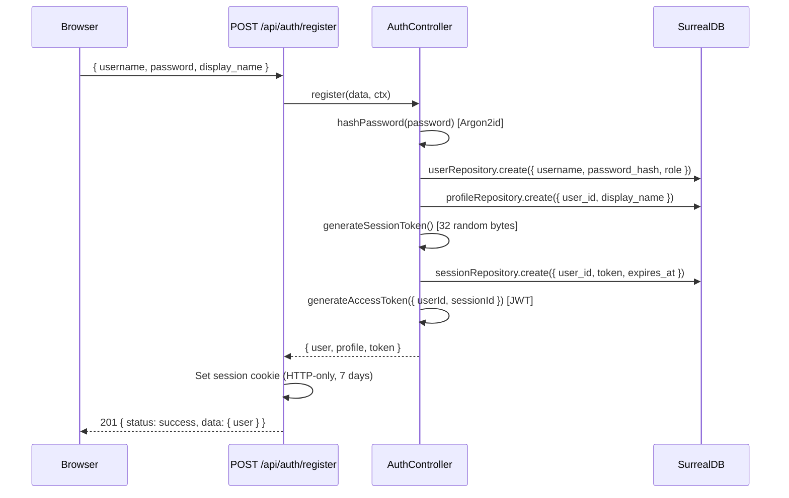
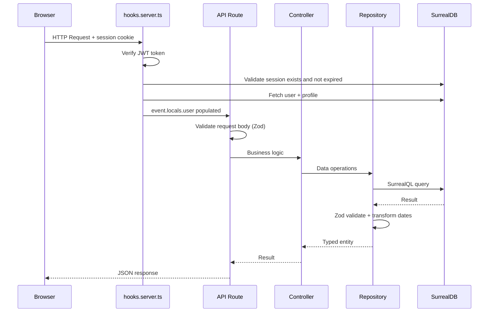

# apps/syr Reference

`@syr-is/syr` is the main SvelteKit application for the Syr platform. It provides self-sovereign identity management, post management, authentication, profile management, file uploads, and folder organization.

**Package:** `@syr-is/syr`
**Location:** `apps/syr/app/`
**Framework:** SvelteKit 2 + Svelte 5
**Adapter:** `@sveltejs/adapter-node`

---

## Application Architecture



---

## Technology Stack

| Layer     | Technology                                          |
| --------- | --------------------------------------------------- |
| Frontend  | Svelte 5 with runes, SvelteKit 2                    |
| Styling   | Tailwind CSS 4, shadcn-svelte, tw-animate-css       |
| Forms     | sveltekit-superforms + Zod v4                       |
| Rich text | Milkdown (Markdown editor)                          |
| Database  | SurrealDB (multi-model)                             |
| Storage   | SeaweedFS (S3-compatible via `@aws-sdk/client-s3`)  |
| Auth      | JWT (`jsonwebtoken`) + Argon2id (`@node-rs/argon2`) |
| Build     | Vite 7 + Turborepo                                  |
| Types     | `@syr-is/types` (workspace package)                 |

---

## Authentication System

The authentication system uses **JWT tokens stored in HTTP-only cookies** with **Argon2id password hashing**.

### Auth Flow



### Password Hashing

Uses Argon2id with OWASP-recommended settings:

- Memory cost: 19456 KiB
- Time cost: 2 iterations
- Parallelism: 1

### Session Management

- Sessions are stored in SurrealDB with `token`, `expires_at`, `ip`, `user_agent`, `last_active`.
- `hooks.server.ts` verifies JWT on every request, validates the session exists and is not expired, and populates `event.locals.user`.
- Sessions track IP and user agent for security auditing.
- Users can view, revoke individual sessions, or invalidate all other sessions.

### Security Headers

Applied by `hooks.server.ts`:

- `X-Content-Type-Options: nosniff`
- `X-Frame-Options: DENY`
- `X-XSS-Protection: 1; mode=block`

---

## Repository Pattern

All data access goes through repositories that extend `BaseRepository<T>`.

### BaseRepository Features

- **Zod validation** on all reads (ensures data integrity)
- **Date transformation** (SurrealDB returns dates as strings; repository converts to `Date` objects)
- **CRUD operations**: `create()`, `findById()`, `update()`, `delete()`
- **Query builder**: `findMany({ limit, offset, sort, filters })` with dynamic SurrealQL generation
- **Pagination**: Returns `{ data, total }` for paginated queries

### Concrete Repositories

| Repository          | Table     | Key Features                                            |
| ------------------- | --------- | ------------------------------------------------------- |
| `userRepository`    | `user`    | `findByUsername()`, `usernameExists()`                  |
| `profileRepository` | `profile` | `findByUserId()`                                        |
| `sessionRepository` | `session` | `findByToken()`, `findByUserId()`, expiration checks    |
| `postRepository`    | `post`    | Post CRUD with author filtering                         |
| `uploadRepository`  | `upload`  | Status management, S3 key tracking                      |
| `folderRepository`  | `folder`  | Hierarchical queries, path resolution                   |
| `kvRepository`      | `kv`      | Composite key (`kv:type:index`), TTL, atomic operations |

---

## Controller Pattern

Controllers contain **business logic** and sit between API routes and repositories. They handle validation, authorization, and cross-cutting concerns.

| Controller         | Responsibilities                                                   |
| ------------------ | ------------------------------------------------------------------ |
| `AuthController`   | Register, login, logout, session creation, token validation        |
| `PostController`   | Post CRUD, visibility enforcement, draft management                |
| `FolderController` | Folder CRUD, path resolution, breadcrumbs, public folder detection |
| `UserController`   | Profile updates                                                    |
| `UploadController` | Upload lifecycle (initiate, complete, delete), S3 operations       |

---

## API Routes

All API routes are under `src/routes/api/`.

### Authentication

| Method | Path                 | Description                                            |
| ------ | -------------------- | ------------------------------------------------------ |
| `POST` | `/api/auth/register` | Register new user (username + password + display_name) |
| `POST` | `/api/auth/login`    | Login, returns JWT in cookie                           |
| `POST` | `/api/auth/logout`   | Clear session and cookie                               |

### User Profile

| Method  | Path                | Description                                        |
| ------- | ------------------- | -------------------------------------------------- |
| `GET`   | `/api/user/profile` | Get current user's profile                         |
| `PATCH` | `/api/user/profile` | Update profile (display_name, bio, avatar, banner) |

### Posts

| Method   | Path                    | Description                                |
| -------- | ----------------------- | ------------------------------------------ |
| `GET`    | `/api/posts`            | List posts (paginated, filtered by author) |
| `POST`   | `/api/posts`            | Create new post (blog or media)            |
| `GET`    | `/api/posts/[did]/[id]` | Get single post (DID + ULID)               |
| `PATCH`  | `/api/posts/[did]/[id]` | Update post                                |
| `DELETE` | `/api/posts/[did]/[id]` | Delete post                                |

### Uploads

| Method   | Path                      | Description                               |
| -------- | ------------------------- | ----------------------------------------- |
| `GET`    | `/api/uploads`            | List uploads (paginated, folder-filtered) |
| `POST`   | `/api/uploads`            | Initiate upload (returns presigned URL)   |
| `GET`    | `/api/uploads/[did]/[id]` | Get upload metadata (DID + ULID)          |
| `PATCH`  | `/api/uploads/[did]/[id]` | Complete upload (status: completed)       |
| `DELETE` | `/api/uploads/[did]/[id]` | Delete upload and S3 object               |

### Folders

| Method   | Path                | Description                               |
| -------- | ------------------- | ----------------------------------------- |
| `GET`    | `/api/folders`      | List folders (with optional parent_id)    |
| `POST`   | `/api/folders`      | Create folder                             |
| `GET`    | `/api/folders/[id]` | Get folder with path and breadcrumbs      |
| `PATCH`  | `/api/folders/[id]` | Rename or move folder                     |
| `DELETE` | `/api/folders/[id]` | Delete folder (optional: delete contents) |

### Sessions

| Method   | Path                             | Description                            |
| -------- | -------------------------------- | -------------------------------------- |
| `GET`    | `/api/session`                   | List sessions (paginated)              |
| `DELETE` | `/api/session/[id]`              | Revoke specific session                |
| `POST`   | `/api/session/invalidate-others` | Invalidate all sessions except current |

### Account Deletion

Permanently deletes the user's account and all data (profile, posts, uploads, sessions, identity, etc.). Requires signed verification via Syner (challenge-sign) or Aegis (password). See [Challenge-Sign Flows](/implementer-guide/challenge-sign-flows#Delete-Account-Verification) for the full flow.

| Method | Path                            | Description                                                                 |
| ------ | ------------------------------- | --------------------------------------------------------------------------- |
| `POST` | `/api/account/delete-challenge` | Create challenge (Syner) or verify password (Aegis). Body: `{ password? }`. |
| `GET`  | `/api/account/delete-heartbeat` | SSE; emits `delete_account_verified` with token when Syner signs.           |
| `POST` | `/api/account/delete`           | Perform deletion. Body: `{ delete_account_token }`.                         |

---

## Database Layer

### SurrealDB

**Connection:** Singleton `DatabaseService` manages the SurrealDB connection.
**Auth:** Root-level signin with username/password from environment.
**Schema initialization:** On startup, defines indexes via `initializeSchema()`.

### Current Tables

| Table     | Record ID Format                          | Unique Indexes | Regular Indexes |
| --------- | ----------------------------------------- | -------------- | --------------- |
| `user`    | Simple (`user:id`)                        | `username`     | --              |
| `profile` | Simple (`profile:id`)                     | `user_id`      | --              |
| `session` | Simple (`session:id`)                     | `token`        | `user_id`       |
| `post`    | Composite `{ created_by: DID, id: ULID }` | --             | --              |
| `upload`  | Composite `{ created_by: DID, id: ULID }` | --             | --              |
| `folder`  | Simple (`folder:id`)                      | --             | --              |
| `kv`      | Composite (`kv:type:index`)               | --             | --              |

---

## Storage Layer

### SeaweedFS (S3-Compatible)

- Client: `@aws-sdk/client-s3` with `forcePathStyle: true`
- Auto-setup: `ensureS3Setup()` creates the bucket and configures CORS on first request
- Upload flow:
  1. Client initiates upload via `POST /api/uploads`
  2. Server creates `upload` record (status: `pending`)
  3. Server generates presigned PUT URL
  4. Client uploads directly to S3
  5. Client confirms via `PATCH /api/uploads/[did]/[id]` (status: `completed`)
- Key format: `uploads/{did}/[folder_path/]{ulid}` (DID-namespaced, aligned with composite record IDs)
- Public access: Files in `public` folder hierarchy are served without signed URLs
- S3 config: SeaweedFS `s3_config.json` must allow anonymous read for `Read:syr/uploads/did:syr:*/public/*`

---

## Client State

### AuthStore (`auth.svelte.ts`)

Svelte 5 runes-based store with `$state`:

```typescript
class AuthStore {
	user = $state<User | null>(null);
	profile = $state<Profile | null>(null);
	token = $state<string | null>(null);
	loading = $state(false);

	get isAuthenticated(): boolean;
	get authHeader(): string | null;
	setAuth(user, profile, token): void;
	logout(): void;
}
```

Persists token to `localStorage`.

### Local Storage Store (`local-storage.ts`)

Generic Svelte writable store backed by `localStorage`:

```typescript
createLocalStorageStore<T>(key, defaultValue, opts?): Writable<T>
```

### Storage Events (`storage-events.svelte.ts`)

Simple counter-based reactivity signal for refreshing storage-usage components after uploads/deletions.

---

## Route Structure

```text
src/routes/
  +page.svelte           # Redirect to login or posts
  login/                 # Public login page
  register/              # Public registration page
  (private)/             # Auth-guarded route group
    +layout.server.ts    # Redirects to /login if !locals.user
    posts/               # Post management
    settings/            # Settings layout with sub-nav
      profile/           # Profile settings
      identity/         # Identity, registries, delete account
      sessions/          # Session management
    uploads/             # File management
  api/                   # API endpoints (see above)
```

### Request Lifecycle



---

## UI Components

The application uses **shadcn-svelte** (Svelte port of shadcn/ui) for its component library, built on:

- **bits-ui** for headless primitives
- **Tailwind CSS 4** for styling
- **tailwind-variants** for variant management
- **formsnap** for form field binding

### Custom Components (`src/lib/components/fragments/`)

| Component                                | Purpose                                           |
| ---------------------------------------- | ------------------------------------------------- |
| `new-post.svelte`                        | Post creation form (blog/media)                   |
| `post-preview.svelte`                    | Post card preview                                 |
| `media-upload-zone.svelte`               | Drag-and-drop upload area                         |
| `media-preview-modal.svelte`             | Full-screen media viewer                          |
| `file-card.svelte` / `file-table.svelte` | File listing views                                |
| `folder-card.svelte`                     | Folder display                                    |
| `storage-usage.svelte`                   | Storage quota display                             |
| `view-mode-toggle.svelte`                | Grid/table view switcher                          |
| Various dialogs                          | Create/delete/rename/move/share operations        |
| `delete-account-dialog.svelte`           | Account deletion (Syner or password verification) |
