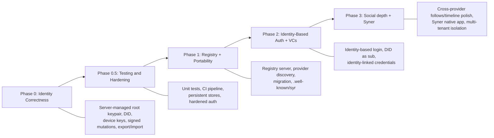

# Spec-to-Implementation Map

This page maps each requirement from the architecture specifications to the current implementation status in the codebase.

**Legend:**

- **Implemented** -- Working in the current codebase
- **Partial** -- Some aspects exist, others are missing
- **Missing** -- No implementation exists yet
- **Planned** -- Targeted for a specific phase

---

## Identity Model Specification

| Requirement                          | Status                        | Details                                                                                                                                                                                                                                                                                                                                                                                                                                                                                                                                                                                                                                               |
| ------------------------------------ | ----------------------------- | ----------------------------------------------------------------------------------------------------------------------------------------------------------------------------------------------------------------------------------------------------------------------------------------------------------------------------------------------------------------------------------------------------------------------------------------------------------------------------------------------------------------------------------------------------------------------------------------------------------------------------------------------------- |
| Root keypair generation (Ed25519)    | **Implemented**               | `packages/crypto/src/keys.ts` — `generateRootKeypair()` and `generateDeviceKeypair()` using `@noble/ed25519`.                                                                                                                                                                                                                                                                                                                                                                                                                                                                                                                                         |
| DID derivation (`did:syr`)           | **Implemented**               | `packages/crypto/src/encoding.ts` — `deriveDid()` produces `did:syr:z6Mk...` from Ed25519 public key.                                                                                                                                                                                                                                                                                                                                                                                                                                                                                                                                                 |
| Identity independent of hosting      | **Implemented**               | Identity is DID-based, derived from public key. Registry maps DID to provider.                                                                                                                                                                                                                                                                                                                                                                                                                                                                                                                                                                        |
| Profile mutations signed             | **Implemented**               | `PATCH /api/user/profile` with optional `signed_mutation`; `assertProfileSignedMutation()`; strict mode `SYR_REQUIRE_SIGNED_MUTATIONS`. Persists signature fields on `profile`. Root or delegated key via `verifyClientSignedContent()`.                                                                                                                                                                                                                                                                                                                                                                                                              |
| Post mutations signed                | **Implemented**               | Post create/update/delete accept signed envelopes; `PostCreateRequestSchema` / `signed_mutation` on updates; signatures stored on `post`.                                                                                                                                                                                                                                                                                                                                                                                                                                                                                                             |
| Identity exportable                  | **Implemented**               | `GET /api/identity/export` returns portable bundle. `GET /api/identity/export-bundle` returns a full zip with posts/assets.                                                                                                                                                                                                                                                                                                                                                                                                                                                                                                                           |
| Identity importable                  | **Implemented**               | `POST /api/identity/import` accepts a zip bundle, creates identity + posts + assets on new instance.                                                                                                                                                                                                                                                                                                                                                                                                                                                                                                                                                  |
| Signed export bundle (manifest v2)   | **Implemented**               | `.syr` `manifest.json` is `format_version: 2`: `files` map (SHA-256 of every bundle file), `rotation_seq`, `counts`, and a root-key `signature` block (`signed_payload_json` JCS + multibase Ed25519 + `signing_key`). Built in `export-manifest.ts`; custodial (Aegis) exports sign with the unlocked seed. `identity.json` embeds `rotationChain` so the bundle is self-verifying. See [Export §5](/architecture/export).                                                                                                                                                                                                                           |
| Self-custody export manifest signing | **Partial (unsigned marker)** | Self-custody (Syner) data-only `.syr` cannot yet carry the manifest payload through the existing chunked signer round without redesigning it, so it emits `format_version: 2` with an explicit `"unsigned": true` marker — never a silent downgrade. Importers treat it like a legacy bundle (authenticity not verifiable). Device-signed manifests are the tracked follow-up.                                                                                                                                                                                                                                                                        |
| Verified import (tamper-evident)     | **Implemented**               | `verifyBundleTrust()` recomputes every file hash, verifies the embedded rotation chain from genesis, binds `signing_key` to the chain-resolved root, and checks the manifest signature. The `assertBundleIntegrity()` backstop runs on **every** bundle-ingesting route — `POST /api/identity/import`, `POST /api/auth/register-with-import`, and `POST /api/identity/sync-from-backup` — hard-failing a tampered v2 signed bundle with HTTP 422 `IMPORT_TAMPERED` before any write or token consumption; the import dialog shows verified / legacy-unsigned / tampered. v1 bundles stay importable as legacy. See [Import §4](/architecture/import). |
| Delegated device keys                | **Implemented**               | `POST /api/identity/delegate` endpoint. `delegated_key` table exists. Root signature verification implemented.                                                                                                                                                                                                                                                                                                                                                                                                                                                                                                                                        |
| Provider hosting                     | **Implemented**               | App serves profiles and APIs. `GET /.well-known/did/:did` exists. `GET /.well-known/syr` instance discovery and `GET /.well-known/syr/{did}` per-identity manifest with content negotiation.                                                                                                                                                                                                                                                                                                                                                                                                                                                          |
| Registry resolution                  | **Implemented**               | `apps/registry/api` — NestJS server with `GET /resolve/:did`, `POST /update`, opted-in `GET /directory/search` and `POST /directory/upsert` (root-signed directory rows).                                                                                                                                                                                                                                                                                                                                                                                                                                                                             |
| Identity-based login                 | **Implemented**               | `POST /api/auth/identity-login/challenge` and `POST /api/auth/identity-login/token` endpoints. Persistent KV-backed store.                                                                                                                                                                                                                                                                                                                                                                                                                                                                                                                            |
| Independent login (challenge-sign)   | **Implemented**               | `POST /api/auth/independent-login/challenge`, `POST /api/auth/independent-login/verify`, `/auth/independent-callback`. QR + syr:// deep link + Syner opener.                                                                                                                                                                                                                                                                                                                                                                                                                                                                                          |
| Attestations / VCs                   | **Partial**                   | Type schemas exist in `packages/types/src/credentials.ts`. No API endpoints yet.                                                                                                                                                                                                                                                                                                                                                                                                                                                                                                                                                                      |
| Layered identity assurance           | **Partial**                   | Permissionless layer exists (any user can register). Social and legal layers missing.                                                                                                                                                                                                                                                                                                                                                                                                                                                                                                                                                                 |
| Migration model                      | **Implemented**               | Export-bundle + import endpoints enable full migration. Registry update to point to new provider.                                                                                                                                                                                                                                                                                                                                                                                                                                                                                                                                                     |

---

## did:syr Method Specification

| Requirement                                    | Status          | Details                                                                                                |
| ---------------------------------------------- | --------------- | ------------------------------------------------------------------------------------------------------ |
| DID syntax `did:syr:<multibase-pubkey>`        | **Implemented** | `packages/did/src/parse.ts` — `parseDid()` validates and extracts public key from `did:syr:z...`.      |
| Multibase-encoded Ed25519 public key           | **Implemented** | `packages/crypto/src/encoding.ts` — `encodeMultibase()` and `decodeMultibase()` with base58btc.        |
| DID Document structure                         | **Implemented** | `packages/did/src/document.ts` — `buildDidDocument()` returns W3C-compliant DID Document.              |
| Resolution via registry lookup                 | **Implemented** | `packages/resolver/src/resolve.ts` — `resolveDid()` queries registry, verifies signature, fetches doc. |
| DID Document contains `verificationMethod`     | **Implemented** | `Ed25519VerificationKey2020` with `#root` id.                                                          |
| Service endpoint in DID Document               | **Implemented** | Optional `#provider` service with `SyrIdentityProvider` type.                                          |
| Registry update authorization (root signature) | **Implemented** | `POST /update` on registry verifies Ed25519 signature over JCS-canonicalized payload.                  |
| Migration semantics (DID unchanged)            | **Implemented** | DID is key-anchored. Migration only changes provider URL in registry.                                  |
| Identity-based auth binding                    | **Implemented** | Challenge/token flow binds authentication to DID via SYR instance.                                     |

---

## Key Hierarchy & Delegation Specification

| Requirement                             | Status          | Details                                                                                                                                                                             |
| --------------------------------------- | --------------- | ----------------------------------------------------------------------------------------------------------------------------------------------------------------------------------- |
| Ed25519 root key generation             | **Implemented** | `packages/crypto/src/keys.ts` — `generateRootKeypair()`.                                                                                                                            |
| Root key stored on server               | **Implemented** | `identity.private_key` field stores multibase-encoded private key (server-managed identities).                                                                                      |
| Delegated device keys                   | **Implemented** | `POST /api/identity/delegate`. Delegation statement signed by root key, verified server-side.                                                                                       |
| Delegation statement (root-signed)      | **Implemented** | JCS-canonicalized `{ did, delegate, scope, createdAt, expiresAt? }` signed with root key.                                                                                           |
| Delegation verification                 | **Implemented** | `identity.controller.ts` — `verifyDelegation()` checks root signature, DID match, expiration, revocation.                                                                           |
| Delegation scopes (`device`, `session`) | **Implemented** | `DelegationScopeSchema` in `packages/types/src/identity.ts`.                                                                                                                        |
| Root-signed revocation records          | **Partial**     | `revoked_at` field exists on `DelegatedKey`. Formal revocation record format not yet implemented.                                                                                   |
| Multi-device operation                  | **Implemented** | Multiple delegated keys per identity supported.                                                                                                                                     |
| Key export                              | **Implemented** | `GET /api/identity/export` and `GET /api/identity/export-bundle` (full zip with posts/assets). Target format: [Sigil](/architecture/sigil); current uses PKCS#8 PEM (transitional). |

---

## Sigil & Aegis Specifications

| Requirement                | Status          | Details                                                                                                                                                                                                                   |
| -------------------------- | --------------- | ------------------------------------------------------------------------------------------------------------------------------------------------------------------------------------------------------------------------- |
| Aegis custodial generation | **Partial**     | Server-side seed generation, Argon2 + AES-GCM encryption in identity creation. Target spec: [Aegis v1](/architecture/aegis).                                                                                              |
| Aegis deletion             | **Implemented** | `POST /api/identity/delete-aegis`. Requires Syner verification (challenge-sign) to prove user has backed up keys. See [challenge-sign-flows](/implementer-guide/challenge-sign-flows#Delete-Aegis-Verification).          |
| Account deletion           | **Implemented** | `POST /api/account/delete`. Requires signed verification via Syner or Aegis password. Cascade deletion of all user data. See [challenge-sign-flows](/implementer-guide/challenge-sign-flows#Delete-Account-Verification). |
| Sigil export format        | **Implemented** | [Sigil v1](/architecture/sigil) spec in `packages/rust/syr-crypto-sigil` and `packages/ts/crypto`. Export-key-dialog produces `.sigil` files.                                                                             |

---

## Registry Protocol Specification

| Requirement                                | Status          | Details                                                                                       |
| ------------------------------------------ | --------------- | --------------------------------------------------------------------------------------------- |
| Hosting record (`did -> provider`)         | **Implemented** | `apps/registry/api` — SurrealDB-backed registry with `identity_registry` table.               |
| Ed25519 signature on records               | **Implemented** | Registry verifies Ed25519 signatures using `@syr-is/crypto`.                                  |
| JCS canonical signing (RFC 8785)           | **Implemented** | `packages/crypto/src/canonical.ts` — `canonicalize()` implements RFC 8785.                    |
| `GET /resolve/:did`                        | **Implemented** | Returns hosting record with provider URL.                                                     |
| `POST /update` with signature verification | **Implemented** | Verifies signature, validates DID ownership, updates hosting record.                          |
| Strictly increasing `updatedAt` timestamps | **Implemented** | Registry rejects stale timestamps.                                                            |
| Migration flow                             | **Implemented** | Export identity + assets from old provider, import on new, update registry with new provider. |

---

## Provider Service Specification

| Requirement                       | Status          | Details                                                                                                                                                                                                                                              |
| --------------------------------- | --------------- | ---------------------------------------------------------------------------------------------------------------------------------------------------------------------------------------------------------------------------------------------------- |
| `GET /.well-known/did/:did`       | **Implemented** | Returns DID Document for identities hosted on this instance.                                                                                                                                                                                         |
| `GET /.well-known/syr` discovery  | **Implemented** | Instance-level discovery at `/.well-known/syr` with `public_url`, all public API paths, and `identity_manifest_template`. Per-identity manifest at `/.well-known/syr/{did}` with content negotiation (JSON manifest or 302 redirect to web profile). |
| `GET /api/identity/export`        | **Implemented** | Returns portable identity bundle (JSON).                                                                                                                                                                                                             |
| `GET /api/identity/export-bundle` | **Implemented** | Returns full zip with identity, posts, and assets.                                                                                                                                                                                                   |
| `POST /api/identity/import`       | **Implemented** | Accepts zip bundle, creates identity + posts + assets.                                                                                                                                                                                               |
| Identity-based auth endpoints     | **Implemented** | Challenge and token exchange with persistent KV-backed store.                                                                                                                                                                                        |
| TLS requirement                   | **Implemented** | App runs behind HTTPS in production.                                                                                                                                                                                                                 |

---

## Follows, Timeline, and Verification UI

| Requirement                                         | Status          | Details                                                                                                                                                                                                                                                                                                                                                                        |
| --------------------------------------------------- | --------------- | ------------------------------------------------------------------------------------------------------------------------------------------------------------------------------------------------------------------------------------------------------------------------------------------------------------------------------------------------------------------------------ |
| DID-keyed follows and registry discovery            | **Implemented** | `user_follow` with `followed_provider_url` and `is_public`; `GET/POST/DELETE/PATCH /api/follows`; `PATCH /api/follows/visibility`; `POST /api/follows/refresh`. Public follows: `GET /api/public/following/{did}`. Gating uses **discovery registries**. Following page: manual URL edit, refresh, public/private toggle. `u/[param]` profile route with `?provider=` support. |
| Profile `identity_host_url` (public “home” URL)     | **Implemented** | Optional on `profile`; public `GET /api/public/profile/…`; signed `profile@v1` + Syner `profile-sync` payload; export bundle `identityHostUrl`; defaults to `{PUBLIC_URL}/u/{encodeURIComponent(did)}` when identity is created on Syr.                                                                                                                                        |
| Cross-site follow intent (`/follow?target_did=`)    | **Implemented** | Authenticated `(private)/follow` route; post-login cookie `post_login_redirect` (same-origin paths). See [Follow on Syr](/implementer-guide/follow-on-syr).                                                                                                                                                                                                                    |
| Home timeline (meta + full post fetch)              | **Partial**     | Home `+page.svelte` uses stored provider URL per follow when set; else batched registry resolve; merges public post meta client-side; full post on **Load details**; virtual scroll not yet added.                                                                                                                                                                             |
| Public post/profile read for feeds                  | **Implemented** | `GET /api/public/profile/[param]`, `GET /api/public/posts/[did]`, `GET /api/public/posts/[did]/[localId]`. See [Public read API](/reference/public-api).                                                                                                                                                                                                                       |
| Profile stories (24h reel, UTC storage, public API) | **Partial**     | Spec: [Profile stories (v1)](/architecture/profile-stories). **`GET /api/public/stories/{did}`** implemented; home tray + fullscreen viewer and full spec items may still evolve. [Public read API](/reference/public-api).                                                                                                                                                    |
| Registry directory search (opt-in)                  | **Partial**     | Registry `directory/search` + Syr `GET /api/search/directory` merges **discovery** registry URLs per account; Syr `/search` UI. Publication list unchanged for sync/outbox.                                                                                                                                                                                                    |
| Signature verification UI (profile/post)            | **Implemented** | `signature-verification.svelte` on profile settings, post view, and `u/` profile.                                                                                                                                                                                                                                                                                              |
| Untrusted HTML/markdown/media (sanitize + consent)  | **Implemented** | DOMPurify + `marked` pipeline (`sanitize-post-body.ts`); subresource URL extraction; path/glob trust rules (`user_content_trust_rule`, Settings → Content trust); per-post consent + feed avoids cross-origin media prefetch. See [untrusted post content](/architecture/untrusted-post-content). **Signatures ≠ HTML safety.**                                                |
| Signing UX preferences + Syner Sigil handoff        | **Partial**     | User prefs API; **Settings → Signing**: file load + **Syner QR/deeplink** handoff (`POST /api/user/sigil-handoff-session`, poll `GET …/sigil-handoff/[id]`, Syner `POST …/payload`); `sigil-session.ts` + WASM `signMutationPayload()` / `getUnlockedSigningSeed()`. Wired-in signing in forms still evolving.                                                                 |

---

## Syner (Self-Custody Companion)

| Requirement                 | Status          | Details                                                                                                                                                                                                                                    |
| --------------------------- | --------------- | ------------------------------------------------------------------------------------------------------------------------------------------------------------------------------------------------------------------------------------------ |
| Syner native app (Tauri v2) | **Implemented** | Personas, Sigil storage, independent login, export/import verification, profile sync. `syr://sigil-handoff` deep link opens trust-warning route for browser signing handoff. Phase 3 goals (platform keystores, pairing) are enhancements. |

---

## Multi-Tenancy

| Requirement           | Status          | Details                                        |
| --------------------- | --------------- | ---------------------------------------------- |
| Tenant CRUD           | **Implemented** | `/api/tenants/*` routes and tenant repository. |
| Tenant isolation      | **Implemented** | Optional `tenant_id` on identity records.      |
| Tenant-scoped queries | **Partial**     | Identity repository supports tenant filtering. |

---

## Rotation Specification (Recovery out of scope)

**Product note:** Root key rotation via a per-DID signed chain is **implemented** — see [Root key rotation](/architecture/recovery-rotation). The DID stays genesis-derived; the current root key is resolved through the chain. **Recovery keys remain out of scope** for v1: rotation requires possession (Aegis password or external signer).

| Requirement                                  | Status           | Details                                                                                                                                                                                                                                                                                                                                                                                                                                                                                                                                                                                                             |
| -------------------------------------------- | ---------------- | ------------------------------------------------------------------------------------------------------------------------------------------------------------------------------------------------------------------------------------------------------------------------------------------------------------------------------------------------------------------------------------------------------------------------------------------------------------------------------------------------------------------------------------------------------------------------------------------------------------------- |
| Recovery key generation at identity creation | **Out of scope** | Deliberate: no second long-lived root-replacement secret in v1; see [rotation spec §8](/architecture/recovery-rotation).                                                                                                                                                                                                                                                                                                                                                                                                                                                                                            |
| Recovery statement format                    | **Out of scope** | Deferred with recovery keys.                                                                                                                                                                                                                                                                                                                                                                                                                                                                                                                                                                                        |
| Root key rotation (signed chain)             | **Implemented**  | Statement v2 `{ did, seq, prevRoot, newRoot, rotatedAt }` (JCS, signed by retiring key) in `syr-crypto-core::rotation`; `POST /api/identity/rotate` with `aegis` (custodial) and `external` (self-custody) modes; rollback ledger on failure.                                                                                                                                                                                                                                                                                                                                                                       |
| Key history chain (append-only)              | **Implemented**  | `identity_rotation` table (unique `did`+`seq`); `verify_rotation_chain()` in Rust/WASM/`@syr-is/crypto`; public `GET /api/identity/{did}/rotations`; manifest `endpoints.rotations`; `getCurrentRootKey()` trust anchor across the app.                                                                                                                                                                                                                                                                                                                                                                             |
| Registry update after rotation               | **Implemented**  | Rotation enqueues `registry_sync` jobs; pushes attach `rotation_chain`; registry verifies chain → current key, prefix-pins the committed chain (rollback + fork protection), and persists the record write + commitment in one transaction; `@syr-is/resolver` verifies chain-bearing hosting records.                                                                                                                                                                                                                                                                                                              |
| Delegation validity across rotation          | **Implemented**  | Retired-root delegations stay valid if created before that key's `rotatedAt`; custodial rotation re-signs active delegations with the new root. See [key hierarchy §4.2.1](/architecture/key-hierarchy-delegation).                                                                                                                                                                                                                                                                                                                                                                                                 |
| Cross-instance import of a rotated identity  | **Partial**      | The export bundle now embeds the rotation chain (`identity.json` `rotationChain`) and the manifest v2 signature is verifiable under the chain-resolved current root, so bundle authenticity is established even for rotated identities. But `validateBundle` still gates identity **creation** on the genesis key equalling `identity.publicKey`, so a rotated identity's `KEY_MISMATCH` bundle is rejected before creation — full re-home on a foreign instance stays out of scope. Rotated identities remain fully resolvable on their home instance. See [rotation spec §10.1](/architecture/recovery-rotation). |

---

## Testing & CI

| Requirement                    | Status          | Details                                                                                 |
| ------------------------------ | --------------- | --------------------------------------------------------------------------------------- |
| Unit tests for shared packages | **Implemented** | Vitest tests for `crypto`, `did`, `resolver`, `types` — see CI/repo for current counts. |
| CI pipeline                    | **Implemented** | `.github/workflows/test.yml` with per-package path-filtered jobs.                       |
| Code quality checks            | **Implemented** | `.github/workflows/code-quality.yml` with lint and format checks.                       |

---

## Implementation Priority

