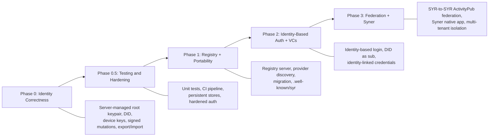

# Spec-to-Implementation Map

This page maps each requirement from the architecture specifications to the current implementation status in the codebase.

**Legend:**

- **Implemented** -- Working in the current codebase
- **Partial** -- Some aspects exist, others are missing
- **Missing** -- No implementation exists yet
- **Planned** -- Targeted for a specific phase

---

## Identity Model Specification

| Requirement                        | Status          | Details                                                                                                                                                                                                                                  |
| ---------------------------------- | --------------- | ---------------------------------------------------------------------------------------------------------------------------------------------------------------------------------------------------------------------------------------- |
| Root keypair generation (Ed25519)  | **Implemented** | `packages/crypto/src/keys.ts` — `generateRootKeypair()` and `generateDeviceKeypair()` using `@noble/ed25519`.                                                                                                                            |
| DID derivation (`did:syr`)         | **Implemented** | `packages/crypto/src/encoding.ts` — `deriveDid()` produces `did:syr:z6Mk...` from Ed25519 public key.                                                                                                                                    |
| Identity independent of hosting    | **Implemented** | Identity is DID-based, derived from public key. Registry maps DID to provider.                                                                                                                                                           |
| Profile mutations signed           | **Implemented** | `PATCH /api/user/profile` with optional `signed_mutation`; `assertProfileSignedMutation()`; strict mode `SYR_REQUIRE_SIGNED_MUTATIONS`. Persists signature fields on `profile`. Root or delegated key via `verifyClientSignedContent()`. |
| Post mutations signed              | **Implemented** | Post create/update/delete accept signed envelopes; `PostCreateRequestSchema` / `signed_mutation` on updates; signatures stored on `post`.                                                                                                |
| Identity exportable                | **Implemented** | `GET /api/identity/export` returns portable bundle. `GET /api/identity/export-bundle` returns a full zip with posts/assets.                                                                                                              |
| Identity importable                | **Implemented** | `POST /api/identity/import` accepts a zip bundle, creates identity + posts + assets on new instance.                                                                                                                                     |
| Delegated device keys              | **Implemented** | `POST /api/identity/delegate` endpoint. `delegated_key` table exists. Root signature verification implemented.                                                                                                                           |
| Provider hosting                   | **Partial**     | App serves profiles and APIs. `GET /.well-known/did/:did` exists. `GET /.well-known/syr` stub at `apps/syr/app/src/routes/.well-known/syr/+server.ts`.                                                                                   |
| Registry resolution                | **Implemented** | `apps/registry/api` — NestJS server with `GET /resolve/:did`, `POST /update`, opted-in `GET /directory/search` and `POST /directory/upsert` (root-signed directory rows).                                                                |
| Identity-based login               | **Implemented** | `POST /api/auth/identity-login/challenge` and `POST /api/auth/identity-login/token` endpoints. Persistent KV-backed store.                                                                                                               |
| Independent login (challenge-sign) | **Implemented** | `POST /api/auth/independent-login/challenge`, `POST /api/auth/independent-login/verify`, `/auth/independent-callback`. QR + syr:// deep link + Syner opener.                                                                             |
| Attestations / VCs                 | **Partial**     | Type schemas exist in `packages/types/src/credentials.ts`. No API endpoints yet.                                                                                                                                                         |
| Layered identity assurance         | **Partial**     | Permissionless layer exists (any user can register). Social and legal layers missing.                                                                                                                                                    |
| Migration model                    | **Implemented** | Export-bundle + import endpoints enable full migration. Registry update to point to new provider.                                                                                                                                        |

---

## did:syr Method Specification

| Requirement                                    | Status          | Details                                                                                                |
| ---------------------------------------------- | --------------- | ------------------------------------------------------------------------------------------------------ |
| DID syntax `did:syr:<multibase-pubkey>`        | **Implemented** | `packages/did/src/parse.ts` — `parseDid()` validates and extracts public key from `did:syr:z...`.      |
| Multibase-encoded Ed25519 public key           | **Implemented** | `packages/crypto/src/encoding.ts` — `encodeMultibase()` and `decodeMultibase()` with base58btc.        |
| DID Document structure                         | **Implemented** | `packages/did/src/document.ts` — `buildDidDocument()` returns W3C-compliant DID Document.              |
| Resolution via registry lookup                 | **Implemented** | `packages/resolver/src/resolve.ts` — `resolveDid()` queries registry, verifies signature, fetches doc. |
| DID Document contains `verificationMethod`     | **Implemented** | `Ed25519VerificationKey2020` with `#root` id.                                                          |
| Service endpoint in DID Document               | **Implemented** | Optional `#provider` service with `SyrIdentityProvider` type.                                          |
| Registry update authorization (root signature) | **Implemented** | `POST /update` on registry verifies Ed25519 signature over JCS-canonicalized payload.                  |
| Migration semantics (DID unchanged)            | **Implemented** | DID is key-anchored. Migration only changes provider URL in registry.                                  |
| Identity-based auth binding                    | **Implemented** | Challenge/token flow binds authentication to DID via SYR instance.                                     |

---

## Key Hierarchy & Delegation Specification

| Requirement                             | Status          | Details                                                                                                                                                                             |
| --------------------------------------- | --------------- | ----------------------------------------------------------------------------------------------------------------------------------------------------------------------------------- |
| Ed25519 root key generation             | **Implemented** | `packages/crypto/src/keys.ts` — `generateRootKeypair()`.                                                                                                                            |
| Root key stored on server               | **Implemented** | `identity.private_key` field stores multibase-encoded private key (server-managed identities).                                                                                      |
| Delegated device keys                   | **Implemented** | `POST /api/identity/delegate`. Delegation statement signed by root key, verified server-side.                                                                                       |
| Delegation statement (root-signed)      | **Implemented** | JCS-canonicalized `{ did, delegate, scope, createdAt, expiresAt? }` signed with root key.                                                                                           |
| Delegation verification                 | **Implemented** | `identity.controller.ts` — `verifyDelegation()` checks root signature, DID match, expiration, revocation.                                                                           |
| Delegation scopes (`device`, `session`) | **Implemented** | `DelegationScopeSchema` in `packages/types/src/identity.ts`.                                                                                                                        |
| Root-signed revocation records          | **Partial**     | `revoked_at` field exists on `DelegatedKey`. Formal revocation record format not yet implemented.                                                                                   |
| Multi-device operation                  | **Implemented** | Multiple delegated keys per identity supported.                                                                                                                                     |
| Key export                              | **Implemented** | `GET /api/identity/export` and `GET /api/identity/export-bundle` (full zip with posts/assets). Target format: [Sigil](/architecture/sigil); current uses PKCS#8 PEM (transitional). |

---

## Sigil & Aegis Specifications

| Requirement                | Status          | Details                                                                                                                                                                                                                   |
| -------------------------- | --------------- | ------------------------------------------------------------------------------------------------------------------------------------------------------------------------------------------------------------------------- |
| Aegis custodial generation | **Partial**     | Server-side seed generation, Argon2 + AES-GCM encryption in identity creation. Target spec: [Aegis v1](/architecture/aegis).                                                                                              |
| Aegis deletion             | **Implemented** | `POST /api/identity/delete-aegis`. Requires Syner verification (challenge-sign) to prove user has backed up keys. See [challenge-sign-flows](/implementer-guide/challenge-sign-flows#Delete-Aegis-Verification).          |
| Account deletion           | **Implemented** | `POST /api/account/delete`. Requires signed verification via Syner or Aegis password. Cascade deletion of all user data. See [challenge-sign-flows](/implementer-guide/challenge-sign-flows#Delete-Account-Verification). |
| Sigil export format        | **Implemented** | [Sigil v1](/architecture/sigil) spec in `packages/rust/syr-crypto-sigil` and `packages/ts/crypto`. Export-key-dialog produces `.sigil` files.                                                                             |

---

## Registry Protocol Specification

| Requirement                                | Status          | Details                                                                                       |
| ------------------------------------------ | --------------- | --------------------------------------------------------------------------------------------- |
| Hosting record (`did -> provider`)         | **Implemented** | `apps/registry/api` — SurrealDB-backed registry with `identity_registry` table.               |
| Ed25519 signature on records               | **Implemented** | Registry verifies Ed25519 signatures using `@syr-is/crypto`.                                  |
| JCS canonical signing (RFC 8785)           | **Implemented** | `packages/crypto/src/canonical.ts` — `canonicalize()` implements RFC 8785.                    |
| `GET /resolve/:did`                        | **Implemented** | Returns hosting record with provider URL.                                                     |
| `POST /update` with signature verification | **Implemented** | Verifies signature, validates DID ownership, updates hosting record.                          |
| Strictly increasing `updatedAt` timestamps | **Implemented** | Registry rejects stale timestamps.                                                            |
| Migration flow                             | **Implemented** | Export identity + assets from old provider, import on new, update registry with new provider. |

---

## Provider Service Specification

| Requirement                       | Status          | Details                                                                                         |
| --------------------------------- | --------------- | ----------------------------------------------------------------------------------------------- |
| `GET /.well-known/did/:did`       | **Implemented** | Returns DID Document for identities hosted on this instance.                                    |
| `GET /.well-known/syr` discovery  | **Partial**     | Stub JSON at `/.well-known/syr` with `public_url` and public API hints; extend as spec matures. |
| `GET /api/identity/export`        | **Implemented** | Returns portable identity bundle (JSON).                                                        |
| `GET /api/identity/export-bundle` | **Implemented** | Returns full zip with identity, posts, and assets.                                              |
| `POST /api/identity/import`       | **Implemented** | Accepts zip bundle, creates identity + posts + assets.                                          |
| Identity-based auth endpoints     | **Implemented** | Challenge and token exchange with persistent KV-backed store.                                   |
| TLS requirement                   | **Implemented** | App runs behind HTTPS in production.                                                            |

---

## Follows, Timeline, and Verification UI

| Requirement                                  | Status          | Details                                                                                                                                                                             |
| -------------------------------------------- | --------------- | ----------------------------------------------------------------------------------------------------------------------------------------------------------------------------------- |
| DID-keyed follows and registry discovery     | **Implemented** | `user_follow` table; `GET/POST/DELETE /api/follows`; registry gate via `@syr-is/resolver` `resolveProvider`. `u/[param]` profile route.                                             |
| Home timeline (meta + full post fetch)       | **Partial**     | Home `+page.svelte` merges public post meta client-side (batched registry resolve + meta `fetch`); full post on **Load details** (not eager per-row); virtual scroll not yet added. |
| Public post/profile read for feeds           | **Implemented** | `GET /api/public/profile/[param]`, `GET /api/public/posts/[did]`, `GET /api/public/posts/[did]/[localId]`.                                                                          |
| Registry directory search (opt-in)           | **Partial**     | Registry `directory/search` + Syr `GET /api/search/directory` merges registries; Syr `/search` UI.                                                                                  |
| Signature verification UI (profile/post)     | **Implemented** | `signature-verification.svelte` on profile settings, post view, and `u/` profile.                                                                                                   |
| Signing UX preferences + Syner Sigil handoff | **Partial**     | User prefs API + settings; `syr://sigil-handoff` + Syner trust page; WASM `signMutationPayload()` helper. Full QR/file pipe TBD.                                                    |

---

## Syner (Self-Custody Companion)

| Requirement                 | Status          | Details                                                                                                                                                                                                                                    |
| --------------------------- | --------------- | ------------------------------------------------------------------------------------------------------------------------------------------------------------------------------------------------------------------------------------------ |
| Syner native app (Tauri v2) | **Implemented** | Personas, Sigil storage, independent login, export/import verification, profile sync. `syr://sigil-handoff` deep link opens trust-warning route for browser signing handoff. Phase 3 goals (platform keystores, pairing) are enhancements. |

---

## ActivityPub Federation

| Requirement                    | Status      | Details                                                               |
| ------------------------------ | ----------- | --------------------------------------------------------------------- |
| Outbox (publishing activities) | **Partial** | Outbox routes exist (`/api/identity/outbox/*`). Registry sync outbox. |
| Inbox (receiving activities)   | **Missing** | No inbox endpoint for receiving activities from remote instances.     |
| HTTP Signatures                | **Partial** | Signature infrastructure exists but inbox verification missing.       |
| Actor discovery (WebFinger)    | **Missing** | No WebFinger endpoint yet.                                            |

---

## Multi-Tenancy

| Requirement           | Status          | Details                                        |
| --------------------- | --------------- | ---------------------------------------------- |
| Tenant CRUD           | **Implemented** | `/api/tenants/*` routes and tenant repository. |
| Tenant isolation      | **Implemented** | Optional `tenant_id` on identity records.      |
| Tenant-scoped queries | **Partial**     | Identity repository supports tenant filtering. |

---

## Recovery & Rotation Specification

**Product note:** Under [Identity lifecycle (simplified)](/architecture/identity-lifecycle-simplified), rotation and recovery are **out of scope** until a future phase explicitly revives them. Portability is **migration + export/import**; new root keys imply a **new DID**.

| Requirement                                  | Status           | Details                                                                                                                      |
| -------------------------------------------- | ---------------- | ---------------------------------------------------------------------------------------------------------------------------- |
| Recovery key generation at identity creation | **Out of scope** | Deferred per simplified lifecycle; see [roadmap](/roadmap) Phase 5 note.                                                     |
| Recovery statement format                    | **Out of scope** | Deferred.                                                                                                                    |
| Root key rotation (signed chain)             | **Out of scope** | `createRotationStatement()` / `verifyRotationStatement()` exist in `@syr-is/crypto` but are **not** roadmap-backed features. |
| Key history chain (append-only)              | **Out of scope** | Not planned under simplified lifecycle.                                                                                      |
| Registry update after rotation               | **Out of scope** | Registry updates apply to **hosting** migration, not key rotation.                                                           |

---

## Testing & CI

| Requirement                    | Status          | Details                                                                                 |
| ------------------------------ | --------------- | --------------------------------------------------------------------------------------- |
| Unit tests for shared packages | **Implemented** | Vitest tests for `crypto`, `did`, `resolver`, `types` — see CI/repo for current counts. |
| CI pipeline                    | **Implemented** | `.github/workflows/test.yml` with per-package path-filtered jobs.                       |
| Code quality checks            | **Implemented** | `.github/workflows/code-quality.yml` with lint and format checks.                       |

---

## Implementation Priority

