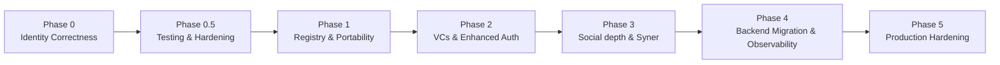

# SYR Roadmap

This document outlines the implementation phases for the SYR platform, from the current proof-of-concept through to a production-ready system with cross-provider identity, social features, and native application support.

---

## Phase 0: Identity Correctness (In Progress)

The foundation phase. Establishes the cryptographic identity model and core data flows.

**Completed:**

- Ed25519 root keypair generation and server-side management (`@syr-is/crypto`)
- `did:syr` method: DID derivation, parsing, document generation (`@syr-is/did`)
- DID resolution via registry (`@syr-is/resolver`)
- Identity initialization (client-initiated and server-created)
- Delegated device keys with root-signed delegation statements
- Identity export (JSON bundle and full zip with posts/assets)
- Identity import from zip bundle (posts, assets, profile migration)
- Identity-based authentication (challenge/token flow)
- Registry server with signature-verified hosting records
- Multi-tenancy foundations (tenant CRUD, identity scoping)
- Zod v4 schema validation across all shared packages
- **Syner** native app (Tauri v2): personas, Sigil storage, independent login, export/import verification, profile sync
- **Sigil** export format (PIEF v1) — `.sigil` files for portable key backup

**Remaining:**

- Enforce signed mutations on all profile/post writes
- `.well-known/syr` instance discovery endpoint
- Signed mutation middleware for API routes

---

## Phase 0.5: Testing & Hardening (In Progress)

Stabilize the foundation before adding new features.

**Completed:**

- Unit tests for all shared packages (93 tests across crypto, did, resolver, types)
- CI pipeline with per-package path-filtered test jobs
- Persistent identity-auth challenge store (KV-backed, replaces in-memory Map)
- Sigil export format implemented in export-key-dialog and `@syr-is/crypto` / `syr-crypto-sigil`

**Remaining:**

- Integration tests for identity lifecycle (create, delegate, export, import)
- Load testing for registry resolution
- Error boundary hardening across API routes

---

## Phase 1: Registry & Provider Portability

Make identity truly portable across SYR instances.

**Goals:**

- `.well-known/syr` discovery endpoint (instance capabilities, supported features)
- Registry improvements: batch resolution, caching, health checks
- Full migration flow: export from provider A, import on provider B, update registry
- Provider-to-provider identity verification

**Shipped: root key rotation.** In-place **root key rotation** with an **append-only key history chain** is implemented — see [Root key rotation](/architecture/recovery-rotation). The DID never changes; `POST /api/identity/rotate` (custodial `aegis` / self-custody `external` modes) appends chain statements, the public chain is served at `GET /api/identity/{did}/rotations`, and registries verify chain-bearing hosting records with rollback protection. **Recovery keys stay out of scope** (rotation requires possession of the current key); a Syner rotation UI for the external mode is a follow-up.

---

## Phase 2: Verifiable Credentials & Enhanced Auth

Add credential exchange and richer authentication.

**Goals:**

- Verifiable Credential storage and presentation (W3C VC 2.0)
- VC issuance API for third-party issuers
- Verifiable Presentation builder for platform admission
- Identity-based auth SDK (`@syr-is/sdk`) for third-party integration
- DID as `sub` claim in authentication tokens
- Scoped authorization (fine-grained permission delegation)

---

## Phase 3: Social depth & Syner enhancements

Deeper cross-provider experience (DID-keyed follows, registry resolution, public APIs—see [Follows, Discovery, and Home Timeline](/architecture/follows-and-timeline)) and Syner improvements. Core Syner app is implemented (Phase 0).

**Goals:**

- Optional server-side timeline aggregation or feed reliability improvements (client-side merge remains baseline)
- Registry sync and public-fetch observability (retries, metrics) where it helps multi-provider flows
- **Syner enhancements** (core app exists: personas, independent login, export-verify, profile sync):
  - Platform-native secure keystore (Keychain, DPAPI, libsecret, Android Keystore)
  - SSE-based signing bridge with SYR web app
  - Deep link fallback for platforms without background process support
  - Device pairing flow with QR code enrollment
  - Syner-managed identity as the canonical self-custody method

---

## Phase 4: Backend Migration & Observability

Architectural maturation for production readiness.

**Goals:**

- SvelteKit frontend + NestJS backend separation
- OpenTelemetry integration (traces, metrics, logs)
- Structured logging with correlation IDs
- Rate limiting and abuse prevention
- Audit trail for identity operations (key generation, delegation, export)

---

## Phase 5: Production Hardening

Prepare for real-world deployment.

**Goals:**

- Backup and disaster recovery procedures
- Horizontal scaling (load-balanced API, read replicas)
- Improved identity export/import with incremental sync
- Social recovery guardians (threshold key recovery) — **deferred**; conflicts with [simplified identity lifecycle](/architecture/identity-lifecycle-simplified) until explicitly replanned
- Hardware-backed key attestation support

---

## Removed from Roadmap

The following items were previously considered but have been removed:

- **Edge Computing**: Removed. Not aligned with the self-hosted model. SYR instances are meant to be operated by individuals or communities, not distributed to edge nodes.

---

## Phase Overview

