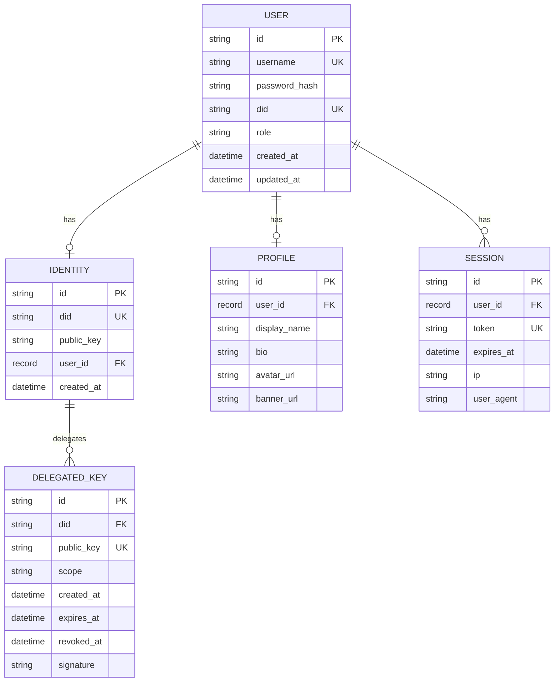

# Phase 0: Database Schema

Phase 0 adds two new tables to SurrealDB and extends the existing `user` table with a `did` field.

---

## Current Schema

Before Phase 0, the database has these tables with indexes:

| Table | Unique Indexes | Regular Indexes |
| ----- | -------------- | --------------- |
| `user` | `username` | -- |
| `profile` | `user_id` | -- |
| `session` | `token` | `user_id` |
| `post` | -- | -- |
| `upload` | -- | -- |
| `folder` | -- | -- |
| `kv` | -- | -- |

---

## New Tables

### `identity`

Stores root identity metadata. One row per user. Never stores private keys.

```sql
DEFINE TABLE identity SCHEMAFULL;
DEFINE FIELD did ON identity TYPE string
  ASSERT string::starts_with($value, "did:syr:");
DEFINE FIELD public_key ON identity TYPE string;
DEFINE FIELD user_id ON identity TYPE record<user>;
DEFINE FIELD created_at ON identity TYPE datetime;
DEFINE INDEX idx_identity_did ON identity FIELDS did UNIQUE;
DEFINE INDEX idx_identity_user ON identity FIELDS user_id UNIQUE;
```

| Field | Type | Description |
| ----- | ---- | ----------- |
| `did` | `string` | `did:syr:<multibase>` identifier |
| `public_key` | `string` | Multibase-encoded Ed25519 public key |
| `user_id` | `record<user>` | Reference to the owning user |
| `created_at` | `datetime` | Identity creation timestamp |

**Constraints:**
- `did` must start with `did:syr:`
- `did` is globally unique
- `user_id` is unique (one identity per user)

### `delegated_key`

Stores device delegations. Multiple rows per identity.

```sql
DEFINE TABLE delegated_key SCHEMAFULL;
DEFINE FIELD did ON delegated_key TYPE string;
DEFINE FIELD public_key ON delegated_key TYPE string;
DEFINE FIELD scope ON delegated_key TYPE string DEFAULT "device";
DEFINE FIELD created_at ON delegated_key TYPE datetime;
DEFINE FIELD expires_at ON delegated_key TYPE option<datetime>;
DEFINE FIELD revoked_at ON delegated_key TYPE option<datetime>;
DEFINE FIELD signature ON delegated_key TYPE string;
DEFINE INDEX idx_dk_pubkey ON delegated_key FIELDS public_key UNIQUE;
DEFINE INDEX idx_dk_did ON delegated_key FIELDS did;
```

| Field | Type | Description |
| ----- | ---- | ----------- |
| `did` | `string` | Owning identity's DID |
| `public_key` | `string` | Multibase-encoded device public key |
| `scope` | `string` | Delegation scope (`device` in Phase 0) |
| `created_at` | `datetime` | Delegation creation time |
| `expires_at` | `option<datetime>` | Optional expiration |
| `revoked_at` | `option<datetime>` | Set when revoked by root key |
| `signature` | `string` | Root key signature over the delegation statement |

**Constraints:**
- `public_key` is globally unique (one delegation per device key)
- `did` is indexed for lookups

---

## Schema Modification: `user` table

Add optional `did` field:

```sql
DEFINE FIELD did ON user TYPE option<string>;
DEFINE INDEX idx_user_did ON user FIELDS did UNIQUE;
```

The `did` field is optional to allow existing users to onboard incrementally. New users get a DID during the first-run identity creation flow.

---

## Entity Relationship Diagram



---

## Migration Strategy

Phase 0 schema changes are **additive only**:

1. New `identity` and `delegated_key` tables are created via `initializeSchema()`.
2. `did` field is added to `user` as `option<string>`.
3. No existing data is modified or deleted.
4. Existing users without a DID continue to function normally.
5. Identity creation is triggered on the client after login/register if no identity exists.
