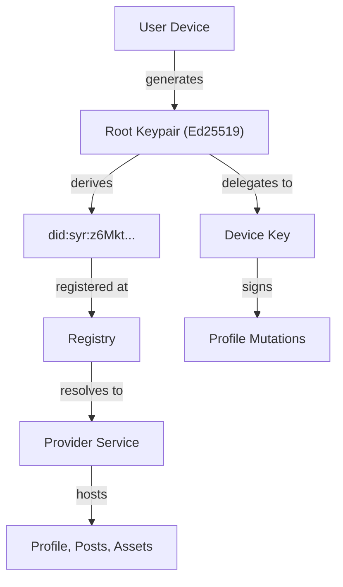

# What is Syr?

**Syr** stands for **Self Yield Identity Representation**.

It is a system that lets you generate, host, and control your own cryptographic identity. Your keys live on your device. Your identity is derived from those keys. You choose where your data is hosted, and you can move it at any time without losing who you are.

---

## The Problem

Most identity systems today work like this:

- A platform creates an account for you.
- The platform owns your username, your data, and your login.
- If the platform disappears, your identity disappears with it.
- If you want to move, you start over.

This is not ownership. It is tenancy.

---

## The Syr Approach

Syr inverts the model:

1. **You generate a root keypair** (Ed25519) on your own device.
2. **Your identity is derived** from your public key as a DID (`did:syr:z6Mkt...`).
3. **You choose a provider** to host your profile, posts, and assets, or you self-host.
4. **You can migrate** to a different provider at any time. Your DID never changes.
5. **Everything you do is signed** by your keys, making your actions cryptographically attributable to you.

No platform owns you. No server holds your root key. If a provider disappears, you export your identity bundle and set up somewhere else.

---

## High-Level Architecture



---

## Core Concepts

### Root Identity

Every Syr identity starts with a **locally generated Ed25519 keypair**. The private key never leaves the user's control. The public key is encoded as a multibase string and embedded in the DID identifier. This keypair is the ultimate trust anchor for everything: hosting decisions, delegated keys, signed actions, and migrations.

### Decentralized Identifier (DID)

Syr uses the `did:syr` method. The DID is deterministically derived from the root public key:

```text
did:syr:z6Mkt9...abc
```

Because the DID is derived from the key itself, no external authority is needed to verify ownership. Registries exist only for service discovery, not for trust.

### Delegated Device Keys

The root key is sacred and used rarely. For daily operations (signing posts, authenticating sessions), Syr creates **delegated device keys**. Each device generates its own keypair, which is then authorized by the root key via a signed delegation statement. Delegated keys can be revoked at any time without affecting the root identity.

### Providers

A provider is a server that hosts your profile data, APIs, and storage. Providers can be:

- **Self-hosted** by the user
- **Community-hosted** by a trusted operator

Providers host your identity state but never own your identity. You can migrate between providers without changing your DID.

### Registry

The registry maps DIDs to their current provider endpoints:

```text
did:syr:z6Mkt... → https://provider.example
```

Only the root key can update this mapping. Registry operators cannot impersonate identities or forge migrations.

### Signed Mutations

Every profile mutation (updating your bio, creating a post) is signed by a delegated device key. The server verifies the delegation chain before accepting any write. Unsigned writes are rejected.

### Identity Export

At any time, you can export your identity as a portable bundle containing your DID, public keys, delegated keys, and a signed profile snapshot. This bundle can be verified offline and imported to a new provider.

---

## What Syr is Not

Syr is **not** a social network, a blockchain, or a federation protocol. It is an **identity layer** that other applications can build on. It provides:

- Cryptographic identity generation and management
- Provider-portable hosting
- Signed, attributable actions
- Export and import of identity state

Social features, federation (ActivityPub), attestations, and moderation are built on top of this foundation in later phases.

---

## Implementation Phases

| Phase       | Focus                              | Status      |
| ----------- | ---------------------------------- | ----------- |
| **Phase 0** | Local-first cryptographic identity | In progress |
| Phase 1     | Registry + Provider portability    | Planned     |
| Phase 2     | OAuth + Institutional trust        | Planned     |
| Phase 3     | Federation + Social features       | Planned     |

---

## Next Steps

- Read the [Identity Model specification](/architecture/identity-model) for the full technical design.
- See the [Phase 0 Blueprint](/implementation/phase-0-blueprint) for implementation details.
- Browse the [Reference](/reference/types) section for current codebase documentation.
