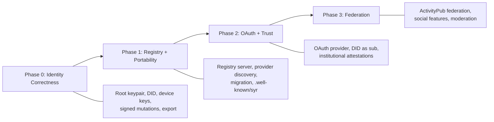

# Spec-to-Implementation Map

This page maps each requirement from the architecture specifications to the current implementation status in the codebase.

**Legend:**
- **Implemented** -- Working in the current codebase
- **Partial** -- Some aspects exist, others are missing
- **Stubbed** -- Code exists but is commented out or incomplete
- **Missing** -- No implementation exists yet
- **Planned** -- Targeted for a specific phase

---

## Identity Model Specification

| Requirement | Status | Details |
| ----------- | ------ | ------- |
| Root keypair generation (Ed25519) | **Missing** | Phase 0 target. `packages/crypto` to be created. |
| DID derivation (`did:syr`) | **Stubbed** | `generateDID()` is commented out in `auth.controller.ts:42`. Uses `did:web`, needs migration to `did:syr`. |
| Identity independent of hosting | **Missing** | Currently identity is server-bound (username + password). |
| Profile mutations signed | **Missing** | Currently simple auth-gated writes. Phase 0 target. |
| Identity exportable | **Missing** | Phase 0 target. `GET /api/identity/export` to be created. |
| Delegated device keys | **Missing** | Phase 0 target. `delegated_key` table to be created. |
| Provider hosting | **Partial** | App serves profiles and APIs but no `.well-known/syr` discovery endpoint. |
| Registry resolution | **Missing** | Phase 1 target. Registry server not yet built. |
| OAuth with DID as `sub` | **Missing** | OAuth schemas defined in `packages/types/oauth.ts` but no OAuth server. Phase 2 target. |
| Attestations | **Missing** | Future phase. No attestation types or logic. |
| Layered identity assurance | **Partial** | Permissionless layer exists (any user can register). Social and legal layers missing. |
| Migration model | **Missing** | Phase 1 target. Requires registry + provider export/import. |

---

## did:syr Method Specification

| Requirement | Status | Details |
| ----------- | ------ | ------- |
| DID syntax `did:syr:<multibase-pubkey>` | **Missing** | Code has remnants of `did:web`. `packages/did` to be created. |
| Multibase-encoded Ed25519 public key | **Missing** | `packages/crypto` to provide `encodeMultibase()`. |
| DID Document structure | **Missing** | `packages/did` to provide `buildDidDocument()`. |
| Resolution via registry lookup | **Missing** | Phase 1 target. |
| DID Document contains `verificationMethod` | **Missing** | Part of `buildDidDocument()` in Phase 0. |
| Service endpoint in DID Document | **Missing** | Depends on registry (Phase 1). |
| Registry update authorization (root signature) | **Missing** | Phase 1 target. |
| Migration semantics (DID unchanged) | **Missing** | Phase 1 target. |
| OAuth binding (`sub` = DID) | **Missing** | Phase 2 target. |

---

## Key Hierarchy & Delegation Specification

| Requirement | Status | Details |
| ----------- | ------ | ------- |
| Ed25519 root key generation | **Missing** | Phase 0 target. |
| Root key stored locally, never on server | **Missing** | Phase 0: IndexedDB in browser. |
| Delegated device keys | **Missing** | Phase 0 target. |
| Delegation statement (root-signed) | **Missing** | Phase 0 target. Schema: `{ did, delegate, scope, createdAt, expiresAt?, signature }` |
| Delegation verification | **Missing** | Phase 0 target. Server must verify root signature. |
| Delegation scopes (`device`, `session`) | **Missing** | Phase 0: `device` scope only. |
| Root-signed revocation records | **Missing** | Phase 0 stub (compile-level only). |
| Multi-device operation | **Missing** | Phase 0 supports multiple delegated keys. |

---

## Registry Protocol Specification

| Requirement | Status | Details |
| ----------- | ------ | ------- |
| Hosting record (`did -> provider`) | **Missing** | Phase 1 target. |
| Ed25519 signature on records | **Missing** | `packages/crypto` provides signing. |
| JCS canonical signing (RFC 8785) | **Missing** | `packages/crypto` to provide `canonicalize()`. |
| `GET /resolve/{did}` | **Missing** | Phase 1: Registry server. |
| `POST /update` with signature verification | **Missing** | Phase 1: Registry server. |
| Strictly increasing `updatedAt` timestamps | **Missing** | Phase 1. |
| Migration flow | **Missing** | Phase 1. |

---

## Provider Service Specification

| Requirement | Status | Details |
| ----------- | ------ | ------- |
| `GET /.well-known/syr` discovery | **Missing** | Phase 1 target. |
| `GET /profile` public endpoint | **Partial** | Profile data exists in DB. No public DID-addressed profile endpoint. |
| OAuth endpoints (`/oauth/authorize`, etc.) | **Missing** | Phase 2 target. OAuth schemas defined. |
| `sub` = DID in OAuth tokens | **Missing** | Phase 2 target. |
| `GET /export` endpoint | **Missing** | Phase 0 target. `GET /api/identity/export`. |
| Export authentication (root/delegated key proof) | **Missing** | Phase 0 target. |
| TLS requirement | **Implemented** | App runs behind HTTPS in production. |
| Import endpoint | **Missing** | Out of scope for v0.1. |

---

## Recovery & Rotation Specification

| Requirement | Status | Details |
| ----------- | ------ | ------- |
| Recovery key generation at identity creation | **Missing** | Future phase. |
| Recovery statement format | **Missing** | Future phase. |
| Root key rotation via signed chain | **Missing** | Phase 0 stub (compile-level only). |
| Rotation statement format | **Missing** | Phase 0 stub. `packages/crypto/src/rotation.ts`. |
| Key history chain (append-only) | **Missing** | Phase 0 stub (data structure only). |
| Registry update after rotation | **Missing** | Phase 1. |

---

## Known Bugs and Inconsistencies

### Type System Issues

| Issue | Location | Impact | Fix Target |
| ----- | -------- | ------ | ---------- |
| `AuthenticatedUserSchema` picks `did` from `UserSchema` but `UserSchema` has no `did` field | `packages/types/src/user.ts:137` | Runtime error if `AuthenticatedUserSchema` is used with `.parse()` | Phase 0 |
| `DBActorSchema` uses `z.uuid()` for `user_id` | `packages/types/src/activitypub.ts` | Mismatch with app's SurrealDB `RecordId` pattern | Future reconciliation |
| OAuth schemas use `z.uuid()` for user references | `packages/types/src/oauth.ts` | Same `RecordId` vs `uuid` mismatch | Future reconciliation |

### Architecture Gaps

| Gap | Description | Resolution |
| --- | ----------- | ---------- |
| No DID field on User | `UserSchema` has no `did` field despite `AuthenticatedUserSchema` expecting one | Phase 0: Add optional `did` field |
| Commented-out DID generation | `auth.controller.ts:42` has `// const did = generateDID(username);` for `did:web` | Phase 0: Replace with `did:syr` from `packages/crypto` |
| No cryptographic signing | All mutations are auth-gated but not cryptographically signed | Phase 0: Add device key signing |
| No identity export | No way to export identity state for portability | Phase 0: `GET /api/identity/export` |

---

## Implementation Priority

