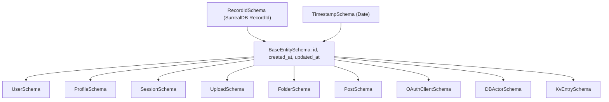

# packages/types Reference

`@syr-is/types` is the shared type package for the Syr platform. It provides Zod v4 schemas and TypeScript types used by all apps and packages in the monorepo.

**Package:** `@syr-is/types`
**Location:** `packages/types/`
**Build:** TypeScript compiler (`tsc`)
**Dependencies:** `zod` (v4, from catalog), `surrealdb` (for RecordId type)

---

## Schema Architecture

All database entities extend from a common `BaseEntitySchema` that provides `id`, `created_at`, and `updated_at` fields. IDs are SurrealDB `RecordId` instances, and timestamps are JavaScript `Date` objects.



---

## Base Schemas (`common.ts`)

The foundation of all entity schemas.

| Schema | Type | Description |
| ------ | ---- | ----------- |
| `RecordIdSchema` | `RecordId` | SurrealDB record identifier instance |
| `TimestampSchema` | `Date` | JavaScript Date object validation |
| `BaseEntitySchema` | `{ id, created_at, updated_at }` | Common fields for all database entities |
| `MetadataSchema` | `Record<string, any>` | Generic metadata key-value object |

**Design decision:** SurrealDB returns `RecordId` objects natively. Rather than converting to strings at the database layer, schemas validate the native type. Conversion to strings happens at the API boundary via codecs.

---

## Codecs (`codecs.ts`)

Zod v4 codecs provide **bi-directional transformations** between network representations and internal types. Each codec defines a `decode` (network -> internal) and `encode` (internal -> network) function.

| Codec | Input | Output | Purpose |
| ----- | ----- | ------ | ------- |
| `stringToRecordId` | `string` (`"table:id"`) | `RecordId` | Convert API strings to SurrealDB IDs |
| `isoDatetimeToDate` | ISO 8601 string | `Date` | Convert API timestamps to Date objects |
| `hexToBytes` | hex string | `Uint8Array` | Binary data encoding |
| `stringToNumber` | string | `number` | Query parameter parsing |
| `stringToInt` | string | integer | Integer query parameters |
| `stringToBoolean` | `"true"` / `"false"` | `boolean` | Boolean query parameters |
| `json(schema)` | JSON string | `T` | Generic JSON parse/stringify with validation |
| `epochSecondsToDate` | Unix timestamp (s) | `Date` | Epoch conversion |
| `epochMillisToDate` | Unix timestamp (ms) | `Date` | Epoch conversion |
| `uriComponent` | encoded URI | decoded URI | URI encoding/decoding |
| `nullToUndefined` | `null` | `undefined` | Nullability conversion |

**Usage pattern:**

```typescript
// Decode: API string -> internal type
const recordId = stringToRecordId.decode("user:abc123");

// Encode: internal type -> API string
const str = stringToRecordId.encode(recordId);
```

---

## User Domain (`user.ts`)

Core identity and authentication schemas.

### UserSchema

```typescript
BaseEntitySchema.extend({
  username: z.string().min(3).max(30).regex(/^[a-zA-Z0-9_-]+$/),
  password_hash: z.string(),
  role: z.enum(['ADMIN', 'USER']).default('USER')
})
```

**Design decision:** No email field. Syr is designed for digital sovereignty -- username and DID are the only identity anchors. No email is required for registration.

### ProfileSchema

```typescript
BaseEntitySchema.extend({
  user_id: RecordIdSchema,
  display_name: z.string().min(1).max(100),
  bio: z.string().max(500).optional(),
  avatar_url: z.url().optional(),
  banner_url: z.url().optional(),
  metadata: MetadataSchema.optional()
})
```

### SessionSchema

```typescript
{
  id: RecordIdSchema,
  created_at: TimestampSchema,
  user_id: RecordIdSchema,
  token: z.string(),
  expires_at: TimestampSchema,
  ip: z.string().optional(),
  user_agent: z.string().optional(),
  last_active: TimestampSchema.optional()
}
```

### Form/API Schemas

| Schema | Purpose |
| ------ | ------- |
| `UserRegistrationInputSchema` | Backend registration validation (username + password + display_name) |
| `UserRegistrationSchema` | Frontend form validation (adds `confirmPassword` + refine) |
| `UserLoginSchema` | Login request validation |
| `ProfileUpdateSchema` | Partial profile update (all fields optional) |
| `ProfileCreateSchema` | Minimal profile creation (user_id + display_name) |

### AuthenticatedUserSchema

Combined user + profile for authenticated contexts. Picks `id`, `username`, `role` from User and extends with `display_name` and `avatar_url` from Profile.

> **Known issue:** This schema currently picks `did: true` from `UserSchema`, but `UserSchema` does not yet have a `did` field. This will be fixed in Phase 0 when `did` is added to `UserSchema`.

---

## Posts Domain (`posts.ts`)

Content creation schemas with type discrimination.

### Post Types

| Type | Content Type | Description |
| ---- | ------------ | ----------- |
| `blog` | `markdown` or `html` | Text-based posts with rich content |
| `media` | n/a | Media-focused posts (images, video, audio) |

### PostSchema

```typescript
BaseEntitySchema.extend({
  type: z.enum(['blog', 'media']),
  content_type: z.enum(['markdown', 'html']).optional(),
  title: z.string().optional(),
  description: z.string().max(280).optional(),
  content: z.string().optional(),
  media_urls: z.array(z.string()).optional(),
  display_mode: z.enum(['carousel', 'masonry', 'gallery']).optional(),
  visibility: z.enum(['public', 'unlisted', 'private']).default('public'),
  status: z.enum(['draft', 'completed']).default('draft'),
  author_id: RecordIdSchema
})
```

**Refinements:**
- Blog posts MUST have `content_type` set.
- Media posts MUST NOT have `content_type` set.
- These are enforced via `superRefine` validators.

### Media Display Modes

| Mode | Description |
| ---- | ----------- |
| `carousel` | Embla-based horizontal carousel |
| `masonry` | CSS masonry grid layout |
| `gallery` | Uniform grid with preview modal |

---

## Uploads Domain (`uploads.ts`)

File upload schemas with status-dependent validation.

### UploadSchema

```typescript
BaseEntitySchema.extend({
  key: UploadKeySchema.optional(),
  owner_id: RecordIdSchema,
  folder_id: RecordIdSchema.nullable().optional(),
  filename: z.string().min(1),
  mime_type: z.string().min(1),
  size: z.number().int().nonnegative(),
  sha256: z.string().regex(/^[a-f0-9]{64}$/i).optional(),
  url: z.url().optional(),
  status: z.enum(['pending', 'uploading', 'completed', 'failed', 'cancelled']).default('pending'),
  is_public: z.boolean().default(false),
  metadata: MetadataSchema.optional()
})
```

**Status-dependent validation:**
- `pending` uploads do not require `key` or `url`.
- `completed` uploads MUST have both `key` and `url`.
- Enforced via `.refine()`.

### Upload Key Format

```
uploads/{owner_id}/[folder_path/]{table:id}
```

Examples:
- `uploads/user:abc/upload:xyz` (root level)
- `uploads/user:abc/public/images/upload:xyz` (nested in public folder)
- `uploads/user:abc/public/post_assets/post:123/upload:xyz` (post asset)

---

## Folders Domain (`folders.ts`)

Hierarchical file organization.

### FolderSchema

```typescript
BaseEntitySchema.extend({
  name: z.string().min(1).max(255).regex(/^[^/\\*?"<>|]+$/),
  owner_id: RecordIdSchema,
  parent_id: RecordIdSchema.nullable().optional()
})
```

**Special folder:** The folder named `public` (case-insensitive) marks files as publicly accessible without signed URLs. All subfolders of a `public` folder inherit this behavior.

---

## ActivityPub Domain (`activitypub.ts`)

Federation schemas for ActivityPub protocol support.

> **Implementation status:** Types are defined but ActivityPub federation is not yet implemented in the application. These schemas provide the foundation for future federation work.

### Core Schemas

| Schema | Description |
| ------ | ----------- |
| `ActorSchema` | ActivityPub actor (Person, Service, Application, Group, Organization) |
| `ActivitySchema` | Activities (Create, Update, Delete, Follow, Accept, Reject, Like, Announce, Undo, Block) |
| `ObjectSchema` | Content objects (Note, Article, Image, Video, Document, Page) |
| `CollectionSchema` | AP Collection / OrderedCollection |
| `CollectionPageSchema` | Paginated collection pages |
| `WebFingerResourceSchema` | RFC 7033 WebFinger resource discovery |

### Database Schemas

| Schema | Description |
| ------ | ----------- |
| `DBActorSchema` | Internal actor representation with user_id, keypair, URLs |
| `FollowerSchema` | Follower relationship with status (pending/accepted/rejected) |
| `FollowingSchema` | Following relationship with status |
| `StoredActivitySchema` | Internal activity storage |

---

## OAuth Domain (`oauth.ts`)

Full OIDC-compatible OAuth 2.0 schema set.

> **Implementation status:** Types are defined but the OAuth server is not yet implemented. These schemas will be used when Syr becomes an OAuth provider in Phase 2.

### Schema Summary

| Schema | Purpose |
| ------ | ------- |
| `OAuthClientSchema` | Registered OAuth 2.0 clients |
| `OAuthClientRegistrationSchema` | Client registration request |
| `OAuthAuthorizationCodeSchema` | Authorization code lifecycle |
| `OAuthAccessTokenSchema` | Access token with scopes and revocation |
| `OAuthRefreshTokenSchema` | Refresh token lifecycle |
| `OAuthAuthorizationRequestSchema` | Authorization endpoint request (with PKCE) |
| `OAuthTokenRequestSchema` | Token endpoint request |
| `OAuthTokenResponseSchema` | Token endpoint response |
| `OAuthUserInfoResponseSchema` | OpenID Connect UserInfo response |
| `OAuthErrorResponseSchema` | Standardized error responses |

### OAuth Scopes

```
openid, profile, email,
read:activities, write:activities,
read:credentials, write:credentials,
read:proofs, write:proofs
```

---

## Events Domain (`events.ts`)

Event system for cross-service communication.

> **Implementation status:** Event schemas are defined but the event system is not yet wired up in the application.

### Event Types

```
post.created, post.updated, post.deleted,
comment.created, comment.updated, comment.deleted,
like.created, like.deleted,
follow.created, follow.deleted,
share.created, user.updated, content.viewed
```

### Event Data Schemas

| Schema | Fields |
| ------ | ------ |
| `PostEventDataSchema` | post_id, content, title, url, media, tags, visibility |
| `CommentEventDataSchema` | comment_id, post_id, parent_comment_id, content |
| `InteractionEventDataSchema` | target_id, target_type, target_url |
| `ContentViewEventDataSchema` | content_id, content_type, duration_seconds, completion_percentage |

---

## KV Domain (`kv.ts`)

Generic key-value storage using SurrealDB.

### KV ID Format

```
kv:{type}:{index}
```

- `type`: Category (e.g., `session`, `cache`, `user_prefs`)
- `index`: Unique key within type (can contain colons for record IDs)

### KvEntrySchema

```typescript
BaseEntitySchema.extend({
  id: KvRecordIdSchema,
  kv_type: z.string(),
  value: z.unknown(),
  expires_at: TimestampSchema.optional()
})
```

**Features:**
- TTL support via `expires_at`
- Automatic expiration cleanup
- Atomic increment operations
- Create-if-absent pattern

### Helper Functions

| Function | Purpose |
| -------- | ------- |
| `parseKvId(kvId)` | Extract type and index from KV ID string |
| `createKvId(type, index)` | Build validated KV ID string |
| `createKvRecordId(type, index)` | Build SurrealDB RecordId for KV entry |

---

## API Domain (`api.ts`)

Generic API response and query schemas.

### Response Schemas

| Schema | Purpose |
| ------ | ------- |
| `APIResponseSchema<T>` | Generic `{ status, data?, error?, meta? }` |
| `PaginatedResponseSchema<T>` | `{ status, data[], pagination, meta? }` |
| `APIErrorSchema` | Structured error with code, message, field_errors |

### Error Codes

```
VALIDATION_ERROR, AUTHENTICATION_ERROR, AUTHORIZATION_ERROR,
NOT_FOUND, CONFLICT, RATE_LIMIT_EXCEEDED,
INTERNAL_SERVER_ERROR, SERVICE_UNAVAILABLE,
BAD_REQUEST, FORBIDDEN, INVALID_CREDENTIALS,
TOKEN_EXPIRED, INVALID_TOKEN, INSUFFICIENT_PERMISSIONS
```

### Query Schemas

| Schema | Purpose |
| ------ | ------- |
| `PaginationSchema` | `{ limit, offset, total?, has_more? }` |
| `QueryOptionsSchema` | `{ limit, offset, sort?, search?, filters? }` |
| `QueryParamsSchema` | URL param parsing with transform to `QueryOptions` |
| `SortSchema` | `{ field, order: 'asc' \| 'desc' }` |
| `BatchOperationRequestSchema` | Batch create/update/delete operations |
